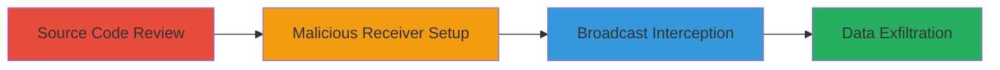

---
tags:
  - android
  - information-disclosure
  - broadcast-interception
  - nextcloud
type: attack_chain
tools: []
tactics:
  - '[[Collection]]'
verified: false
platforms:
  - Android
submitted: true
complexity: medium
created_at: '2023-10-01T00:00:00Z'
procedures:
  - '[[procedures/Review-Nextcloud-Android-Source-Code-for-Insecure-Broadcasts]]'
  - '[[procedures/Implement-Malicious-Broadcast-Receiver-in-Android-App]]'
  - '[[procedures/Intercept-and-Parse-Nextcloud-Upload-Broadcasts]]'
step_count: 3
techniques:
  - '[[Data from Local System]]'
  - '[[Automated Collection]]'
updated_at: '2025-12-14T17:24:42.271Z'
description: >-
  A multi-stage attack exploiting insecure broadcasts in the Nextcloud Android
  app to intercept sensitive file upload and sync data, leading to privacy
  breaches via malware.
skill_level: intermediate
impact_level: high
id: 333158ad-abfe-41af-a19c-528eae254201
validated: true
mitre_tactics:
  - '[[Collection]]'
mitre_techniques:
  - '[[Data from Local System]]'
  - '[[Automated Collection]]'
---
# Intercept Unprotected Broadcasts in Nextcloud Android App for Information Disclosure

Multi-stage attack chain demonstrating how to exploit unprotected sticky broadcasts in the Nextcloud Android app to disclose sensitive account and file information to malicious apps.

## Chain Metrics Dashboard

| Metric | Value |
|--------|-------|
| Chain Status | Unverified |
| Total Steps | 3 |
| Execution Time | ~30 minutes |
| Skill Level | Intermediate |
| Complexity | Medium |
| Impact Level | High |

## Attack Flow Visualization



## Prerequisites & Requirements

### Required Tools

- Android Studio (for app development)
- GitHub access (for source review)

### Target Environment

- Android OS (version compatible with Nextcloud app, e.g., API 21+)
- Installed Nextcloud Android app
- Development environment for building malicious APK

### Initial Access Requirements

- Physical or emulated Android device
- Ability to install custom APKs (developer mode or sideloading)
- No root required, but same-device access for interception

## Detailed Attack Procedures

### Step 1: Source Code Review
procedure: [[procedures/Review-Nextcloud-Android-Source-Code-for-Insecure-Broadcasts]]

**Objective**: Identify vulnerable broadcast sends in the Nextcloud app's source code to understand the data exposed.

**Instructions**: Access the Nextcloud Android GitHub repository and examine key files for uses of Context.sendStickyBroadcast.

Navigate to the repository at https://github.com/nextcloud/android and review FileUploader.java lines 1116, 1136, 1170 for actions like UPLOAD_START, UPLOAD_FINISH, UPLOADS_ADDED. Similarly, check SyncFolderHandler.java lines 186 and 201.

**Expected Output**: Confirmation of sticky broadcasts sending intents with account details, file paths, and upload status without restrictions.

**Success Indicators**:
- Identified broadcast actions: FileUploader.UPLOAD_START, UPLOAD_FINISH, UPLOADS_ADDED
- Noted lack of LocalBroadcastManager usage

### Step 2: Malicious Receiver Setup
procedure: [[procedures/Implement-Malicious-Broadcast-Receiver-in-Android-App]]

**Objective**: Create a malicious Android app that registers a high-priority receiver to capture broadcasts before the legitimate Nextcloud app.

**Instructions**: Use Android Studio to build an app with an exported BroadcastReceiver in AndroidManifest.xml.

Define the receiver with high priority (999) and intent filters for the vulnerable actions:

```xml
<receiver android:name=".MaliciousReceiver"
    android:exported="true"
    android:enabled="true">
    <intent-filter android:priority="999">
        <action android:name="com.owncloud.android.files.services.FileUploader$UploadStatus" />
        <data android:scheme="content" />
    </intent-filter>
</receiver>
```

Implement the receiver in Java to log or exfiltrate intent extras:

```java
public class MaliciousReceiver extends BroadcastReceiver {
    @Override
    public void onReceive(Context context, Intent intent) {
        // Extract account, file info from intent.getExtras()
        String account = intent.getStringExtra("account");
        // Log or send to attacker server
    }
}
```

Install the APK on the target device alongside Nextcloud.

**Expected Output**: Malicious app installed and receiver registered without errors.

**Success Indicators**:
- Receiver appears in logcat as registered
- APK installs successfully on device

### Step 3: Broadcast Interception
procedure: [[procedures/Intercept-and-Parse-Nextcloud-Upload-Broadcasts]]

**Objective**: Trigger Nextcloud uploads/syncs and capture the broadcasts to extract sensitive data.

**Instructions**: With both apps installed, perform a file upload or sync in the Nextcloud app to trigger broadcasts.

Monitor via logcat or implement network exfil in the receiver:

```java
// In onReceive:
Bundle extras = intent.getExtras();
if (extras != null) {
    // Parse file paths, account names, status
    Log.d("Intercept", extras.toString());
    // Or HTTP POST to attacker server
}
```

The sticky nature allows late registration to retrieve pending broadcasts.

**Expected Output**: Logs or exfiltrated data containing account details, file names, and upload progress.

**Success Indicators**:
- Intercepted intents received before Nextcloud processes them
- Sensitive data like file paths and user accounts extracted

## Attack Chain Summary

### Key Achievements

1. Identified insecure broadcast implementation in Nextcloud source code
2. Deployed high-priority malicious receiver to preempt legitimate processing
3. Successfully disclosed private file and account information via interception

## Technique & Tactic Coverage

### MITRE ATT&CK Techniques

- [[Data from Local System]] Data from Local System
- [[Automated Collection]] Automated Collection

### MITRE ATT&CK Tactics

- [[Collection]] Collection

---
*Last updated: 2023-10-01T00:00:00Z*
