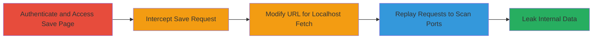

---
tags:
  - ssrf
  - blind-ssrf
  - port-scanning
  - reconnaissance
  - web
type: attack_chain
tools:
  - '[[tools/Burp-Suite]]'
tactics:
  - '[[Initial Access]]'
  - '[[Reconnaissance]]'
verified: false
platforms:
  - Web
submitted: true
complexity: medium
created_at: '2023-10-01T00:00:00Z'
procedures:
  - '[[procedures/Exploit-Blind-SSRF-for-Internal-Port-Scanning-in-GetPocket]]'
step_count: 5
techniques:
  - '[[Exploit Public-Facing Application]]'
  - '[[Network Service Scanning]]'
updated_at: '2025-12-14T03:46:09.045Z'
description: >-
  Multi-stage attack chain exploiting an internal blind SSRF vulnerability in
  Mozilla's GetPocket service to perform port scanning on localhost services and
  leak internal data.
skill_level: intermediate
impact_level: high
id: e886088c-88d6-4fd2-9f5e-f6d1126a05ec
validated: true
mitre_tactics:
  - '[[Initial Access]]'
  - '[[Reconnaissance]]'
mitre_techniques:
  - '[[Exploit Public-Facing Application]]'
  - '[[Network Service Scanning]]'
---
# Internal Blind SSRF for Port Scanning in Mozilla GetPocket Save Feature

Multi-stage attack chain demonstrating exploitation of an internal blind Server-Side Request Forgery (SSRF) in Mozilla's GetPocket service. An authenticated user can trigger the server to fetch arbitrary localhost URLs via the save feature, leading to distinguishable responses that enable blind port scanning of internal services. This allows reconnaissance of open ports (e.g., SSH on 22) and potential leakage of internal data like server status pages. Note: The original report was deemed a false positive due to caching effects, but the technique illustrates SSRF risks in URL handling.

## Chain Metrics Dashboard

| Metric | Value |
|--------|-------|
| Chain Status | Unverified |
| Total Steps | 5 |
| Execution Time | ~10 minutes |
| Skill Level | Intermediate |
| Complexity | Medium |
| Impact Level | High |

## Attack Flow Visualization

## Prerequisites & Requirements

### Required Tools

- [[tools/Burp-Suite]]

### Target Environment

- Web platform with access to https://getpocket.com/saves
- Authenticated session in GetPocket (Mozilla account)
- Internal localhost services running (e.g., ports 21/FTP, 22/SSH, 86/custom)
- Proxy setup for request interception

### Initial Access Requirements

- Valid Mozilla/GetPocket credentials for authentication
- Direct network access to the GetPocket web application
- No prior internal access needed; exploits authenticated user context

## Detailed Attack Procedures

### Step 1: Access the Save Page as an Authenticated User
procedure: [[procedures/Exploit-Blind-SSRF-for-Internal-Port-Scanning-in-GetPocket]]

**Objective**: Gain authenticated access to the save feature to initiate URL submission.

**Instructions**: Log in to your Mozilla account and navigate to the save page. This sets up the context for submitting URLs that trigger server-side fetches.

**Expected Output**: Successful login and access to https://getpocket.com/saves interface with the plus icon visible for adding URLs.

**Success Indicators**:
- Authenticated session active
- Save page loaded without errors

### Step 2: Attempt to Save a Localhost URL
procedure: [[procedures/Intercept-and-Modify-GetPocket-Save-Request]]

**Objective**: Submit a localhost URL to trigger the SSRF, preparing for interception.

**Instructions**: Click the plus icon on the save page and enter a test localhost URL like `https://127.0.0.1:1/`. Submit the request while ensuring your browser traffic is proxied through Burp Suite.

**Expected Output**: Request intercepted in Burp Suite; server responds with a fetch attempt.

**Success Indicators**:
- URL submission intercepted
- No immediate validation error on localhost input

### Step 3: Intercept and Forward the Request
procedure: [[procedures/Exploit-Blind-SSRF-for-Internal-Port-Scanning-in-GetPocket]]

**Objective**: Capture the save request to allow modification for SSRF exploitation.

**Instructions**: In Burp Suite Proxy, intercept the POST request to the save endpoint. Forward it to the Repeater or Intruder tab for analysis and replay.

**Expected Output**: Request visible in Burp with URL parameter containing the localhost address.

**Success Indicators**:
- Request successfully intercepted and forwarded
- Original response observable (e.g., shorter for closed ports)

### Step 4: Modify and Replay Requests to Scan Ports
procedure: [[procedures/Exploit-Blind-SSRF-for-Internal-Port-Scanning-in-GetPocket]]

**Objective**: Alter the port in the URL to probe for open internal services via blind SSRF.

**Instructions**: In Burp Repeater, change the port in the URL parameter (e.g., from `:1/` to `:22/` for SSH). Replay the request multiple times for different ports (e.g., 21, 22, 86, 87, 88). Compare response lengths: open ports yield longer responses (>3000 bytes) due to connection establishment.

**Expected Output**: Varying response sizes; longer for open ports, shorter for closed.

**Success Indicators**:
- Differences in response length observed
- Open ports (e.g., 22, 86) confirmed

### Step 5: Exploit for Internal Data Leakage
procedure: [[procedures/Exploit-Blind-SSRF-for-Internal-Port-Scanning-in-GetPocket]]

**Objective**: Use confirmed open ports to access and read sensitive internal endpoints.

**Instructions**: Target open ports with SSRF requests to internal paths (e.g., `https://127.0.0.1:22/server-status` or status pages). Replay in Burp to fetch and observe leaked data like server versions or status.

**Expected Output**: Response containing internal data (e.g., server version, status info).

**Success Indicators**:
- Internal data leaked in response
- Reconnaissance enabling further attacks

## Attack Chain Summary

### Key Achievements

1. Authenticated access to trigger SSRF without validation
2. Blind port scanning identifying internal services (e.g., SSH on 22)
3. Data leakage from internal endpoints for reconnaissance

## Technique & Tactic Coverage

### MITRE ATT&CK Techniques

- [[Exploit Public-Facing Application]] Exploit Public-Facing Application
- [[Network Service Scanning]] Network Service Scanning

### MITRE ATT&CK Tactics

- [[Initial Access]] Initial Access
- [[Reconnaissance]] Reconnaissance

---

*Last updated: 2023-10-01T00:00:00Z*
