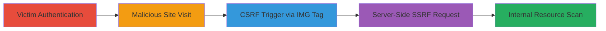

# Internal GET SSRF via CSRF in WordPress Press This Scan Feature

Multi-stage attack chain demonstrating exploitation of CSRF vulnerability in WordPress's Press This scan feature to achieve internal SSRF, forcing the victim's server to scan private network resources like localhost services.

## Chain Metrics Dashboard

| Metric | Value |
|--------|-------|
| Chain Status | Unverified |
| Total Steps | 5 |
| Execution Time | ~1 minute |
| Skill Level | Intermediate |
| Complexity | Medium |
| Impact Level | High |

## Attack Flow Visualization



## Prerequisites & Requirements

### Required Tools

- None (browser-based exploitation)

### Target Environment

- WordPress site with Press This feature enabled
- PHP backend
- Internal services on ports like 8080 (e.g., localhost:8080)
- Network access to host a malicious site

### Initial Access Requirements

- Victim must be authenticated as a logged-in WordPress user (e.g., admin)
- Attacker controls a website that the victim can visit
- No direct access to victim's network required

## Detailed Attack Procedures

### Step 1: Victim Authentication

procedure: [[procedures/Trigger-CSRF-to-Initiate-SSRF-in-WordPress-Press-This]]

**Objective**: Ensure the victim is logged into their WordPress site, establishing an authenticated session vulnerable to CSRF.

**Instructions**: The victim navigates to their WordPress site (e.g., http://myWordpress.com/wp-admin) and authenticates using valid credentials. No attacker action is needed here; rely on social engineering to lure the victim to log in first.

**Expected Output**: Victim's browser maintains an active session cookie for the WordPress site.

**Success Indicators**:
- Victim confirms login via dashboard access
- Session cookies (e.g., wordpress_logged_in_*) are set in the browser

### Step 2: Victim Visits Malicious Site

procedure: [[procedures/Trigger-CSRF-to-Initiate-SSRF-in-WordPress-Press-This]]

**Objective**: Trick the victim into loading a page under attacker control that embeds the CSRF trigger.

**Instructions**: Host a malicious webpage on an attacker-controlled domain (e.g., http://attacker.com/malicious.html) containing an invisible IMG tag pointing to the vulnerable endpoint. Use social engineering (e.g., phishing email) to direct the victim to this page while logged into WordPress.

The IMG tag syntax:

```html

```

**Expected Output**: The page loads without visible changes, but the browser automatically fetches the IMG src.

**Success Indicators**:
- Victim loads the page (track via server logs)
- No JavaScript errors; IMG tag executes silently

### Step 3: Browser Triggers CSRF Request

procedure: [[procedures/Trigger-CSRF-to-Initiate-SSRF-in-WordPress-Press-This]]

**Objective**: Leverage the victim's authenticated session to send a cross-site GET request to the Press This endpoint without CSRF protection.

**Instructions**: Upon page load, the browser interprets the IMG src as a GET request to http://myWordpress.com/wp-admin/press-this.php?u=http://0.0.0.0:8080&url-scan-submit=Scan. The WordPress server processes this due to the active session cookies, bypassing origin checks.

Monitor attacker server or use network tools to confirm the request is sent from the victim's browser.

**Expected Output**: WordPress server receives and logs the GET request with the malicious 'u' parameter.

**Success Indicators**:
- Request appears in WordPress access logs
- No 403/401 errors; request is accepted

### Step 4: Server Executes SSRF

procedure: [[procedures/Trigger-CSRF-to-Initiate-SSRF-in-WordPress-Press-This]]

**Objective**: Force the WordPress server to make an internal HTTP request to a private address, scanning sensitive services.

**Instructions**: The Press This endpoint scrapes the 'u' URL (http://0.0.0.0:8080, resolving to 127.0.0.1:8080). No further attacker input needed; the server handles the fetch.

Replace 0.0.0.0:8080 with other private IPs (e.g., 127.0.0.1:3306 for MySQL) to target different services.

**Expected Output**: WordPress attempts to fetch and process content from the internal endpoint.

**Success Indicators**:
- Internal service logs show incoming request from WordPress server
- Any error responses (e.g., 404 if port closed) indicate scan success

### Step 5: Internal Response and Impact

procedure: [[procedures/Trigger-CSRF-to-Initiate-SSRF-in-WordPress-Press-This]]

**Objective**: Receive or observe the results of the internal scan, potentially exfiltrating data.

**Instructions**: The internal service (e.g., on localhost:8080) responds to the SSRF request. In Press This, scraped content may be processed or logged; for data exfil, chain with other vulns to capture responses.

Validate by checking if sensitive data (e.g., internal API responses) is accessible via subsequent requests or logs.

**Expected Output**: Response from internal service reaches the WordPress server; potential for data leakage if not sanitized.

**Success Indicators**:
- Internal service responds (e.g., HTTP 200)
- Attacker infers success via timing or chained exfil

## Attack Chain Summary

### Key Achievements

1. Bypassed CSRF protections to invoke admin endpoint from victim browser
2. Achieved server-side requests to private IPs without direct access
3. Enabled blind scanning of internal network ports and services

## Technique & Tactic Coverage

### MITRE ATT&CK Techniques

- [[Exploit Public-Facing Application]]
- [[Drive-by Compromise]]

### MITRE ATT&CK Tactics

- [[Initial Access]]
- [[Discovery]]

---
*Last updated: 2023-10-01T00:00:00Z*
