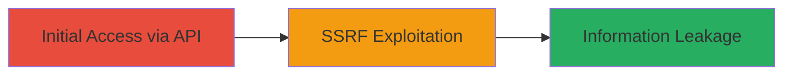

---
tags:
  - ssrf
  - bypass
  - information-leakage
  - slack
type: attack_chain
tools: []
tactics:
  - '[[Initial Access]]'
verified: false
platforms:
  - Web
submitted: true
complexity: medium
created_at: '2023-10-01T00:00:00Z'
procedures:
  - '[[procedures/Exploit-SSRF-Bypass-in-Slack-Slash-Commands]]'
step_count: 1
techniques:
  - '[[Exploit Public-Facing Application]]'
updated_at: '2025-12-14T03:46:08.935Z'
description: >-
  A multi-stage exploitation chain demonstrating how to bypass SSRF mitigations
  in Slack's slash command API to leak information from internal services.
skill_level: intermediate
impact_level: medium
id: 3c14822f-8cd1-47c4-ac75-1cc0e3e94314
validated: true
mitre_tactics:
  - '[[Initial Access]]'
mitre_techniques:
  - '[[Exploit Public-Facing Application]]'
---
# Internal SSRF Bypass via Slack Slash Commands for Information Leakage

Multi-stage attack chain demonstrating a complete attack workflow targeting a bypass in Slack's slash command handling at api.slack.com, allowing SSRF to internal services for information leakage.

## Chain Metrics Dashboard

| Metric | Value |
|--------|-------|
| Chain Status | Unverified |
| Total Steps | 1 |
| Execution Time | ~5 minutes |
| Skill Level | Intermediate |
| Complexity | Medium |
| Impact Level | Medium |

## Attack Flow Visualization



## Prerequisites & Requirements

### Required Tools

- [[commands/curl-ssrf-slack]]

### Target Environment

- Web platform
- Service: api.slack.com slash commands
- Network access: Public internet to Slack API

### Initial Access Requirements

- Valid Slack workspace access or token (for authenticated testing)
- Knowledge of slash command endpoint
- No prior internal access needed

## Detailed Attack Procedures

### Step 1: Exploit SSRF Bypass
procedure: [[procedures/Exploit-SSRF-Bypass-in-Slack-Slash-Commands]]

**Objective**: Bypass previous SSRF mitigations in slash commands to make arbitrary internal requests and leak data from internal services.

**Instructions**: Identify the slash command API endpoint (typically POST to https://slack.com/api/chat.postMessage or custom slash handler). Craft a payload that includes an internal URL (e.g., metadata service) in a parameter vulnerable to SSRF, such as a URL field in the command input. Use [[commands/curl-ssrf-slack]] to send the request:

```bash
curl -X POST https://slack.com/api/chat.command -H "Authorization: Bearer YOUR_TOKEN" -d "command=/test&text=internal://169.254.169.254/latest/meta-data/"
```

Validate the response for leaked internal data, such as AWS instance metadata if applicable.

**Expected Output**: HTTP response containing leaked internal service data, e.g., JSON with metadata fields.

**Success Indicators**:
- Response includes internal resource data (e.g., IP addresses, metadata)
- No external error; successful internal fetch indicated by partial data leakage

## Attack Chain Summary

### Key Achievements

1. Bypassed SSRF mitigation in slash commands
2. Achieved information leakage from internal services
3. Demonstrated medium-impact vulnerability leading to potential further exploitation

## Technique & Tactic Coverage

### MITRE ATT&CK Techniques

- [[Exploit Public-Facing Application]]

### MITRE ATT&CK Tactics

- [[Initial Access]]

---
*Last updated: 2023-10-01T00:00:00Z*
