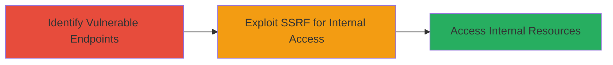

---
tags:
  - ssrf
  - internal-ssrf
  - web-vulnerability
type: attack_chain
tools: []
tactics:
  - '[[Initial Access]]'
  - '[[Reconnaissance]]'
verified: false
platforms:
  - Web
submitted: true
complexity: medium
created_at: '2023-10-01T00:00:00Z'
procedures:
  - '[[procedures/Exploiting-SSRF-in-Bime-Endpoints]]'
step_count: 2
techniques:
  - '[[Exploit Public-Facing Application]]'
updated_at: '2025-12-14T04:39:02.403Z'
description: >-
  A multi-stage attack chain demonstrating the discovery and exploitation of
  Server-Side Request Forgery (SSRF) vulnerabilities in Bime product endpoints,
  enabling access to internal network resources.
skill_level: intermediate
impact_level: high
id: c06a32e3-df1d-473a-a7e2-de42c1dd1a12
validated: true
mitre_tactics:
  - '[[Initial Access]]'
  - '[[Reconnaissance]]'
mitre_techniques:
  - '[[Exploit Public-Facing Application]]'
---
# Internal SSRF Exploitation in Bime Endpoints for Network Access

Multi-stage attack chain demonstrating a complete attack workflow targeting SSRF vulnerabilities in the Bime product.

## Chain Metrics Dashboard

| Metric | Value |
|--------|-------|
| Chain Status | Unverified |
| Total Steps | 2 |
| Execution Time | ~5 minutes |
| Skill Level | Intermediate |
| Complexity | Medium |
| Impact Level | High |

## Attack Flow Visualization



## Prerequisites & Requirements

### Required Tools

- None specified (uses standard HTTP clients like curl)

### Target Environment

- Web application (Bime product)
- Exposed endpoints accepting URL inputs
- Internal network resources (e.g., metadata services)

### Initial Access Requirements

- Valid user session or public access to Bime endpoints
- Network position allowing HTTP requests to the target
- No prior credentials needed for unauthenticated endpoints

## Detailed Attack Procedures

### Step 1: Identify Vulnerable Endpoints

procedure: [[procedures/Exploiting-SSRF-in-Bime-Endpoints]]

**Objective**: Locate endpoints in the Bime application that process user-supplied URLs without proper validation, allowing SSRF.

**Instructions**: Review the application's API documentation or use automated scanning to identify endpoints handling imports, integrations, or URL parameters. For Bime, multiple unspecified endpoints were found vulnerable. Manually test by submitting internal-like URLs (e.g., http://localhost/admin) to observe if the server makes internal requests.

**Expected Output**: Server response indicating internal request processing, such as error messages revealing internal hostnames or delayed responses.

**Success Indicators**:
- Endpoint accepts and processes arbitrary URLs
- Response leaks internal information or behaves differently for internal targets

### Step 2: Exploit SSRF for Internal Access

procedure: [[procedures/Exploiting-SSRF-in-Bime-Endpoints]]

**Objective**: Craft and send SSRF payloads to access internal network resources, such as metadata services or private APIs.

**Instructions**: Use a tool like curl to send a request to the vulnerable endpoint with an internal URL payload. For example, target AWS metadata if applicable:

```bash
curl -X POST 'https://bime.example.com/vulnerable-endpoint' -d 'url=http://169.254.169.254/latest/meta-data/' -H 'Content-Type: application/json'
```

Monitor the response for exfiltrated internal data. Iterate with different internal IPs (e.g., 127.0.0.1, 10.0.0.0/8) to map the internal network.

**Expected Output**: Response containing internal resource data, such as instance metadata or file contents from internal servers.

**Success Indicators**:
- Retrieval of sensitive internal data
- Confirmation of access to non-public resources

## Attack Chain Summary

### Key Achievements

1. Identification of multiple SSRF-vulnerable endpoints in Bime
2. Successful internal network access via forged server requests
3. Potential for further exploitation like data exfiltration or lateral movement

## Technique & Tactic Coverage

### MITRE ATT&CK Techniques

- [[Exploit Public-Facing Application]]

### MITRE ATT&CK Tactics

- [[Initial Access]]
- [[Reconnaissance]]

---
*Last updated: 2023-10-01T00:00:00Z*
