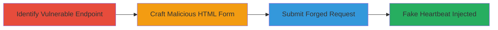

# JSON CSRF Exploitation to Forge WakaTime Heartbeat Data

Multi-stage attack chain demonstrating exploitation of a JSON CSRF vulnerability in WakaTime's POST Heartbeats API, allowing attackers to inject false coding activity data into a victim's account via a malicious webpage that leverages cookie-based authentication without proper content-type validation.

## Chain Metrics Dashboard

| Metric | Value |
|--------|-------|
| Chain Status | Unverified |
| Total Steps | 3 |
| Execution Time | ~5 minutes |
| Skill Level | Intermediate |
| Complexity | Medium |
| Impact Level | High |

## Attack Flow Visualization

## Prerequisites & Requirements

### Required Tools

- [[tools/jQuery]]

### Target Environment

- Web platform with access to WakaTime API
- Victim must be authenticated via cookies to https://wakatime.com
- Attacker needs to host a malicious HTML page (e.g., on a web server or via phishing)

### Initial Access Requirements

- Victim's browser must visit the attacker's malicious page while authenticated to WakaTime
- No special credentials needed beyond victim's session cookies
- Network access to https://api.wakatime.com

## Detailed Attack Procedures

### Step 1: Identify Vulnerable API Endpoint
procedure: [[procedures/Identify-WakaTime-Heartbeats-API-Vulnerability]]

**Objective**: Locate the Heartbeats API endpoint and confirm lack of CSRF protections for non-JSON content-types.

**Instructions**: Review WakaTime's API documentation or use browser developer tools to inspect network requests during normal heartbeat submissions. Verify that the endpoint accepts POST requests with cookie authentication but does not enforce application/json content-type or require API keys.

**Expected Output**: Confirmation that https://api.wakatime.com/api/v1/users/current/heartbeats processes text/plain payloads as JSON.

**Success Indicators**:
- Endpoint identified without additional auth headers
- Test request with text/plain succeeds in parsing JSON

### Step 2: Craft Malicious HTML Form
procedure: [[procedures/Craft-JSON-CSRF-POC-HTML]]

**Objective**: Create an HTML page that constructs and submits a forged JSON payload via a form with text/plain encoding to bypass CSRF checks.

**Instructions**: Use [[tools/jQuery]] to dynamically build the form. Set up an HTML form with ENCTYPE='text/plain' targeting the API endpoint, and a hidden input to hold the JSON string (e.g., {"entity":"https://example.com","type":"domain","category":"coding","project":"FakeProject","language":"Python","timestamp":1234567890}).

**Expected Output**: A self-contained HTML file ready for hosting, which auto-submits on load.

**Success Indicators**:
- Form renders correctly in browser
- JSON payload is properly formatted in the input value

### Step 3: Submit Forged Request and Verify
procedure: [[procedures/Submit-Forged-Heartbeat-Request]]

**Objective**: Trick the victim into loading the page, submitting the forged request, and confirming data injection.

**Instructions**: Host the HTML page and lure the victim (e.g., via phishing email). On page load, use JavaScript to set the input value and submit the form. Monitor WakaTime dashboard for injected fake heartbeats.

**Expected Output**: Server accepts the request, processes the fake JSON as a valid heartbeat, updating the victim's coding logs.

**Success Indicators**:
- No errors in browser console
- Victim's WakaTime account shows anomalous coding activity

## Attack Chain Summary

### Key Achievements

1. Bypassed CSRF protections by exploiting content-type leniency in JSON API.
2. Forged heartbeat data to inject false coding metrics without direct access.
3. Demonstrated potential for misleading productivity reports or account manipulation.

## Technique & Tactic Coverage

### MITRE ATT&CK Techniques

- [[Exploit Public-Facing Application]]

### MITRE ATT&CK Tactics

- [[Initial Access]]

---
*Last updated: 2023-10-01T00:00:00Z*
