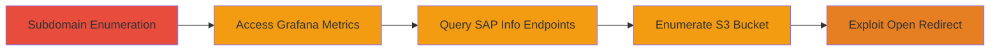

---
tags:
  - information-disclosure
  - reconnaissance
  - grafana
  - sap
  - aws-s3
  - open-redirect
type: attack_chain
tools: []
tactics:
  - '[[Reconnaissance]]'
commands:
  - '[[commands/curl-access-grafana-metrics]]'
  - '[[commands/curl-access-sap-info]]'
  - '[[commands/curl-list-s3-bucket]]'
  - '[[commands/curl-sap-open-redirect]]'
platforms:
  - Web
  - AWS
complexity: low
procedures:
  - '[[procedures/Access-Grafana-Metrics-Without-Authentication]]'
  - '[[procedures/Expose-SAP-Internal-Information-via-Public-Endpoints]]'
  - '[[procedures/List-Contents-of-Public-AWS-S3-Bucket]]'
  - '[[procedures/Exploit-Open-Redirect-in-SAP-Logoff-Endpoint]]'
step_count: 4
techniques:
  - '[[Active Scanning]]'
  - '[[Gather Victim Host Information]]'
description: >-
  A reconnaissance-focused attack chain exploiting multiple information
  disclosure vulnerabilities in JetBlue's infrastructure, including
  unauthenticated Grafana metrics, SAP internal details, public AWS S3 bucket
  listing, and open redirects, discovered through subdomain enumeration.
skill_level: beginner
impact_level: medium
id: c569c63a-bc51-448f-9c97-51bfe8bf0a6b
created_at: '2025-12-14T17:25:13.474Z'
updated_at: '2025-12-14T17:25:13.474Z'
verified: false
validated: true
submitted: true
mitre_tactics:
  - '[[Reconnaissance]]'
mitre_techniques:
  - '[[Active Scanning]]'
  - '[[Gather Victim Host Information]]'
---
# JetBlue Information Disclosure via Misconfigured Grafana, SAP, and AWS S3 Endpoints

## Overview

This attack chain outlines a reconnaissance workflow targeting JetBlue's infrastructure, starting with subdomain enumeration to identify exposed services. Attackers can then access unauthenticated endpoints to disclose sensitive information, such as Grafana server metrics revealing resource usage, SAP internal IP addresses and OS details, AWS S3 bucket contents for file enumeration, and open redirects in SAP logoff pages that could facilitate phishing. The chain leverages public-facing misconfigurations without requiring authentication, enabling passive information gathering that aids further attacks like targeted exploitation or social engineering.

## Attack Flow Visualization



## Prerequisites & Requirements

### Required Tools

- Web browser or [[commands/curl-access-grafana-metrics]] for endpoint access

### Target Environment

- Web platform with exposed services on ports 80/443
- AWS cloud infrastructure
- Services: Grafana, SAP, AWS S3

### Initial Access Requirements

- Public internet access to JetBlue subdomains
- No credentials required due to misconfigurations

## Detailed Attack Procedures

### Step 1: Subdomain Enumeration

procedure: [[procedures/Access-Grafana-Metrics-Without-Authentication]]

**Objective**: Identify subdomains hosting vulnerable services like Grafana to expand the attack surface.

**Instructions**: Use standard subdomain scanning tools (inferred from discovery context) to list potential targets, then probe for the /metrics endpoint using [[commands/curl-access-grafana-metrics]]:

```bash
curl -s https://████.jetblue.com/metrics | head -20
```

**Expected Output**: JSON or text output displaying Grafana metrics, including server resource details like CPU and memory usage.

**Success Indicators**:
- Metrics data returned without authentication prompt
- Sensitive internal metrics visible

### Step 2: Query SAP Information Endpoints

procedure: [[procedures/Expose-SAP-Internal-Information-via-Public-Endpoints]]

**Objective**: Retrieve internal network details from unprotected SAP public info endpoints to map infrastructure.

**Instructions**: Directly access the SAP endpoints using [[commands/curl-access-sap-info]] to fetch exposed data:

```bash
curl -s https://█████████.jetblue.com/sap/public/info
```

Repeat for additional subdomains:

```bash
curl -s https://████.jetblue.com/sap/public/info
```

**Expected Output**: HTML or text revealing internal IP addresses, OS versions, and SAP system configurations.

**Success Indicators**:
- Internal IPs and OS details disclosed
- No access denial or redirect to login

### Step 3: Enumerate Public AWS S3 Bucket

procedure: [[procedures/List-Contents-of-Public-AWS-S3-Bucket]]

**Objective**: List and access files in a publicly configured S3 bucket to disclose sensitive documents or endpoints.

**Instructions**: Navigate to the bucket URL or use [[commands/curl-list-s3-bucket]] to retrieve the directory listing:

```bash
curl -s https://███████.travelproducts.jetblue.com/ | grep -o 'href="[^"]*"' | cut -d'"' -f2
```

**Expected Output**: XML or HTML listing bucket contents, including file names and potential sensitive data.

**Success Indicators**:
- Bucket contents listed without authentication
- Access to internal files or endpoints

### Step 4: Test Open Redirect in SAP Logoff

procedure: [[procedures/Exploit-Open-Redirect-in-SAP-Logoff-Endpoint]]

**Objective**: Validate arbitrary redirects to craft phishing links or bypass controls.

**Instructions**: Append a malicious redirect URL to the logoff endpoint using [[commands/curl-sap-open-redirect]]:

```bash
curl -s -L "https://██████████.jetblue.com/sap/public/bc/icf/logoff?redirecturl=https://google.com"
```

Test the second endpoint similarly:

```bash
curl -s -L "https://█████████.jetblue.com/sap/public/bc/icf/logoff?redirecturl=https://google.com"
```

**Expected Output**: Successful redirect to the specified external site without validation errors.

**Success Indicators**:
- Redirect to external domain occurs
- No URL sanitization or blocking

## Attack Chain Summary

### Key Achievements

1. Exposed Grafana metrics aiding server reconnaissance
2. Leaked SAP internal details for network mapping
3. Public S3 access revealing file structures
4. Open redirects enabling phishing vectors

## Technique & Tactic Coverage

### MITRE ATT&CK Techniques

- [[Active Scanning]] Active Scanning
- [[Gather Victim Host Information]] Gather Victim Host Information

### MITRE ATT&CK Tactics

- [[Reconnaissance]] Reconnaissance

*Last updated: 2023-10-01T00:00:00Z*
