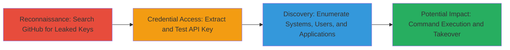

---
tags:
  - api-key-leak
  - hard-coded-credentials
  - jumpcloud
  - github
  - unauthorized-access
  - cloud-compromise
type: attack_chain
tools:
  - '[[tools/curl]]'
tactics:
  - '[[Credential Access]]'
  - '[[Initial Access]]'
commands:
  - '[[commands/curl-list-jumpcloud-systems]]'
  - '[[commands/curl-list-jumpcloud-system-users]]'
  - '[[commands/curl-list-jumpcloud-applications]]'
platforms:
  - Cloud
  - Web
complexity: low
procedures:
  - '[[procedures/Discover-Leaked-API-Key-in-GitHub-Repository]]'
  - '[[procedures/Exploit-Leaked-JumpCloud-API-Key]]'
step_count: 2
techniques:
  - '[[Credentials In Files]]'
  - '[[T1078.004]]'
description: >-
  Attack chain exploiting a hard-coded JumpCloud API key exposed in a public
  GitHub repository, enabling unauthorized enumeration of systems, users, and
  SSO applications with potential for further compromise including command
  execution and AWS takeover.
skill_level: intermediate
impact_level: high
id: df75a11f-b949-448a-bae0-f1cef8f5d5ab
created_at: '2025-12-14T17:32:48.653Z'
updated_at: '2025-12-14T17:32:48.653Z'
verified: false
validated: true
submitted: true
mitre_tactics:
  - '[[Credential Access]]'
  - '[[Initial Access]]'
mitre_techniques:
  - '[[Credentials In Files]]'
  - '[[T1078.004]]'
---
# JumpCloud API Key Leak via Public GitHub Repository Leading to Unauthorized Access

Multi-stage attack chain demonstrating the discovery and exploitation of a hard-coded JumpCloud API key in a public GitHub repository, allowing unauthorized access to internal resources such as system lists, user information, and SSO applications. This could lead to command execution on managed systems, user manipulation, and potential AWS account takeover.

## Chain Metrics Dashboard

| Metric | Value |
|--------|-------|
| Chain Status | Unverified |
| Total Steps | 2 |
| Execution Time | ~5 minutes |
| Skill Level | Intermediate |
| Complexity | Low |
| Impact Level | High |

## Attack Flow Visualization



## Prerequisites & Requirements

### Required Tools

- [[tools/curl]]

### Target Environment

- Cloud platform with JumpCloud integration
- Public GitHub repositories
- Access to AWS services via JumpCloud SSO

### Initial Access Requirements

- Internet access for GitHub searches
- No prior credentials needed; relies on public exposure
- Basic knowledge of API interactions

## Detailed Attack Procedures

### Step 1: Discover Leaked API Key
procedure: [[procedures/Discover-Leaked-API-Key-in-GitHub-Repository]]

**Objective**: Identify public GitHub repositories containing hard-coded sensitive credentials like API keys through targeted searches.

**Instructions**: Perform a GitHub search using keywords related to the target organization and API types, such as "Starbucks JumpCloud API key". Review search results to locate source code files with embedded credentials. For this case, the search revealed the repository https://github.com/██████████/Project and the file https://github.com/████/Project/blob/0d56bb910923da2fbee95971778923f734a25f68/getSystemUsers.go containing the hard-coded key in the line `req.Header.Add("x-api-key", "████████")`.

**Expected Output**: Identification of the repository and exact file with the leaked key.

**Success Indicators**:
- Repository and file located
- API key extracted from source code

### Step 2: Exploit Leaked API Key
procedure: [[procedures/Exploit-Leaked-JumpCloud-API-Key]]

**Objective**: Use the extracted API key to authenticate against JumpCloud API endpoints and enumerate internal resources.

**Instructions**: Test the key by making authenticated HTTP requests to JumpCloud endpoints. Start with listing systems using [[commands/curl-list-jumpcloud-systems]]:

```bash
curl -H "x-api-key: ████████" "https://console.jumpcloud.com/api/systems"
```

Follow with user enumeration using [[commands/curl-list-jumpcloud-system-users]]:

```bash
curl -H "x-api-key: █████" "https://console.jumpcloud.com/api/systemusers"
```

Finally, list SSO applications with [[commands/curl-list-jumpcloud-applications]]:

```bash
curl -H "x-api-key: ██████" "https://console.jumpcloud.com/api/applications"
```

**Expected Output**: JSON responses containing lists of systems, users, and applications.

**Success Indicators**:
- Successful 200 OK responses with data
- Access to sensitive internal information confirmed

## Attack Chain Summary

### Key Achievements

1. Discovered hard-coded JumpCloud API key in public GitHub repo
2. Gained unauthorized access to enumerate JumpCloud-managed systems and users
3. Identified potential for SSO application access leading to AWS compromise

## Technique & Tactic Coverage

### MITRE ATT&CK Techniques

- [[Credentials In Files]]
- [[T1078.004]]

### MITRE ATT&CK Tactics

- [[Credential Access]]
- [[Initial Access]]

---
*Last updated: 2023-10-01*
