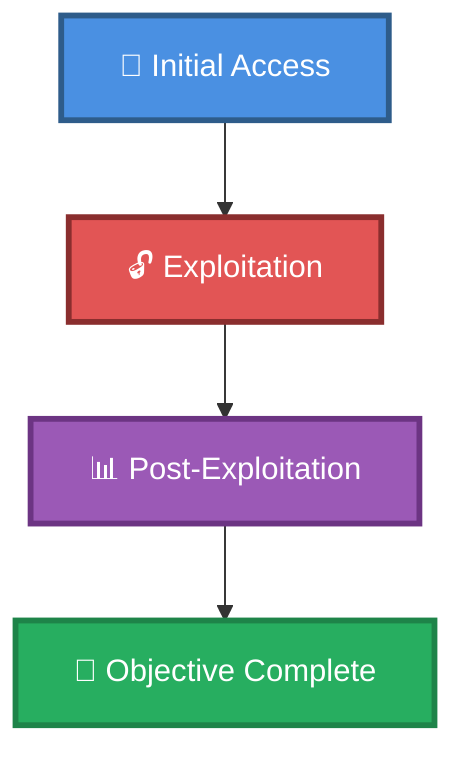

# 🎯 KC1

> **Enhanced Attack Chain Dashboard**

---

## 📊 Chain Metrics Dashboard

| Metric | Value |
|--------|-------|
| **Chain Status** | ⚠️ **UNVERIFIED** |
| **Total Steps** | `4` |
| **Execution Time** | ~1-2 hours |
| **Skill Level** | 🟢 Beginner-Intermediate |
| **Complexity** | Medium |
| **Impact Level** | 🟡 **MEDIUM** |

---

## 🎭 Attack Flow Visualization



---

## 🛠️ Prerequisites & Requirements

### Required Tools
```bash path=null start=null
# Tools will be listed here based on procedures
```

### Target Environment
- ✅ Network connectivity to target

### Initial Access Requirements
- 🔓 Requirements based on first step of chain
- 🔓 See detailed procedures below

---

## 🔬 Detailed Attack Procedures

### **[Step 1]** Thorough Port Scan with Service Enumeration

**Progress:** `██░░░░░░░░` 25% | **Risk:** 🟢 Low

**Procedure:** [[Thorough Port Scan with Service Enumeration]]

> 📝 **Objective:** Query a computer's services by probing the ports on which it listens. Since each system potentially has 65,535 ports for TCP and UDP, it's often best to perform multiple scans, each focusing on a different technique or port range.

**Expected Output:**
- Refer to procedure documentation for details

**Success Indicators:** ✅ Objective achieved

---

### **[Step 2]** Thorough Port Scan with Service Enumeration

**Progress:** `█████░░░░░` 50% | **Risk:** 🟢 Low

**Procedure:** [[Thorough Port Scan with Service Enumeration]]

> 📝 **Objective:** Query a computer's services by probing the ports on which it listens. Since each system potentially has 65,535 ports for TCP and UDP, it's often best to perform multiple scans, each focusing on a different technique or port range.

**Expected Output:**
- Refer to procedure documentation for details

**Success Indicators:** ✅ Objective achieved

---

### **[Step 3]** Upgrade from a Website RCE to Reverse Shell (Linux)

**Progress:** `███████░░░` 75% | **Risk:** 🔴 High

**Procedure:** [[Upgrade from a Website RCE to Reverse Shell (Linux)]]

> 📝 **Objective:** In cases where Remote Code Execution (RCE) is achieved on a web application, the next step is usually to launch a reverse shell for terminal access. This procedure will outline a few common approaches.

**Expected Output:**
- Refer to procedure documentation for details

**Success Indicators:** ✅ Objective achieved

---

### **[Step 4]** Enumerate a Web CMS for Usernames and Passwords

**Progress:** `██████████` 100% | **Risk:** 🟢 Low

**Procedure:** [[Enumerate a Web CMS for Usernames and Passwords]]

> 📝 **Objective:** Many websites reveal usernames and potential passwords in the pages themselves, hidden files, and configuration files. By enumerating a site's content with tools, username and password lists can be generated and used for login brute forcing.

**Expected Output:**
- Refer to procedure documentation for details

**Success Indicators:** ✅ Objective achieved

---

## 🎯 Attack Chain Summary

### Key Achievements
- ✅ Thorough Port Scan with Service Enumeration
- ✅ Upgrade from a Website RCE to Reverse Shell (Linux)
- ✅ Enumerate a Web CMS for Usernames and Passwords

---

## 📈 Technique & Tactic Coverage

---

**Last Updated:** 2023-05-29T16:48:53.162677+00:00 | **Chain Version:** 2.0 Enhanced | **Status:** ⚠️ Draft
