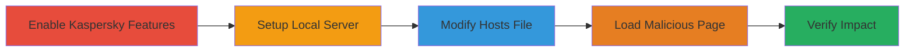

---
tags:
  - kaspersky
  - command-injection
  - javascript
  - browser-extension
  - rce
type: attack_chain
tools:
  - '[[tools/Python-3]]'
  - '[[tools/server-py]]'
  - '[[tools/Internet-Explorer]]'
tactics:
  - '[[Execution]]'
  - '[[Persistence]]'
  - '[[Privilege Escalation]]'
commands:
  - '[[commands/edit-windows-hosts-file]]'
verified: false
platforms:
  - Windows
  - Web
  - Internet Explorer
submitted: true
complexity: medium
created_at: '2023-10-01T00:00:00Z'
procedures:
  - '[[procedures/Enable-Kaspersky-Anti-Banner-and-Private-Browsing]]'
  - '[[procedures/Setup-Local-HTTPS-Server-for-Malicious-HTML]]'
  - '[[procedures/Modify-Windows-Hosts-File-for-Domain-Redirect]]'
  - '[[procedures/Load-Malicious-HTML-in-Internet-Explorer]]'
  - '[[procedures/Verify-Kaspersky-Feature-Disabling-Impact]]'
step_count: 5
techniques:
  - '[[JavaScript]]'
  - '[[Compromise Client Software Binary]]'
  - '[[DLL Search Order Hijacking]]'
updated_at: '2025-12-14T17:29:36.243Z'
description: >-
  A multi-stage attack exploiting a vulnerability in Kaspersky's Web protection
  add-on for Internet Explorer, allowing arbitrary webpages to intercept
  JavaScript method calls, access internal namespaces, and execute unauthorized
  commands, potentially leading to RCE in the avp.exe process with SYSTEM
  privileges.
skill_level: intermediate
impact_level: high
id: b79c9c8d-b908-4758-bc58-0c91f96dfbb6
validated: true
mitre_tactics:
  - '[[Execution]]'
  - '[[Persistence]]'
  - '[[Privilege Escalation]]'
mitre_techniques:
  - '[[JavaScript]]'
  - '[[Compromise Client Software Binary]]'
  - '[[DLL Search Order Hijacking]]'
---
# Kaspersky Web Protection Command Injection via String.prototype.indexOf Interception in Internet Explorer

Multi-stage attack chain demonstrating exploitation of Kaspersky's Web protection add-on in Internet Explorer, where a malicious webpage intercepts calls to String.prototype.indexOf made by the add-on's script, gaining access to Kaspersky's internal namespace and command interface. This allows disabling protections, manipulating blocklists, and potentially achieving remote code execution in the elevated avp.exe process running as SYSTEM.

## Chain Metrics Dashboard

| Metric | Value |
|--------|-------|
| Chain Status | Unverified |
| Total Steps | 5 |
| Execution Time | ~10 minutes |
| Skill Level | Intermediate |
| Complexity | Medium |
| Impact Level | High |

## Attack Flow Visualization

## Prerequisites & Requirements

### Required Tools

- [[tools/Python-3]]
- [[tools/server-py]]
- [[tools/Internet-Explorer]]

### Target Environment

- Target OS/Platform: Windows with Kaspersky Internet Security installed
- Required services/ports: Port 5000 open locally for HTTPS server
- Network access requirements: Localhost access; Internet Explorer with Kaspersky add-on enabled

### Initial Access Requirements

- Credential requirements: Administrator privileges for hosts file edit
- Network position: Local machine
- Prior access needed: Kaspersky installed and Web protection active

## Detailed Attack Procedures

### Step 1: Enable Kaspersky Features
procedure: [[procedures/Enable-Kaspersky-Anti-Banner-and-Private-Browsing]]

**Objective**: Activate Anti-Banner and Private Browsing features in Kaspersky to ensure the Web protection script is injected and vulnerable to interception.

**Instructions**: Access the Kaspersky settings interface via the system tray or control panel. Navigate to the Web protection section and enable Anti-Banner (blocks ads) and Private Browsing (enhances privacy). Save changes to trigger script injection on matching domains.

**Expected Output**: Confirmation in settings that features are toggled on; Kaspersky logs may show activation.

**Success Indicators**:
- Anti-Banner and Private Browsing status shows as enabled in Kaspersky interface
- No errors in Kaspersky event logs

### Step 2: Setup Local HTTPS Server for Malicious HTML
procedure: [[procedures/Setup-Local-HTTPS-Server-for-Malicious-HTML]]

**Objective**: Host the malicious HTML file locally using a rudimentary HTTPS server to simulate a secure connection and deliver the exploit payload.

**Instructions**: Download the server.py script and the disable_features2.html file. Execute the server using [[tools/Python-3]] by running `python server.py` in the directory containing the files. The server starts on https://localhost:5000/ with an invalid self-signed certificate.

**Expected Output**: Server output indicating it's listening on port 5000; access https://localhost:5000/disable_features2.html to verify the page loads.

**Success Indicators**:
- Server console shows no errors and confirms HTTPS binding
- Malicious HTML accessible via browser (ignoring cert warning)

### Step 3: Modify Windows Hosts File for Domain Redirect
procedure: [[procedures/Modify-Windows-Hosts-File-for-Domain-Redirect]]

**Objective**: Redirect a fake Google domain to localhost to trigger Kaspersky's Web protection script injection on the malicious page.

**Instructions**: Open the hosts file as administrator using a text editor like Notepad. Add the entry `127.0.0.1 www.google.example.com` to the end of the file. Save and flush DNS cache if needed with `ipconfig /flushdns`.

**Expected Output**: Hosts file updated; `ping www.google.example.com` resolves to 127.0.0.1.

**Success Indicators**:
- Domain resolves to localhost
- No permission errors during edit

### Step 4: Load Malicious HTML in Internet Explorer
procedure: [[procedures/Load-Malicious-HTML-in-Internet-Explorer]]

**Objective**: Navigate to the malicious page in IE to execute the JavaScript that intercepts String.indexOf calls, accessing Kaspersky's namespace and issuing disable commands.

**Instructions**: Launch Internet Explorer with the Kaspersky add-on enabled. Navigate to https://www.google.example.com:5000/disable_features2.html, overriding the invalid certificate warning. The page's script hooks String.prototype.indexOf to spy on and manipulate Kaspersky's internal calls.

**Expected Output**: Page loads; browser console may show intercepted calls; Kaspersky features begin disabling silently.

**Success Indicators**:
- Certificate override successful
- No immediate browser crashes; page content renders

### Step 5: Verify Kaspersky Feature Disabling Impact
procedure: [[procedures/Verify-Kaspersky-Feature-Disabling-Impact]]

**Objective**: Confirm the exploit's success by checking that Anti-Banner and Private Browsing have been disabled via the hijacked interface.

**Instructions**: Reopen the Kaspersky settings interface. Navigate to Web protection and observe the status of Anti-Banner and Private Browsing features.

**Expected Output**: Features listed as disabled; potential log entries of unauthorized commands.

**Success Indicators**:
- Anti-Banner and Private Browsing toggled off
- Ability to add arbitrary URLs to blocklists if further tested

## Attack Chain Summary

### Key Achievements

1. Interception of Kaspersky's JavaScript method calls via prototype pollution
2. Unauthorized access to internal command interface, disabling key protections
3. Potential escalation to RCE in avp.exe with SYSTEM privileges

## Technique & Tactic Coverage

### MITRE ATT&CK Techniques

- [[JavaScript]] JavaScript
- [[Compromise Client Software Binary]] Compromise Client Software
- [[DLL Search Order Hijacking]] Hijack Execution Flow: DLL Search Order Hijacking (adapted for JS prototypes)

### MITRE ATT&CK Tactics

- [[Execution]] Execution
- [[Persistence]] Persistence (disabling protections)
- [[Privilege Escalation]] Privilege Escalation

---

*Last updated: 2023-10-01T00:00:00Z*
