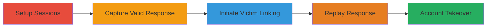

---
tags:
  - auth-bypass
  - account-takeover
  - response-replay
  - client-side-bypass
type: attack_chain
tools:
  - '[[tools/Burp-Suite]]'
tactics:
  - '[[Initial Access]]'
commands: []
verified: false
platforms:
  - Web
submitted: true
complexity: medium
created_at: '2023-10-01T00:00:00Z'
procedures:
  - '[[procedures/Setup-Attacker-and-Victim-Sessions]]'
  - '[[procedures/Capture-Successful-Password-Response]]'
  - '[[procedures/Initiate-Victim-Linking-Attempt]]'
  - '[[procedures/Replay-Authentication-Response]]'
step_count: 7
techniques:
  - '[[Valid Accounts]]'
  - '[[Exploit Public-Facing Application]]'
updated_at: '2025-12-14T17:31:11.405Z'
description: >-
  Multi-stage attack exploiting client-side only password confirmation during
  account linking on Khan Academy, allowing response replay for unauthorized
  external account linking and account takeover.
skill_level: intermediate
impact_level: high
id: 26209784-ff64-4ab8-b176-3b34c2e3c1df
validated: true
mitre_tactics:
  - '[[Initial Access]]'
mitre_techniques:
  - '[[Valid Accounts]]'
  - '[[Exploit Public-Facing Application]]'
---
# Khan Academy Account Linking Password Bypass via Response Manipulation

Multi-stage attack chain demonstrating a complete workflow to bypass client-side password confirmation during external account linking (e.g., Gmail) on Khan Academy, enabling unauthorized linking and subsequent account takeover by replaying manipulated HTTP responses.

## Chain Metrics Dashboard

| Metric | Value |
|--------|-------|
| Chain Status | Unverified |
| Total Steps | 7 |
| Execution Time | ~10 minutes |
| Skill Level | Intermediate |
| Complexity | Medium |
| Impact Level | High |

## Attack Flow Visualization

## Prerequisites & Requirements

### Required Tools

- [[tools/Burp-Suite]]

### Target Environment

- Web platform (Khan Academy website)
- Required services/ports: HTTPS (443) for account linking with Gmail OAuth
- Network access requirements: Direct internet access to Khan Academy and Gmail

### Initial Access Requirements

- Attacker must have a legitimate Khan Academy account
- Victim must be logged in on a separate session (e.g., shared device or controlled environment)
- No prior access to victim credentials needed, but ability to observe or control browser sessions

## Detailed Attack Procedures

### Step 1: Setup Victim Session
procedure: [[procedures/Setup-Attacker-and-Victim-Sessions]]

**Objective**: Establish a persistent login session for the victim on Khan Academy without logging them out, preparing for the linking attempt.

**Instructions**: Open a browser (e.g., Chrome) and log in to the victim's Khan Academy account. Ensure the session remains active by not closing the tab or logging out. This creates a valid authentication cookie for subsequent interactions.

**Expected Output**: Victim's dashboard loads, confirming active session.

**Success Indicators**:
- Victim account dashboard accessible
- No logout or session expiration

### Step 2: Setup Attacker Session
procedure: [[procedures/Setup-Attacker-and-Victim-Sessions]]

**Objective**: Create a separate browser session for the attacker's own Khan Academy account to perform legitimate actions for response capture.

**Instructions**: Open a new browser window or incognito mode and log in using the attacker's credentials. Navigate to the account settings where external linking (e.g., Gmail) is available.

**Expected Output**: Attacker's account dashboard loads successfully.

**Success Indicators**:
- Attacker session active and isolated from victim
- Access to account linking features confirmed

### Step 3: Trigger Legitimate Linking on Attacker Account
procedure: [[procedures/Capture-Successful-Password-Response]]

**Objective**: Initiate the account linking process on the attacker's session to prompt and enter the correct password, setting up for response interception.

**Instructions**: In the attacker's session, navigate to the external account linking section (e.g., connect Gmail). When prompted for password confirmation, enter the correct password for the external service.

**Expected Output**: Password prompt appears and is submitted successfully.

**Success Indicators**:
- Linking prompt displayed
- Correct password entered without errors

### Step 4: Intercept Successful Response
procedure: [[procedures/Capture-Successful-Password-Response]]

**Objective**: Use a proxy to capture the HTTP response from the server confirming successful password validation during the attacker's linking attempt.

**Instructions**: Configure [[tools/Burp-Suite]] as a proxy for the browser. Submit the password and intercept the POST request to the Khan Academy endpoint (likely /api/account/link or similar). Copy the full successful response body, including any tokens or status codes indicating authentication success (e.g., 200 OK with success payload).

**Expected Output**: Proxy shows a successful HTTP response (e.g., {"status": "success"}).

**Success Indicators**:
- Response captured and saved (e.g., JSON with success indicators)
- No errors in proxy interception

### Step 5: Initiate Linking on Victim Session
procedure: [[procedures/Initiate-Victim-Linking-Attempt]]

**Objective**: Switch to the victim's session and start the account linking process to trigger the password confirmation prompt.

**Instructions**: Return to the victim's browser session, navigate to the same account linking feature, and select the external service (e.g., Gmail) to link.

**Expected Output**: Linking interface loads in victim's session.

**Success Indicators**:
- Victim session still active
- Linking prompt ready for input

### Step 6: Submit Invalid Password on Victim
procedure: [[procedures/Initiate-Victim-Linking-Attempt]]

**Objective**: Enter an arbitrary or incorrect password to generate a request that can be intercepted and modified.

**Instructions**: In the victim's session, enter a wrong password (e.g., "wrongpass") and submit. Use the proxy to intercept this failing request/response.

**Expected Output**: Proxy intercepts the request before it reaches the server or captures the would-be failure.

**Success Indicators**:
- Invalid submission intercepted
- Request details match the legitimate one (same endpoint, headers)

### Step 7: Replay Successful Response
procedure: [[procedures/Replay-Authentication-Response]]

**Objective**: Modify the intercepted response from the victim's failed attempt by replacing it with the captured successful response, bypassing server validation.

**Instructions**: In [[tools/Burp-Suite]], drop the outgoing request if needed, but primarily modify the incoming response to match the attacker's successful one. Forward the altered response to the victim's browser, tricking the client-side JavaScript into believing authentication succeeded.

**Expected Output**: Victim's client-side proceeds as if linking succeeded, associating the external account with the victim's Khan Academy account.

**Success Indicators**:
- Unauthorized linking completes without server re-validation
- Attacker gains control over linked external account features

## Attack Chain Summary

### Key Achievements

1. Bypassed client-side only password confirmation via response replay
2. Enabled unauthorized linking of external accounts (e.g., Gmail) to victim's Khan Academy profile
3. Facilitated full account takeover, including password reset to lock out the victim

## Technique & Tactic Coverage

### MITRE ATT&CK Techniques

- [[Valid Accounts]] Valid Accounts
- [[Exploit Public-Facing Application]] Exploit Public-Facing Application

### MITRE ATT&CK Tactics

- [[Initial Access]] Initial Access

---

*Last updated: 2023-10-01T00:00:00Z*
