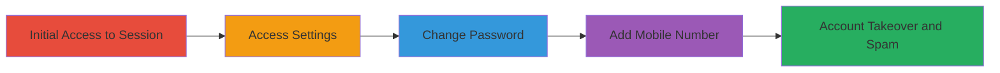

# Khan Academy Account Takeover via Unverified Password and Mobile Number Changes

Multi-stage attack chain demonstrating a complete attack workflow exploiting weak authentication in Khan Academy's account settings.

## Chain Metrics Dashboard

| Metric | Value |
|--------|-------|
| Chain Status | Unverified |
| Total Steps | 4 |
| Execution Time | ~2 minutes |
| Skill Level | Beginner |
| Complexity | Low |
| Impact Level | High |

## Attack Flow Visualization

## Prerequisites & Requirements

### Required Tools

- Web browser (e.g., Chrome, Firefox)

### Target Environment

- Khan Academy website (web platform)
- Logged-in user session

### Initial Access Requirements

- Valid session cookie or authentication token (e.g., via phishing or session hijacking)
- No network restrictions to khanacademy.org
- Prior access to a logged-in account needed

## Detailed Attack Procedures

### Step 1: Access the Profile Menu
procedure: [[procedures/Access-Khan-Academy-Account-Settings]]

**Objective**: Gain entry to the account settings interface using an active session.

**Instructions**: Open the Khan Academy website in a browser and ensure you are logged in with a target account session. Click on the user's profile name located in the top right corner of the page to open the dropdown menu.

**Expected Output**: Dropdown menu appears with options including 'settings'.

**Success Indicators**:
- Profile dropdown is visible and accessible
- No logout or session expiration occurs

### Step 2: Navigate to Settings
procedure: [[procedures/Access-Khan-Academy-Account-Settings]]

**Objective**: Enter the account settings page where sensitive changes can be made.

**Instructions**: From the profile dropdown menu, select the 'settings' option to load the account settings interface.

**Expected Output**: Account settings page loads, displaying sections for password and mobile number management.

**Success Indicators**:
- Settings page is fully loaded without errors
- Forms for password and mobile are visible

### Step 3: Change the Password
procedure: [[procedures/Change-Password-Without-Verification]]

**Objective**: Alter the account password without any authentication checks, locking out the legitimate user.

**Instructions**: In the settings form, locate the password change section. Enter a new password of your choice in the provided field and submit the form. No old password, OTP, or CAPTCHA is required.

**Expected Output**: Password updated successfully with a confirmation message.

**Success Indicators**:
- New password is set and account login with old password fails
- No verification prompts appear during submission

### Step 4: Add or Change Mobile Number
procedure: [[procedures/Add-Mobile-Number-Without-Verification]]

**Objective**: Update the mobile number to enable spam or further control, without SMS verification.

**Instructions**: In the settings form, find the mobile number section. Enter an arbitrary phone number and submit. No SMS OTP or call verification is prompted.

**Expected Output**: Mobile number updated, potentially triggering Khan Academy notifications to the new number.

**Success Indicators**:
- Mobile number is saved without errors
- Notifications (if any) are sent to the specified number, enabling spam

## Attack Chain Summary

### Key Achievements

1. Full account takeover by changing password undetected
2. Ability to redirect notifications to attacker-controlled phone
3. Potential for SMS spam to arbitrary numbers using the platform's system

## Technique & Tactic Coverage

### MITRE ATT&CK Techniques

- [[Account Manipulation]]

### MITRE ATT&CK Tactics

- [[Persistence]]

---
*Last updated: 2023-10-01T00:00:00Z*
