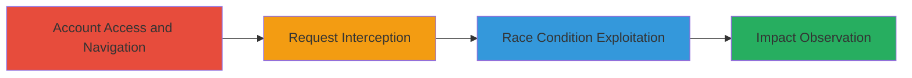

# Khan Academy Race Condition in Email Authentication Leading to Email Bombing

Multi-stage attack chain demonstrating exploitation of a race condition in the /api/internal/graphql/requestAuthEmail endpoint on www.khanacademy.org to bypass state checks and trigger multiple email sends, resulting in email bombing of a random user.

## Chain Metrics Dashboard

| Metric | Value |
|--------|-------|
| Chain Status | Unverified |
| Total Steps | 4 |
| Execution Time | ~5 minutes |
| Skill Level | Intermediate |
| Complexity | Medium |
| Impact Level | Medium |

## Attack Flow Visualization



## Prerequisites & Requirements

### Required Tools

- [[tools/Burp-Suite]]
- [[tools/Turbo-Intruder]]

### Target Environment

- Web platform: www.khanacademy.org
- Services: GraphQL API, Email Service
- Tech Stack: GraphQL
- Network access: Direct internet access to the site

### Initial Access Requirements

- Valid Khan Academy account credentials
- Network position: External attacker with authenticated session
- Prior access: None, but requires login

## Detailed Attack Procedures

### Step 1: Account Access and Navigation
procedure: [[procedures/Access-Khan-Academy-Account-and-Navigate-to-Email-Linking]]

**Objective**: Authenticate to a Khan Academy account and navigate to the email linking section to prepare for the vulnerable request.

**Instructions**: Log in to www.khanacademy.org using valid credentials, then go to Profile > Settings > Account > Linked accounts > Connect another email, and confirm identity with password.

**Expected Output**: Access to the email linking form.

**Success Indicators**:
- Successful login and navigation to email linking page
- Password confirmation prompt resolved

### Step 2: Request Interception
procedure: [[procedures/Intercept-and-Modify-Email-Request-with-Burp-Suite]]

**Objective**: Capture the email confirmation request and modify it for race condition exploitation.

**Instructions**: Enter a target email address, click 'Send confirmation email', and use [[tools/Burp-Suite]] to intercept the POST request to /api/internal/graphql/requestAuthEmail. Downgrade to HTTP/1.1 and add the 'X-Request: %s' header.

**Expected Output**: Intercepted and modified request ready for forwarding.

**Success Indicators**:
- Request captured without errors
- Protocol downgraded and header added successfully

### Step 3: Race Condition Exploitation
procedure: [[procedures/Exploit-Race-Condition-with-Turbo-Intruder]]

**Objective**: Send concurrent requests to exploit the time-of-check-to-time-of-use (TOCTOU) vulnerability in email state checks.

**Instructions**: Forward the request to [[tools/Turbo-Intruder]] and execute the race condition script using [[commands/turbo-intruder-race-script]] to queue 30 concurrent requests with synchronization.

```python
def queueRequests(target, wordlists):
    engine = RequestEngine(endpoint=target.endpoint,
                           concurrentConnections=30,
                           requestsPerConnection=100,
                           pipeline=False
                          )

    for i in range(30):
        engine.queue(target.req, target.baseInput, gate='race1')

    engine.openGate('race1')

    engine.complete(timeout=60)

def handleResponse(req, interesting):
    table.add(req)
```

**Expected Output**: Multiple 200 OK responses from the server.

**Success Indicators**:
- 30 concurrent requests sent
- Bypassed state checks observed in responses

### Step 4: Impact Observation
procedure: [[procedures/Observe-and-Verify-Email-Bombing-Impact]]

**Objective**: Confirm the exploitation by checking for multiple emails and verifying link invalidity.

**Instructions**: Monitor the target email inbox for incoming messages and test the links in the emails.

**Expected Output**: 30 emails titled 'Finish signing up for Khan Academy' with invalid/expired links.

**Success Indicators**:
- Multiple emails received by random user
- Links produce errors when clicked
- Contrast with normal single-email behavior

## Attack Chain Summary

### Key Achievements

1. Bypassed email state checks via race condition
2. Triggered email bombing with 30 concurrent sends
3. Demonstrated DoS impact through excessive unwanted emails

## Technique & Tactic Coverage

### MITRE ATT&CK Techniques

- [[Exploit Public-Facing Application]] Exploit Public-Facing Application
- [[Network Denial of Service]] Network Denial of Service

### MITRE ATT&CK Tactics

- [[Initial Access]] Initial Access
- [[Impact]] Impact

---

*Last updated: 2023-10-01T00:00:00Z*
