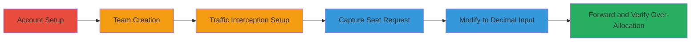

---
tags:
  - improper-input-validation
  - business-logic-flaw
  - api-abuse
  - financial-fraud
  - billing-manipulation
type: attack_chain
tools:
  - '[[tools/Burp-Suite]]'
tactics:
  - '[[Initial Access]]'
verified: false
platforms:
  - Web
submitted: true
complexity: medium
created_at: '2023-10-01T00:00:00Z'
procedures:
  - '[[procedures/Setup-Krisp-Account-and-Team]]'
  - '[[procedures/Intercept-and-Modify-Seat-Addition-Request]]'
step_count: 6
techniques:
  - '[[Exploit Public-Facing Application]]'
updated_at: '2025-12-14T17:28:28.428Z'
description: >-
  Authenticated exploitation of improper input validation in Krisp's PUT
  /v2/seats endpoint, allowing addition of more seats than paid for by
  submitting decimal values, leading to financial loss through inconsistent
  rounding in seat allocation and pricing.
skill_level: intermediate
impact_level: high
id: 1c7183cf-2d43-4807-914b-754c4c8fd81f
validated: true
mitre_tactics:
  - '[[Initial Access]]'
mitre_techniques:
  - '[[Exploit Public-Facing Application]]'
---
# Krisp Seat Price Manipulation via Decimal Input in Billing API

Multi-stage attack chain demonstrating exploitation of a business logic flaw in Krisp's team billing system, where decimal seat inputs lead to over-allocation of seats without corresponding payment.

## Chain Metrics Dashboard

| Metric | Value |
|--------|-------|
| Chain Status | Unverified |
| Total Steps | 6 |
| Execution Time | ~15 minutes |
| Skill Level | Intermediate |
| Complexity | Medium |
| Impact Level | High |

## Attack Flow Visualization

## Prerequisites & Requirements

### Required Tools

- [[tools/Burp-Suite]]

### Target Environment

- Web platform (Krisp application)
- Required services: Stripe for billing
- Tech stack: JavaScript backend
- Network access: Internet access to Krisp.ai

### Initial Access Requirements

- Valid Krisp account credentials (personal account)
- Authenticated session in the Krisp web/app interface
- No prior access needed beyond registration

## Detailed Attack Procedures

### Step 1: Register and Setup Krisp Account
procedure: [[procedures/Setup-Krisp-Account-and-Team]]

**Objective**: Establish initial access by creating a Krisp personal account and completing the app installation.

**Instructions**: Follow the official Krisp help documentation to sign up for a personal account at krisp.ai and download/install the Krisp application on your device. Complete the onboarding process to ensure a valid authenticated session.

**Expected Output**: Active Krisp account with app installed and login successful.

**Success Indicators**:
- Account registration confirmed via email
- App launches and connects to Krisp services

### Step 2: Create a New Team
procedure: [[procedures/Setup-Krisp-Account-and-Team]]

**Objective**: Set up a team environment to access billing features.

**Instructions**: Within the Krisp application, navigate to the team management section and initiate team creation. Provide necessary details such as team name to complete setup.

**Expected Output**: New team created with access to billing and seat management.

**Success Indicators**:
- Team dashboard accessible
- Billing section visible

### Step 3: Configure Traffic Interception

**Objective**: Prepare to monitor and intercept HTTP traffic from the Krisp application.

**Instructions**: Launch [[tools/Burp-Suite]] and configure your browser or system proxy to route traffic through Burp (typically port 8080). Set Burp to intercept requests from the Krisp domain. Navigate to the billing section in the Krisp app to generate initial traffic.

**Expected Output**: Burp Suite capturing HTTP requests from Krisp without errors.

**Success Indicators**:
- Proxy configured and traffic visible in Burp
- No connection issues in Krisp app

### Step 4: Capture Seat Addition Request
procedure: [[procedures/Intercept-and-Modify-Seat-Addition-Request]]

**Objective**: Intercept the API request during seat addition to identify the modifiable endpoint.

**Instructions**: In the billing section, attempt to add seats (e.g., select 1 seat). Burp will intercept the outgoing PUT /v2/seats request, which includes the 'seats' parameter in the body.

**Expected Output**: Intercepted PUT request visible in Burp with JSON body containing integer 'seats' value.

**Success Indicators**:
- Request captured showing PUT /v2/seats
- Parameter 'seats' present in request body

### Step 5: Modify Seats Parameter to Decimal
procedure: [[procedures/Intercept-and-Modify-Seat-Addition-Request]]

**Objective**: Alter the input to exploit the validation flaw by using a decimal value.

**Instructions**: In the Burp Repeater or Interceptor, edit the 'seats' parameter from an integer (e.g., 1) to a decimal like 1.9. Ensure the request remains authenticated with valid headers/tokens.

**Expected Output**: Modified request ready for forwarding, with 'seats': 1.9 in the body.

**Success Indicators**:
- Parameter successfully changed to decimal
- Request structure intact

### Step 6: Forward Request and Verify Result
procedure: [[procedures/Intercept-and-Modify-Seat-Addition-Request]]

**Objective**: Execute the exploit and confirm seat over-allocation without full payment.

**Instructions**: Forward the modified request through Burp. Observe the response and check the team dashboard: the system applies Math.ceil(1.9) = 2 seats added, but pricing uses Math.floor(1.9) * $60 = $60 charged (instead of $120).

**Expected Output**: Success response from API; dashboard shows 2 seats added, billing reflects only $60 increase.

**Success Indicators**:
- Seats increased by 2
- Billing cycle shows undercharge (note: full verification limited by 30-day cycle)

## Attack Chain Summary

### Key Achievements

1. Successful account and team setup for authenticated access.
2. Interception and modification of API request to exploit decimal input.
3. Demonstrated financial manipulation: 2 seats for the price of 1.

## Technique & Tactic Coverage

### MITRE ATT&CK Techniques

- [[Exploit Public-Facing Application]]

### MITRE ATT&CK Tactics

- [[Initial Access]]

---
*Last updated: 2023-10-01T00:00:00Z*
