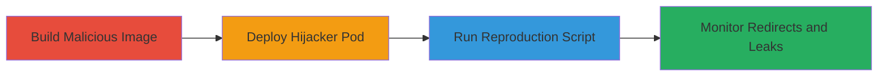

# Kubernetes SSRF via Hijacked Metrics-Server Redirects

Multi-stage attack chain demonstrating SSRF in Kubernetes where a malicious pod hijacks aggregated API servers like metrics-server to issue 30X redirects, causing clients to leak sensitive bearer tokens to attacker-controlled endpoints. This affects managed services like GKE and AKS, enabling data exfiltration and service abuse.

## Chain Metrics Dashboard

| Metric | Value |
|--------|-------|
| Chain Status | Unverified |
| Total Steps | 4 |
| Execution Time | ~15 minutes |
| Skill Level | Intermediate |
| Complexity | Medium |
| Impact Level | High |

## Attack Flow Visualization



## Prerequisites & Requirements

### Required Tools

- [[tools/Docker]]
- [[tools/kubectl]]

### Target Environment

- Kubernetes cluster (e.g., GKE or AKS)
- Access to kube-system namespace for pod deployment
- kubectl configured with cluster admin privileges

### Initial Access Requirements

- Cluster credentials with deployment rights in kube-system
- Network access to build and push Docker images
- No prior pod compromise needed, but label selector knowledge required

## Detailed Attack Procedures

### Step 1: Build Malicious Redirection API Server Image
procedure: [[procedures/Build-Malicious-Redirection-API-Server-Image]]

**Objective**: Create a Docker image for a Go-based server that responds with 30X redirects to an attacker-controlled endpoint.

**Instructions**: Use the provided main.go to build the image locally or in a CI environment, tagging it for deployment.

**Expected Output**: Docker image built and available as docker.io/weinong/go-redirect.

**Success Indicators**:
- Image builds without errors
- Container runs and returns HTTP 301/302 redirects

### Step 2: Deploy Malicious Pod to Hijack Metrics-Server
procedure: [[procedures/Deploy-Malicious-Pod-to-Hijack-Metrics-Server]]

**Objective**: Deploy a pod in the kube-system namespace using the same label selector as metrics-server to intercept API requests.

**Instructions**: Apply the go-redirect.yaml manifest, scaling down the original metrics-server if needed to ensure hijacking.

**Expected Output**: Malicious pod running and selected by API server aggregations.

**Success Indicators**:
- Pod status: Running in kube-system
- Original metrics-server scaled to zero or replaced

### Step 3: Run Reproduction Script to Observe Redirects
procedure: [[procedures/Run-Reproduction-Script-to-Observe-Redirects]]

**Objective**: Execute the script to deploy the hijacker and trigger requests from control plane components.

**Instructions**: Set USE_GKE=1 and run [[commands/run-reproduction-script-gke]] to handle GKE-specific scaling and deployment, capturing initial logs.

```bash
USE_GKE=1 ./run.sh
```

**Expected Output**: Logs in output.txt showing deployment and initial redirects.

**Success Indicators**:
- Hijacker pod intercepts requests
- Redirects observed in logs

### Step 4: Monitor and Capture Redirected Requests
procedure: [[procedures/Monitor-and-Capture-Redirected-Requests]]

**Objective**: Observe incoming requests to the hijacker, capturing bearer tokens and headers from components like kube-controller-manager.

**Instructions**: Tail logs of the malicious pod and use [[commands/run-reproduction-script-gke]] to trigger traffic, then review captured data.

**Expected Output**: Logs revealing tokens from IPs like 34.122.28.173 and components such as azurepolicyaddon.

**Success Indicators**:
- Bearer tokens leaked to attacker endpoint
- Sensitive headers logged

## Attack Chain Summary

### Key Achievements

1. Hijacked metrics-server to issue unauthorized redirects
2. Leaked control plane bearer tokens via SSRF
3. Demonstrated impact on managed Kubernetes like GKE/AKS

## Technique & Tactic Coverage

### MITRE ATT&CK Techniques

- [[Exploit Public-Facing Application]]
- [[Steal Application Access Token]]

### MITRE ATT&CK Tactics

- [[Initial Access]]
- [[Collection]]

---
*Last updated: 2023-10-01T00:00:00Z*
