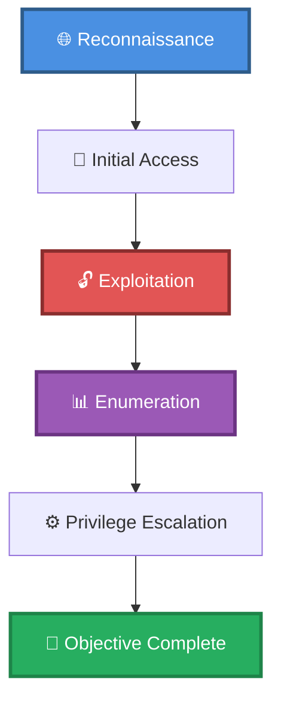

# 🎯 LDAP user search + SMB brute force w/ custom dictionary attack & WinRM Remote

> **Enhanced Attack Chain Dashboard**

---

## 📊 Chain Metrics Dashboard

| Metric | Value |
|--------|-------|
| **Chain Status** | ✅ **VERIFIED & TESTED** |
| **Total Steps** | `6` |
| **Execution Time** | ~1-2 hours |
| **Skill Level** | 🟢 Beginner-Intermediate |
| **Complexity** | Medium |
| **Impact Level** | 🟡 **MEDIUM** |

---

## 🎭 Attack Flow Visualization



---

## 🗺️ Tactical Progression Map

```
┌─────────────┐    ┌─────────────┐    ┌─────────────┐
│ COLLECTION  │ ══►│  CREDENTIAL  │ ══►│  DISCOVERY   │
│  TA0009     │    │   TA0006    │    │  TA0007     │
│             │    │   TA0006    │    │  TA0008     │
└─────────────┘    └─────────────┘    └─────────────┘
```

**Tactics Distribution:**
- 🔍 **Collection** — 25% of chain
- 🔍 **Credential Access** — 25% of chain
- 🔍 **Discovery** — 25% of chain
- 🔍 **Lateral Movement** — 25% of chain

---

## 🛠️ Prerequisites & Requirements

### Required Tools
```bash path=null start=null
winrm                # WinRM shell
```

### Target Environment
- ✅ Windows target system
- ✅ Network connectivity to target

### Initial Access Requirements
- 🔓 Requirements based on first step of chain
- 🔓 See detailed procedures below

---

## 🔬 Detailed Attack Procedures

### **[Step 1]** Query LDAP and Enumerate the Base DN (ldapsearch)

**Progress:** `█░░░░░░░░░` 16% | **Risk:** 🟢 Low

**Procedure:** [[Query LDAP and Enumerate the Base DN (ldapsearch)]]

> 📝 **Objective:** Connect to LDAP with anonymous bind and enumerate the root DSA-specific Entry (DSE), then use the result to enumerate the base DN.

**Expected Output:**
- Refer to procedure documentation for details

**Success Indicators:** ✅ Objective achieved

---

### **[Step 2]** Build a Password List for Online Dictionary Attack

**Progress:** `███░░░░░░░` 33% | **Risk:** 🟢 Low

**Procedure:** [[Build a Password List for Online Dictionary Attack]]

> 📝 **Objective:** Build a custom wordlist of potential passwords using contextual information to minimize network traffic. Brute forcing passwords over the network is slow and noisy, making lists like rockyou unfit.

**Expected Output:**
- Refer to procedure documentation for details

**Success Indicators:** ✅ Objective achieved

---

### **[Step 3]** Brute Force SMB Usernames and Passwords

**Progress:** `█████░░░░░` 50% | **Risk:** 🔴 High

**Procedure:** [[Brute Force SMB Usernames and Passwords]]

> 📝 **Objective:** Various tools can be used to brute force valid username and password combinations of exposed SMB shares, and is a common approach when attacking Active Directory environments. This attack is noisy, and should be avoided is stealth is a requirement.

**Expected Output:**
- Refer to procedure documentation for details

**Success Indicators:** ✅ Objective achieved

---

### **[Step 4]** Browse an SMB Share

**Progress:** `██████░░░░` 66% | **Risk:** 🟡 Medium

**Procedure:** [[Browse an SMB Share]]

> 📝 **Objective:** Use smbclient to connect to an SMB share and browse with an interactive shell.

**Expected Output:**
- Refer to procedure documentation for details

**Success Indicators:** ✅ Objective achieved

---

### **[Step 5]** Spawn an Interactive Shell with WinRM (Linux)

**Progress:** `████████░░` 83% | **Risk:** 🔴 High

**Procedure:** [[Spawn an Interactive Shell with WinRM (Linux)]]

> 📝 **Objective:** Spawn a PowerShell session  on a remote system using the WinRM service (usually port 5985).  See the Evil-WinRM tools page for installation instructions.

**Expected Output:**
- Refer to procedure documentation for details

**Success Indicators:** ✅ Objective achieved

---

### **[Step 6]** List Local Users and Group Membership on Windows

**Progress:** `██████████` 100% | **Risk:** 🟡 Medium

**Procedure:** [[List Local Users and Group Membership on Windows]]

> 📝 **Objective:** Query a Windows system for a list of users, then request basic account information and group membership of a user.

**Expected Output:**
- Refer to procedure documentation for details

**Success Indicators:** ✅ Objective achieved

---

## 🎯 Attack Chain Summary

### Key Achievements
- ✅ Query LDAP and Enumerate the Base DN (ldapsearch)
- ✅ List Local Users and Group Membership on Windows
- ✅ Spawn an Interactive Shell with WinRM (Linux)
- ✅ Build a Password List for Online Dictionary Attack
- ✅ Browse an SMB Share
- ... and 1 more procedures

---

## 📈 Technique & Tactic Coverage

### MITRE ATT&CK Techniques
- [[Account Discovery|T1087 - Account Discovery]]
- [[Windows Remote Management|T1028 - Windows Remote Management]]
- [[Brute Force|T1110 - Brute Force]]
- [[Data from Network Shared Drive|T1039 - Data from Network Shared Drive]]

### MITRE ATT&CK Tactics
- [[Collection|TA0009 - Collection]]
- [[Credential Access|TA0006 - Credential Access]]
- [[Discovery|TA0007 - Discovery]]
- [[Lateral Movement|TA0008 - Lateral Movement]]

---

**Last Updated:** 2023-05-30T20:16:26.162776+00:00 | **Chain Version:** 2.0 Enhanced | **Status:** ✅ Production Ready
