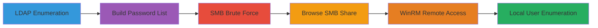

# LDAP-Enumeration-to-SMB-Brute-Force-Credential-Access-and-WinRM-Remote-Shell

This multi-stage attack chain targets Windows Active Directory environments by starting with anonymous LDAP enumeration to discover users and domain structure, building a targeted password list from contextual data, brute-forcing SMB services to obtain valid credentials, accessing shared resources, and finally using the credentials to establish a remote PowerShell session via WinRM for local user enumeration. The chain assumes network access to a domain-joined Windows target with exposed LDAP (port 389) and SMB (port 445) services, and WinRM enabled (port 5985/5986).

## Chain Metrics Dashboard

| Metric | Value |
|--------|-------|
| Chain Status | Verified |
| Total Steps | 6 |
| Execution Time | ~1-2 hours |
| Skill Level | Intermediate |
| Complexity | Medium |
| Impact Level | Medium |

## Attack Flow Visualization



## Prerequisites & Requirements

### Required Tools

- [[tools/OpenLDAP-Utils]]
- [[tools/CrackMapExec]]
- [[tools/Evil-WinRM]]
- [[tools/Samba]]

### Target Environment

- Windows domain controller or member server with LDAP (TCP/389) and SMB (TCP/445) exposed
- WinRM service enabled on target (TCP/5985 for HTTP, TCP/5986 for HTTPS)
- Network connectivity from attacker machine to target

### Initial Access Requirements

- No initial credentials required (anonymous LDAP bind assumed possible)
- Attacker positioned on the same network segment or with routing to target ports
- Basic reconnaissance to identify target IP

## Detailed Attack Procedures

### Step 1: Enumerate Domain Structure via LDAP
procedure: [[procedures/Query-LDAP-and-Enumerate-Base-DN]]

**Objective**: Perform anonymous LDAP queries to discover the domain's base DN and enumerate user accounts for targeting SMB brute force.

**Instructions**: Start by querying the LDAP root DSE to retrieve the domain naming context using [[commands/ldapsearch-query-root-dse-anonymous]]:

```bash
ldapsearch -x -h $_TARGET_IP -s base
```

Extract the rootDomainNamingContext (e.g., DC=example,DC=com). Then, query the base DN to list users with [[commands/ldapsearch-query-base-dn-anonymous]]:

```bash
ldapsearch -x -h $_TARGET_IP -b 'dc=example,dc=com' | grep sAMAccountName
```

**Expected Output**: Domain components (e.g., rootDomainNamingContext: DC=example,DC=com) and a list of sAMAccountNames.

**Success Indicators**:
- rootDomainNamingContext retrieved without authentication errors
- User accounts listed in the output

### Step 2: Build Targeted Password Dictionary
procedure: [[procedures/Build-Custom-Password-List-for-Dictionary-Attack]]

**Objective**: Create a customized password list using enumerated usernames and common patterns to optimize the SMB brute force and reduce noise.

**Instructions**: Use the enumerated usernames as a base. Include common passwords from curated lists (e.g., top 100 from SecLists). For web-related context, crawl any exposed target websites with [[commands/cewl-generate-wordlist-from-website]]:

```bash
cewl http://$_TARGET_IP -d 2 -m 5 -w passwords.txt
```

Mutate the list by appending digits if policy requires them using [[commands/hashcat-mutate-wordlist-append-digit]]:

```bash
hashcat -a 6 --stdout passwords.txt ?d > passwords_mutated.txt
```

Combine with usernames (e.g., password = username) into a final dictionary file.

**Expected Output**: A wordlist file (passwords_mutated.txt) with tailored entries like 'user123', 'password1'.

**Success Indicators**:
- Wordlist generated with relevant terms
- File size reasonable for online attacks (under 10,000 entries)

### Step 3: Brute Force SMB Credentials
procedure: [[procedures/Brute-Force-SMB-Credentials]]

**Objective**: Use the custom dictionary to brute force valid username/password combinations against the target's SMB service.

**Instructions**: Run CrackMapExec with the enumerated usernames and built password list using [[commands/crackmapexec-smb-brute-force]]:

```bash
crackmapexec smb $_TARGET_IP -u users.txt -p passwords_mutated.txt
```

Monitor for successful authentications (Pwn3d! indicator).

**Expected Output**: Output showing valid credentials, e.g., [+] TARGET\user:password (Pwn3d!).

**Success Indicators**:
- At least one valid credential pair identified
- No immediate account lockouts or IDS alerts

### Step 4: Access SMB Share with Obtained Credentials
procedure: [[procedures/Browse-SMB-Share-with-Credentials]]

**Objective**: Connect to the SMB share using brute-forced credentials to enumerate and potentially exfiltrate data.

**Instructions**: Use smbclient to connect to a common share (e.g., IPC$ or ADMIN$) with [[commands/smbclient-connect-authenticated]]:

```bash
smbclient -U $_USERNAME%$_PASSWORD //$_TARGET_IP/IPC$
```

Once connected, list files with 'ls' and download interesting ones with 'get filename'.

**Expected Output**: Interactive SMB prompt (smb: \> ls) showing share contents.

**Success Indicators**:
- Successful authentication and shell access
- Files or directories listed without errors

### Step 5: Establish Remote Shell via WinRM
procedure: [[procedures/Establish-WinRM-Remote-Shell]]

**Objective**: Use the SMB credentials to spawn an interactive PowerShell session on the target via WinRM for deeper access.

**Instructions**: Invoke Evil-WinRM with the valid credentials using [[commands/evil-winrm-connect-to-server]]:

```bash
evil-winrm.rb -i $_TARGET_IP -u $_USERNAME -p $_PASSWORD
```

Interact with the PowerShell prompt for further commands.

**Expected Output**: Evil-WinRM shell prompt (*Evil-WinRM* PS C:\Users\$_USERNAME\>).

**Success Indicators**:
- Connection established without authentication failure
- PowerShell commands executable remotely

### Step 6: Enumerate Local Users and Groups Remotely
procedure: [[procedures/Enumerate-Local-Users-and-Groups-on-Windows]]

**Objective**: From the WinRM shell, query local user accounts and group memberships to identify privileged users.

**Instructions**: In the WinRM session, list all local users with [[commands/net-user-list-local]]:

```command_prompt
net user
```

Then, for a specific user, get details and groups with [[commands/net-user-info-and-groups]]:

```command_prompt
net user $_TARGET_USER
```

**Expected Output**: List of users (e.g., Administrator, Guest) and details including group memberships (e.g., *Administrators).

**Success Indicators**:
- User list retrieved
- Group memberships visible for privilege assessment

## Attack Chain Summary

### Key Achievements

- Domain structure and users enumerated via anonymous LDAP
- Custom password dictionary built to enable efficient brute force
- Valid SMB credentials obtained for share access
- SMB shares browsed for potential data collection
- Remote PowerShell shell established via WinRM
- Local users and groups enumerated for further targeting

---

*Last updated: 2023-10-01T00:00:00.000000+00:00*
