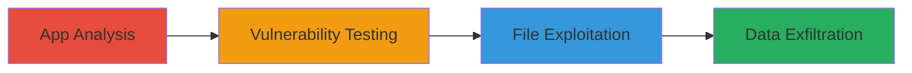

# LFI via Path Traversal in Starbucks Korea Mobile App API

Multi-stage attack chain demonstrating exploitation of a path traversal vulnerability in the Starbucks Korea mobile app's API to read arbitrary files from the server.

## Chain Metrics Dashboard

| Metric | Value |
|--------|-------|
| Chain Status | Unverified |
| Total Steps | 3 |
| Execution Time | ~15 minutes |
| Skill Level | Intermediate |
| Complexity | Medium |
| Impact Level | High |

## Attack Flow Visualization



## Prerequisites & Requirements

### Required Tools

- Network traffic analyzer (e.g., Wireshark or Burp Suite)
- HTTP client (e.g., curl)

### Target Environment

- Web platform
- Port 6443 open
- Access to Starbucks Korea mobile app for reverse engineering

### Initial Access Requirements

- Ability to install and run the mobile app
- Network access to https://msr.istarbucks.co.kr:6443
- No credentials required for public API testing

## Detailed Attack Procedures

### Step 1: App Analysis
procedure: [[procedures/Analyze-Mobile-App-for-API-Endpoints]]

**Objective**: Identify vulnerable API endpoints by analyzing the mobile app's network traffic.

**Instructions**: Install the Starbucks Korea app and monitor its traffic while interacting with features. Use a proxy like Burp Suite to capture requests to the API base URL https://msr.istarbucks.co.kr:6443/appif/.

**Expected Output**: List of API endpoints, including parameters that handle file paths.

**Success Indicators**:
- API calls to /appif/ directory identified
- File path parameters in requests noted

### Step 2: Vulnerability Testing
procedure: [[procedures/Test-API-Endpoint-for-Path-Traversal]]

**Objective**: Probe the API for path traversal weaknesses by injecting traversal sequences.

**Instructions**: Craft HTTP requests to the identified endpoint using [[commands/curl-path-traversal-test]] to append ../ sequences to file path parameters.

```bash
curl -X POST https://msr.istarbucks.co.kr:6443/appif/endpoint -d 'filepath=../../../etc/passwd' -H 'Content-Type: application/json'
```

**Expected Output**: Server response containing unintended file content or error revealing directory structure.

**Success Indicators**:
- Response includes data from outside the app directory
- No 404 or sanitization errors

### Step 3: File Exploitation
procedure: [[procedures/Exploit-LFI-to-Read-Arbitrary-Files]]

**Objective**: Leverage the path traversal to read sensitive files like system configs, source code, and logs.

**Instructions**: Escalate payloads to target specific files, such as /etc/passwd for system info or app source files. Use [[commands/curl-lfi-exploit]] with null byte terminators if needed for bypassing filters.

```bash
curl -X POST https://msr.istarbucks.co.kr:6443/appif/endpoint -d 'filepath=../../../var/log/app.log%00' -H 'Content-Type: application/json'
```

**Expected Output**: Contents of targeted files in the response body.

**Success Indicators**:
- Sensitive file contents retrieved (e.g., logs, source code)
- Proof-of-concept screenshots or dumps collected

## Attack Chain Summary

### Key Achievements

1. Discovered hidden API endpoint in mobile app
2. Confirmed path traversal allowing LFI
3. Retrieved server files demonstrating high impact

## Technique & Tactic Coverage

### MITRE ATT&CK Techniques

- [[Exploit Public-Facing Application]] Exploit Public-Facing Application
- [[File and Directory Discovery]] File and Directory Discovery

### MITRE ATT&CK Tactics

- [[Initial Access]] Initial Access
- [[Discovery]] Discovery

---
*Last updated: 2023-10-01T12:00:00Z*
