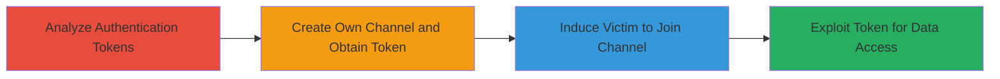

# LINE Notifications Channel Improper Authorization for Cross-Channel Notification Data Disclosure

Multi-stage attack chain demonstrating a complete attack workflow exploiting a bug in LINE's Notifications Channel service authentication, allowing cross-channel access to user notification data.

## Chain Metrics Dashboard

| Metric | Value |
|--------|-------|
| Chain Status | Unverified |
| Total Steps | 4 |
| Execution Time | ~30 minutes |
| Skill Level | Intermediate |
| Complexity | Medium |
| Impact Level | High |

## Attack Flow Visualization

## Prerequisites & Requirements

### Required Tools

- None (manual analysis and API interactions via browser or API client)

### Target Environment

- LINE Channels platform
- Notifications Channel service API
- Web/API access

### Initial Access Requirements

- Valid LINE developer account to create channels
- Ability to interact with LINE API endpoints
- No special network position required; public API access

## Detailed Attack Procedures

### Step 1: Analyze Authentication Tokens
procedure: [[procedures/Analyze-LINE-Channel-Authentication-Tokens]]

**Objective**: Identify the authentication bug allowing cross-channel token reuse in the Notifications Channel service.

**Instructions**: Review the LINE API documentation and test token isolation by inspecting network requests during channel creation and notification retrieval. Use browser developer tools to capture tokens and attempt cross-channel API calls to the Notifications Channel endpoint.

**Expected Output**: Confirmation that tokens from one channel can authenticate requests to another channel's notifications.

**Success Indicators**:
- Tokens observed to lack proper isolation
- Successful unauthorized API response from cross-channel test

### Step 2: Create Own LINE Channel and Obtain Authentication Token
procedure: [[procedures/Create-LINE-Channel-and-Obtain-Authentication-Token]]

**Objective**: Generate a valid authentication token from a controlled channel for later exploitation.

**Instructions**: Log in to the LINE developer console, create a new channel, and retrieve the channel access token via the API management section. Test the token by making a sample API call to verify its validity for the created channel.

**Expected Output**: A functional channel access token associated with the attacker's channel.

**Success Indicators**:
- Channel created successfully
- Token authenticates API requests for the new channel

### Step 3: Induce Victim to Join Attacker's LINE Channel
procedure: [[procedures/Induce-Victim-to-Join-Attackers-LINE-Channel]]

**Objective**: Link the victim's account to the attacker's channel, exposing their notifications via the shared service.

**Instructions**: Share the channel invite link with the victim through social engineering (e.g., email or message). Monitor the LINE admin panel to confirm the victim's join action, which registers their account in the Notifications Channel service.

**Expected Output**: Victim's account listed as a member in the attacker's channel.

**Success Indicators**:
- Victim joins the channel
- Notification service links victim's data to the channel

### Step 4: Exploit Cross-Channel Token Access to Retrieve Victim Notifications
procedure: [[procedures/Exploit-Cross-Channel-Token-Access-to-Retrieve-Victim-Notifications]]

**Objective**: Use the attacker's token to bypass authorization and disclose the victim's notification data.

**Instructions**: Construct an API request to the Notifications Channel endpoint using the attacker's token but targeting the victim's channel ID. Send the request via a tool like curl or Postman to fetch notification history.

**Expected Output**: Unauthorized access to victim's notifications, including sensitive data like message contents or timestamps.

**Success Indicators**:
- API returns victim's notification data
- No authorization error despite using foreign token

## Attack Chain Summary

### Key Achievements

1. Identified and validated the authentication isolation flaw in LINE's Notifications Channel.
2. Successfully created a controlled channel and obtained a reusable token.
3. Socially engineered victim join to expose their data.
4. Exploited the bug to disclose private notification information.

## Technique & Tactic Coverage

### MITRE ATT&CK Techniques

- [[Valid Accounts]]
- [[Exploit Public-Facing Application]]

### MITRE ATT&CK Tactics

- [[Initial Access]]
- [[Collection]]

---
*Last updated: 2023-10-01T00:00:00Z*
