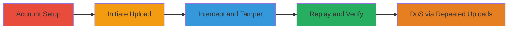

---
tags:
  - file-upload-bypass
  - dos
  - parameter-tampering
  - web-vuln
type: attack_chain
tools:
  - '[[tools/Burp-Suite-Pro]]'
tactics:
  - '[[Execution]]'
  - '[[Impact]]'
commands: []
platforms:
  - Web
complexity: medium
procedures:
  - '[[procedures/Create-LISTSERV-Account-and-Initiate-Upload]]'
  - '[[procedures/Bypass-ImgNum-Parameter-with-Burp-Suite]]'
  - '[[procedures/Verify-Custom-File-Upload]]'
step_count: 10
techniques:
  - '[[Exploit Public-Facing Application]]'
  - '[[Remote File Copy]]'
  - '[[Endpoint Denial of Service]]'
description: >-
  Exploits missing server-side validation in LISTSERV 16.0 logo upload to bypass
  slot limits, enabling unlimited custom file uploads that can exhaust disk
  space for DoS.
skill_level: intermediate
impact_level: high
id: ed80cbf2-5b59-4a30-9ed4-449e245dff1d
created_at: '2025-12-14T05:32:10.181Z'
updated_at: '2025-12-14T05:32:10.181Z'
verified: false
validated: true
submitted: true
mitre_tactics:
  - '[[Execution]]'
  - '[[Impact]]'
mitre_techniques:
  - '[[Exploit Public-Facing Application]]'
  - '[[Remote File Copy]]'
  - '[[Endpoint Denial of Service]]'
---
# LISTSERV 16.0 File Upload Restriction Bypass Leading to DoS

Multi-stage attack chain demonstrating a complete attack workflow exploiting client-side only enforcement in LISTSERV 16.0's logo upload feature. By tampering with the 'imgnum' parameter using a proxy tool, attackers can upload unlimited files with custom names, potentially filling the server's disk and causing Application Denial of Service (DoS).

## Chain Metrics Dashboard

| Metric | Value |
|--------|-------|
| Chain Status | Unverified |
| Total Steps | 10 |
| Execution Time | ~15 minutes |
| Skill Level | Intermediate |
| Complexity | Medium |
| Impact Level | High |

## Attack Flow Visualization

## Prerequisites & Requirements

### Required Tools

- [[tools/Burp-Suite-Pro]]

### Target Environment

- LISTSERV 16.0 web application
- CGI-based scripting (wa.cgi)
- Web browser for initial access

### Initial Access Requirements

- Public access to the LISTSERV instance (e.g., http://target/scripts/wa.cgi)
- No prior credentials needed; account creation is part of the attack
- Network connectivity to intercept HTTP traffic

## Detailed Attack Procedures

### Step 1: Navigate to Target and Create Account
procedure: [[procedures/Create-LISTSERV-Account-and-Initiate-Upload]]

**Objective**: Gain initial access by registering a user account on the LISTSERV platform.

**Instructions**: Open a web browser and access the target LISTSERV instance at http://█████████. Locate the registration form and create a new user account with valid details (e.g., email, username, password).

**Expected Output**: Successful account creation confirmation and login prompt.

**Success Indicators**:
- Account registered without errors
- Able to log in to the user dashboard

### Step 2: Log In and Access Preferences
procedure: [[procedures/Create-LISTSERV-Account-and-Initiate-Upload]]

**Objective**: Authenticate and navigate to the upload interface.

**Instructions**: Log in with the new credentials. From the user menu, go to Preferences and select the 'Newsletter Profile' tab.

**Expected Output**: Newsletter Profile page loads, showing options like logo slots.

**Success Indicators**:
- Logged in successfully
- Profile editing interface accessible

### Step 3: Select Logo Slot and Choose Image
procedure: [[procedures/Create-LISTSERV-Account-and-Initiate-Upload]]

**Objective**: Prepare the standard upload form to capture the request.

**Instructions**: In the logos section, select the default 'Slot 1' (imgnum=1). Click the browse button to select a small image file (e.g., a PNG or JPEG under 1MB).

**Expected Output**: File selected in the form field.

**Success Indicators**:
- Image file path displayed in the form
- Form ready for submission

### Step 4: Submit Update to Trigger Upload
procedure: [[procedures/Create-LISTSERV-Account-and-Initiate-Upload]]

**Objective**: Initiate the POST request for interception.

**Instructions**: Click the 'Update' button to submit the form, sending the multipart/form-data POST request to the logo upload endpoint.

**Expected Output**: Request captured if proxy is active; otherwise, standard upload confirmation.

**Success Indicators**:
- Form submission triggers HTTP POST
- No immediate errors on client side

### Step 5: Capture and Modify imgnum Parameter
procedure: [[procedures/Bypass-ImgNum-Parameter-with-Burp-Suite]]

**Objective**: Intercept the upload request and alter the slot limit parameter.

**Instructions**: Configure your browser to proxy through Burp Suite. Capture the POST request in Burp's Proxy tab. In the request editor, locate the 'imgnum' parameter (originally 1-10) and change it to an arbitrary value like '50' or 'cow'.

**Expected Output**: Modified request visible in Burp with updated imgnum.

**Success Indicators**:
- Parameter successfully changed without breaking request syntax
- No client-side validation blocks the edit

### Step 6: Append Arbitrary Value to Logo Data
procedure: [[procedures/Bypass-ImgNum-Parameter-with-Burp-Suite]]

**Objective**: Tamper with the file payload to match the custom parameter for naming.

**Instructions**: In the 'logo' multipart field, append the same arbitrary value (e.g., 'cow') to the end of the binary image data. Ensure the Content-Type remains image/* and the payload is valid multipart/form-data.

**Expected Output**: Updated payload in Burp showing appended text after image bytes.

**Success Indicators**:
- Payload modification complete
- Request parses correctly in Burp

### Step 7: Replay the Tampered Request
procedure: [[procedures/Bypass-ImgNum-Parameter-with-Burp-Suite]]

**Objective**: Send the modified request to bypass server restrictions.

**Instructions**: Forward the tampered POST request from Burp to the server.

**Expected Output**: Server accepts the request (HTTP 200 or redirect), uploading the file with custom name.

**Success Indicators**:
- No server rejection (e.g., 400/500 errors)
- Upload completes without visible errors

### Step 8: Construct Retrieval URL with Custom imgnum
procedure: [[procedures/Verify-Custom-File-Upload]]

**Objective**: Access the uploaded file using the tampered parameter.

**Instructions**: Note the session's Y parameter (e.g., 9e44b517). Construct the URL: http://█████/scripts/wa.cgi?VL&Y=9e44b517&imgnum=<INSERT MODIFIED VALUE HERE>, replacing with e.g., 'cow'.

**Expected Output**: Page loads with the custom-named logo or direct file access.

**Success Indicators**:
- URL accessible without 404
- Custom imgnum recognized by server

### Step 9: Access Specific Retrieval Endpoint
procedure: [[procedures/Verify-Custom-File-Upload]]

**Objective**: Confirm the upload by retrieving the file.

**Instructions**: Navigate to the full URL, e.g., http://█████████/scripts/wa.cgi?VL&Y=9e44b517&imgnum=cow. Adjust Y if needed for your session.

**Expected Output**: Image or file served from the custom slot.

**Success Indicators**:
- File downloads or displays
- No access denied errors

### Step 10: Verify by Examining File Content
procedure: [[procedures/Verify-Custom-File-Upload]]

**Objective**: Validate the bypass by checking appended data.

**Instructions**: Download the retrieved image. Open it in a text editor (e.g., hex editor or notepad for trailing text) to confirm the appended value (e.g., 'cow') at the end.

**Expected Output**: File contents show image data followed by the custom string.

**Success Indicators**:
- Appended value present
- File integrity otherwise intact

To achieve DoS, repeat steps 3-7 with large files or high volume to exhaust disk space.

## Attack Chain Summary

### Key Achievements

1. Bypassed client-side only upload slot limits (1-10) for unlimited files.
2. Enabled custom filename control via parameter tampering.
3. Demonstrated potential for disk exhaustion DoS on the server.

## Technique & Tactic Coverage

### MITRE ATT&CK Techniques

- [[Exploit Public-Facing Application]]
- [[Remote File Copy]]
- [[Endpoint Denial of Service]]

### MITRE ATT&CK Tactics

- [[Execution]]
- [[Impact]]

---
*Last updated: 2023-10-01*
