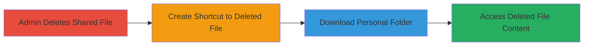

---
tags:
  - authorization-bypass
  - file-access
  - cloud-storage
  - lark
type: attack_chain
tools: []
tactics:
  - '[[Initial Access]]'
  - '[[Collection]]'
verified: false
platforms:
  - Web
  - Cloud
submitted: true
complexity: medium
created_at: '2023-10-01T00:00:00Z'
procedures:
  - '[[procedures/Admin-Deletes-Shared-File-in-Lark]]'
  - '[[procedures/Create-Shortcut-to-Deleted-File-in-Personal-Folder]]'
  - '[[procedures/Download-Personal-Folder-to-Access-Deleted-File]]'
step_count: 3
techniques:
  - '[[Exploit Public-Facing Application]]'
updated_at: '2025-12-14T17:29:09.941Z'
description: >-
  Multi-stage attack chain exploiting a vulnerability in Lark Technologies' file
  sharing and shortcut features to bypass admin deletions and access sensitive
  deleted files.
skill_level: intermediate
impact_level: medium
id: 339bb901-b360-451f-9eda-834f7c7bdb53
validated: true
mitre_tactics:
  - '[[Initial Access]]'
  - '[[Collection]]'
mitre_techniques:
  - '[[Exploit Public-Facing Application]]'
---
# Lark File Deletion Bypass via Shortcuts for Unauthorized Access

Multi-stage attack chain demonstrating a complete attack workflow.

## Chain Metrics Dashboard

| Metric | Value |
|--------|-------|
| Chain Status | Unverified |
| Total Steps | 3 |
| Execution Time | ~5 minutes |
| Skill Level | Intermediate |
| Complexity | Medium |
| Impact Level | Medium |

## Attack Flow Visualization

## Prerequisites & Requirements

### Required Tools

- None (web-based UI exploitation)

### Target Environment

- Lark Technologies platform (web/cloud file sharing service)
- Required services/ports: Web access to Lark app (HTTPS/443)
- Network access requirements: Valid user account in Lark

### Initial Access Requirements

- Credential requirements: Regular user account with prior shared access to the file
- Network position: Internal or authenticated access to Lark
- Prior access needed: Knowledge of the deleted file's location or ID

## Detailed Attack Procedures

### Step 1: Admin Deletes Shared File
procedure: [[procedures/Admin-Deletes-Shared-File-in-Lark]]

**Objective**: Set up the scenario by having an admin remove a shared file, enforcing deletion restrictions that should prevent access.

**Instructions**: As an administrator, navigate to the shared file in the Lark interface and initiate deletion. This action removes the file from shared access, blocking downloads and usage for all users.

**Expected Output**: File marked as deleted in shared folders; users can no longer directly access or download it.

**Success Indicators**:
- Confirmation message in Lark UI showing file deletion
- Attempt to access the file directly fails with access denied

### Step 2: Create Shortcut to Deleted File in Personal Folder
procedure: [[procedures/Create-Shortcut-to-Deleted-File-in-Personal-Folder]]

**Objective**: Exploit the shortcut feature by creating a reference to the deleted file in a personal folder, bypassing deletion validation.

**Instructions**: Log in as a regular user, navigate to your personal folder in Lark, and use the shortcut creation tool to reference the ID or path of the recently deleted shared file. The shortcut mechanism fails to check the file's deletion status.

**Expected Output**: Shortcut appears in the personal folder without errors, linking to the deleted file.

**Success Indicators**:
- Shortcut icon visible in personal folder
- No validation errors during shortcut creation

### Step 3: Download Personal Folder to Access Deleted File
procedure: [[procedures/Download-Personal-Folder-to-Access-Deleted-File]]

**Objective**: Download the personal folder containing the shortcut, which resolves the link and provides indirect access to the deleted file's content.

**Instructions**: In the Lark UI, select the personal folder with the shortcut and initiate a download. The system resolves the shortcut during the download process, retrieving the original file content despite its deleted status.

**Expected Output**: Downloaded folder archive containing the full content of the deleted file.

**Success Indicators**:
- Successful folder download without errors
- Extracted archive reveals the sensitive deleted file content

## Attack Chain Summary

### Key Achievements

1. Bypassed admin-enforced file deletion restrictions
2. Gained unauthorized access to sensitive deleted files via shortcut indirection
3. Demonstrated medium-impact vulnerability leading to data exposure

## Technique & Tactic Coverage

### MITRE ATT&CK Techniques

- [[Exploit Public-Facing Application]]

### MITRE ATT&CK Tactics

- [[Initial Access]]
- [[Collection]]

---
*Last updated: 2023-10-01T00:00:00Z*
