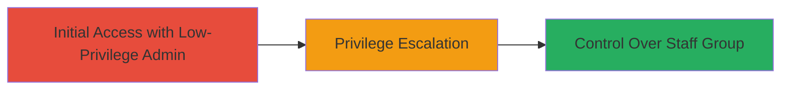

# Lark Technologies Privilege Escalation via Improper Admin Access Control

Multi-stage attack chain demonstrating a complete attack workflow.

## Chain Metrics Dashboard

| Metric | Value |
|--------|-------|
| Chain Status | Unverified |
| Total Steps | 1 |
| Execution Time | ~5 minutes |
| Skill Level | Intermediate |
| Complexity | Medium |
| Impact Level | High |

## Attack Flow Visualization

## Prerequisites & Requirements

### Required Tools

- None (manual web interface testing)

### Target Environment

- Lark Technologies web platform
- Admin account with 'Company Info' permissions
- Access to members and orgs tab

### Initial Access Requirements

- Valid invited admin credentials with 'Company Info' permissions only
- Network access to the Lark platform
- No prior elevated access needed

## Detailed Attack Procedures

### Step 1: Exploit Access Control in Admin Permissions
procedure: [[procedures/Exploit-Lark-Admin-Access-Control-for-Staff-Group-Modification]]

**Objective**: Identify and exploit improper permission checks to escalate privileges by modifying the all-staff group settings.

**Instructions**: Log in to the Lark platform using the low-privilege admin account. Navigate to the members and orgs tab. Attempt to access and modify the Staff group settings, such as editing, accessing, or deleting the all-staff group. No specific commands are required; this is performed via the web UI by testing boundary conditions on permission scopes.

**Expected Output**: Successful modification of Staff group settings, including the ability to edit member lists, access sensitive data, or delete the group.

**Success Indicators**:
- Ability to view or edit Staff group without appropriate permissions
- Changes applied to all-staff group members' data and settings
- No error messages blocking the action

## Attack Chain Summary

### Key Achievements

1. Unauthorized access to high-privilege Staff group settings from a low-privilege admin account
2. Potential control over all staff members' data, enabling further escalation or data manipulation
3. Demonstration of improper access control vulnerability in the platform's permission model

## Technique & Tactic Coverage

### MITRE ATT&CK Techniques

- [[Exploitation for Privilege Escalation]]

### MITRE ATT&CK Tactics

- [[Privilege Escalation]]

---
*Last updated: 2023-10-01T00:00:00Z*
