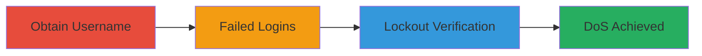

# Lichess Account Lockout DoS via Username-Based Authentication Throttling

Multi-stage attack chain demonstrating a complete denial-of-service workflow against Lichess authentication.

## Chain Metrics Dashboard

| Metric | Value |
|--------|-------|
| Chain Status | Unverified |
| Total Steps | 3 |
| Execution Time | ~5 minutes |
| Skill Level | Beginner |
| Complexity | Low |
| Impact Level | Medium |

## Attack Flow Visualization

## Prerequisites & Requirements

### Required Tools

- None (uses browser or basic HTTP client like curl)

### Target Environment

- Lichess web platform
- Public internet access
- No specific ports required beyond standard HTTPS (443)

### Initial Access Requirements

- No credentials needed
- Public network access to lichess.org
- No prior access required

## Detailed Attack Procedures

### Step 1: Obtain Valid Username
procedure: [[procedures/Obtain-Valid-Lichess-Username]]

**Objective**: Identify a target username to lock out, using publicly available information.

**Instructions**: Browse the Lichess user directory, leaderboard, or search for public profiles to find a valid username. For example, visit https://lichess.org/player and note a username like "exampleuser".

**Expected Output**: A list of valid usernames.

**Success Indicators**:
- Username confirmed as valid via public profile existence
- No authentication required for discovery

### Step 2: Perform Failed Login Attempts
procedure: [[procedures/Perform-Failed-Login-Attempts]]

**Objective**: Trigger rate limiting by submitting multiple incorrect login attempts for the target username.

**Instructions**: Use a browser or HTTP client to submit 5-10 login attempts with the target username and random incorrect passwords to the login endpoint (https://lichess.org/login). Rotate IPs if needed using proxies or VPNs to bypass any potential IP checks, though the vulnerability ties limits only to username.

**Expected Output**: Failed login responses, potentially with increasing delay or error messages.

**Success Indicators**:
- Multiple attempts succeed without IP-based blocking
- Application begins to show throttling signs after 5-10 tries

### Step 3: Verify Account Lockout
procedure: [[procedures/Verify-Account-Lockout]]

**Objective**: Confirm the account is locked out by attempting a valid login from a different location.

**Instructions**: From a new IP or session, attempt a login with the correct credentials for the target account (if known) or simulate legitimate access. The application should deny login due to the triggered lockout.

**Expected Output**: Error message indicating account locked or rate limited, preventing access.

**Success Indicators**:
- Legitimate login attempt fails with lockout message
- Existing sessions remain active, but new logins are blocked

## Attack Chain Summary

### Key Achievements

1. Public username discovery without authentication
2. Account lockout via username-only throttling
3. Denial of new logins, causing user disruption and support load

## Technique & Tactic Coverage

### MITRE ATT&CK Techniques

- [[Endpoint Denial of Service]]

### MITRE ATT&CK Tactics

- [[Impact]]

---
*Last updated: 2023-10-01T00:00:00Z*
