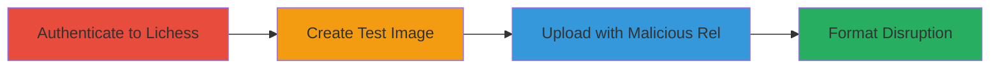

# Lichess Image Upload ImageId Format Injection via Malicious Rel Parameter

Multi-stage attack chain demonstrating improper input validation in the Lichess image upload endpoint, allowing colon injection into the 'rel' parameter to disrupt the standard ImageId format of '{rel}:{random12}:{random8}.{extension}', potentially leading to parsing issues in markdown processing or image lookup components.

## Chain Metrics Dashboard

| Metric | Value |
|--------|-------|
| Chain Status | Unverified |
| Total Steps | 3 |
| Execution Time | ~5 minutes |
| Skill Level | Intermediate |
| Complexity | Low |
| Impact Level | Low |

## Attack Flow Visualization



## Prerequisites & Requirements

### Required Tools

- [[tools/curl]]
- [[tools/echo]]

### Target Environment

- Web platform (Lichess.org)
- Required services: Image upload endpoint (/upload/image/user/{rel})
- Network access: Internet connectivity to https://lichess.org

### Initial Access Requirements

- Valid Lichess account credentials for authentication
- No prior access needed beyond public internet

## Detailed Attack Procedures

### Step 1: Authenticate to Lichess

procedure: [[procedures/Authenticate-to-Lichess-and-Obtain-Session-Cookie]]

**Objective**: Gain authenticated access to Lichess to obtain a valid session cookie for subsequent upload requests.

**Instructions**: Log in to the Lichess application via the web interface or API to capture the session cookie (lila2).

**Expected Output**: Valid session cookie for use in authenticated requests.

**Success Indicators**:
- Successful login confirmed
- Session cookie (lila2=...) extracted from browser or response headers

### Step 2: Create Test Image

procedure: [[procedures/Create-Minimal-Test-PNG-Image]]

**Objective**: Generate a small, valid PNG file to use in the upload without requiring external image creation tools.

**Instructions**: Use the [[commands/create-minimal-png]] command to produce a 1x1 pixel PNG file.

```bash
echo -e '\x89PNG\r\n\x1a\n\x00\x00\x00\rIHDR\x00\x00\x00\x01\x00\x00\x00\x01\x08\x02\x00\x00\x00\x90wS\xde\x00\x00\x00\x0cIDATx\x9cc\xf8\x00\x00\x00\x01\x00\x01\x00\x00\x00\x00\x16\x1d\xb3\x00\x00\x00\x00IEND\xaeB`\x82'> test.png
```

**Expected Output**: A valid 1x1 PNG file named test.png.

**Success Indicators**:
- File test.png created and verifiable as valid PNG (e.g., via file command or image viewer)
- File size small (~50 bytes)

### Step 3: Upload Image with Malicious Rel

procedure: [[procedures/Upload-Image-with-Malicious-Rel-Parameter]]

**Objective**: Exploit the input validation flaw by sending a POST request with colons in the rel parameter to inject into the ImageId format.

**Instructions**: Use [[commands/curl-malicious-upload]] to POST the test image to the endpoint with a rel containing colons (e.g., test:evil:format:break).

```bash
curl -X POST "https://lichess.org/upload/image/user/test:evil:format:break" -b "lila2=YOUR_SESSION_COOKIE" -H "Origin: https://lichess.org" -H "Referer: https://lichess.org/" -F "image=@test.png"
```

**Expected Output**: JSON response with imageUrl containing a malformed ImageId like 'test:evil:format:break:ePU9oRLnNvCz:iFZRITKQ.png' (6 parts instead of 3).

**Success Indicators**:
- HTTP 200 response with successful upload
- ImageId in response shows extra colons, confirming format break
- Potential logs or downstream errors in parsing (if observable)

## Attack Chain Summary

### Key Achievements

1. Authenticated access to Lichess upload functionality
2. Creation of a minimal test image for exploitation
3. Successful injection of colons into rel parameter, resulting in malformed ImageId and potential parsing disruptions

## Technique & Tactic Coverage

### MITRE ATT&CK Techniques

- [[Exploit Public-Facing Application]]

### MITRE ATT&CK Tactics

- [[Initial Access]]

---

*Last updated: 2023-10-01T00:00:00Z*
