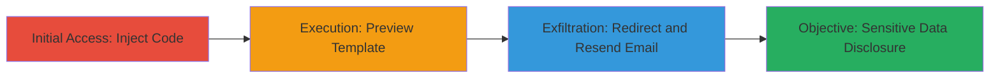

---
id: ac-uuid-12345
name: Limited RCE and Information Disclosure via Liquid Template Injection in Shopify Notifications
type: attack_chain
description: Multi-stage attack exploiting improper validation in Shopify's Liquid templating system to inject code into notification templates, enabling limited remote code execution for information disclosure of sensitive data like hashed passwords.
verified: false
submitted: false
step_count: 3
created_at: 2023-10-01T12:00:00Z
updated_at: 2023-10-01T12:00:00Z
procedures: [[procedures/Inject-Malicious-Liquid-Code-into-Notification-Template]], [[procedures/Preview-Template-for-Code-Execution-and-Info-Gathering]], [[procedures/Exfiltrate-Sensitive-Data-via-Order-Email-Redirect]]
techniques: [[JavaScript]], [[Credentials In Files]]
tactics: [[Execution]], [[Collection]]
tags: liquid-injection, ssti, rce, info-disclosure, shopify
platforms: Web
tools: []
---

# Limited RCE and Information Disclosure via Liquid Template Injection in Shopify Notifications

Multi-stage attack chain demonstrating a complete attack workflow exploiting Shopify's Liquid templating vulnerability for code injection and data exfiltration.

## Chain Metrics Dashboard

| Metric | Value |
|--------|-------|
| Chain Status | Unverified |
| Total Steps | 3 |
| Execution Time | ~10 minutes |
| Skill Level | Intermediate |
| Complexity | Medium |
| Impact Level | High |

## Attack Flow Visualization

## Prerequisites & Requirements

### Required Tools

- None (UI-based exploitation via Shopify admin)

### Target Environment

- Shopify shop administrator access
- Web browser for admin interface navigation
- No specific ports or services beyond standard HTTPS (443)

### Initial Access Requirements

- Valid shop admin credentials
- Access to editable Liquid templates in notifications
- An existing order or draft order for manipulation

## Detailed Attack Procedures

### Step 1: Inject Malicious Liquid Code
procedure: [[procedures/Inject-Malicious-Liquid-Code-into-Notification-Template]]

**Objective**: Insert malicious Liquid code into the New Order notification template to enable method calls on Ruby objects like OrderDrop.

**Instructions**: Navigate to the Shopify admin dashboard, go to Settings > Notifications, select the New Order template, and append Liquid code such as `{{ methods | json }} {{ systemu }} {{ class }} {{ to_yaml }}` in the email body textbox.

**Expected Output**: Template saves without errors, ready for preview or rendering.

**Success Indicators**:
- Template edited successfully
- No validation errors on save

### Step 2: Preview Template for Code Execution
procedure: [[procedures/Preview-Template-for-Code-Execution-and-Info-Gathering]]

**Objective**: Execute the injected code by previewing the template to disclose object methods, class information, and YAML dumps without sending emails.

**Instructions**: In the notification template editor, click the "Preview" button. The Liquid engine renders the template, calling public Ruby methods and displaying output like JSON of available methods and YAML-serialized object properties.

**Expected Output**: Browser displays sensitive info such as listed methods (e.g., `to_yaml`), system details, and object dumps revealing hidden fields.

**Success Indicators**:
- Preview renders without crashing
- Output includes method lists or YAML data
- Evidence of info disclosure (e.g., hashed passwords if applicable)

### Step 3: Exfiltrate Sensitive Data via Email Redirect
procedure: [[procedures/Exfiltrate-Sensitive-Data-via-Order-Email-Redirect]]

**Objective**: Manipulate an order to route the malicious template rendering to an attacker-controlled email, exfiltrating sensitive data like hashed passwords.

**Instructions**: Select an order touched by the target victim (e.g., shop owner), edit the customer email to an attacker-controlled address via the Customers admin interface, then resend the order confirmation email to trigger rendering of the `{{ to_yaml }}` code.

**Expected Output**: Email received at attacker address containing YAML dump of order object, including sensitive properties like user hashes.

**Success Indicators**:
- Email successfully resent
- Attacker receives email with disclosed data
- Confirmation of bypassed access controls

## Attack Chain Summary

### Key Achievements

1. Injected arbitrary public Ruby method calls via Liquid templates
2. Achieved limited RCE for info disclosure without arguments
3. Exfiltrated sensitive data (e.g., hashed passwords) via email redirection, bypassing normal access controls

## Technique & Tactic Coverage

### MITRE ATT&CK Techniques

- [[JavaScript]] JavaScript (adapted for Liquid templating injection)
- [[Credentials In Files]] Credentials In Files (hashed passwords via object dumps)

### MITRE ATT&CK Tactics

- [[Execution]] Execution
- [[Collection]] Collection

---
*Last updated: 2023-10-01T12:00:00Z*
