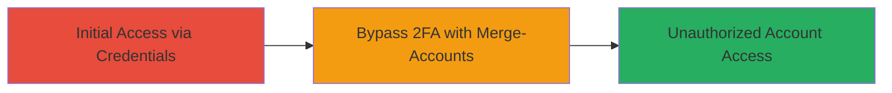

---
tags:
  - 2fa-bypass
  - auth-bypass
  - linkedin
type: attack_chain
tools: []
tactics:
  - '[[Initial Access]]'
verified: false
platforms:
  - Web
submitted: true
created_at: '2023-10-01T00:00:00Z'
procedures:
  - '[[procedures/Bypass-2FA-Using-Merge-Accounts]]'
step_count: 1
techniques:
  - '[[Valid Accounts]]'
  - '[[Exploit Public-Facing Application]]'
updated_at: '2025-12-14T17:31:42.783Z'
description: >-
  A single-stage attack exploiting the LinkedIn merge-accounts feature to bypass
  two-factor authentication and gain unauthorized access to victim accounts.
id: f4528f5c-5380-4d54-a946-eefc5283d729
validated: true
mitre_tactics:
  - '[[Initial Access]]'
mitre_techniques:
  - '[[Valid Accounts]]'
  - '[[Exploit Public-Facing Application]]'
---
# LinkedIn 2FA Bypass via Merge-Accounts Feature

Multi-stage attack chain demonstrating a complete attack workflow.

## Chain Metrics Dashboard

| Metric | Value |
|--------|-------|
| Chain Status | Unverified |
| Total Steps | 1 |
| Execution Time | ~5 minutes |
| Skill Level | Intermediate |
| Complexity | Medium |
| Impact Level | High |

## Attack Flow Visualization

## Prerequisites & Requirements

### Required Tools

- Web browser (e.g., Chrome or Firefox with developer tools)

### Target Environment

- LinkedIn web application
- Active user account with known credentials
- No prior 2FA setup on attacker's account

### Initial Access Requirements

- Victim's email and password
- Attacker's LinkedIn account
- Network access to LinkedIn.com

## Detailed Attack Procedures

### Step 1: Bypass 2FA Using Merge-Accounts
procedure: [[procedures/Bypass-2FA-Using-Merge-Accounts]]

**Objective**: Gain access to the victim's LinkedIn account without triggering 2FA by exploiting the merge-accounts feature.

**Instructions**: Log in to your own LinkedIn account. Navigate to the account settings and initiate the merge-accounts process using the victim's credentials. The system will merge the accounts without enforcing 2FA on the victim's side, granting access to the victim's profile and data.

**Expected Output**: Successful login to the victim's account dashboard, with full access to posts, connections, and settings.

**Success Indicators**:
- Access to victim's private data without 2FA prompt
- Ability to perform actions as the victim (e.g., view messages)

## Attack Chain Summary

### Key Achievements

1. Bypassed LinkedIn's 2FA security controls
2. Achieved unauthorized access to victim accounts
3. Demonstrated flaw in merge-accounts authentication logic

## Technique & Tactic Coverage

### MITRE ATT&CK Techniques

- [[Valid Accounts]]
- [[Exploit Public-Facing Application]]

### MITRE ATT&CK Tactics

- [[Initial Access]]

---
*Last updated: 2023-10-01T00:00:00Z*
