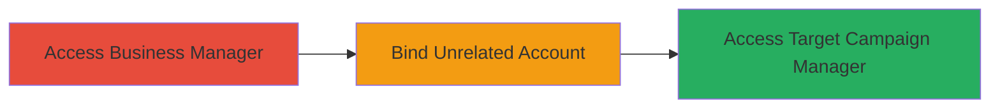

# LinkedIn Business Manager Authorization Bypass for Ad Account Takeover

Multi-stage attack chain demonstrating a complete attack workflow exploiting an authorization flaw in LinkedIn's advertising platform.

## Chain Metrics Dashboard

| Metric | Value |
|--------|-------|
| Chain Status | Unverified |
| Total Steps | 1 |
| Execution Time | ~5 minutes |
| Skill Level | Intermediate |
| Complexity | Medium |
| Impact Level | High |

## Attack Flow Visualization

## Prerequisites & Requirements

### Required Tools

- Web browser (e.g., Chrome with developer tools)

### Target Environment

- LinkedIn Marketing Solutions platform
- Access to a legitimate Business Manager account
- Knowledge of target Campaign Manager account ID

### Initial Access Requirements

- Valid LinkedIn credentials for attacker's Business Manager
- No special network access beyond standard internet
- Prior reconnaissance to identify target account IDs

## Detailed Attack Procedures

### Step 1: Exploit Authorization Bypass
procedure: [[procedures/Bind-Unrelated-Campaign-Manager-Account]]

**Objective**: Bind an unrelated Campaign Manager account to the attacker's Business Manager, gaining unauthorized access to the target's ad accounts.

**Instructions**: Log in to your LinkedIn Business Manager. Navigate to the account settings or integration section where Campaign Manager binding is available. Enter the ID of the target unrelated Campaign Manager account and attempt to bind it. Due to the authorization flaw, the system will accept the binding without proper validation of ownership.

**Expected Output**: Successful binding confirmation, with the target Campaign Manager now listed under your Business Manager.

**Success Indicators**:
- Target account appears in your Business Manager dashboard
- Ability to view and manage the target's ad campaigns
- No error messages during binding process

## Attack Chain Summary

### Key Achievements

1. Unauthorized binding of external Campaign Manager accounts
2. Privilege escalation to control target ad accounts
3. Potential for ad account takeover and manipulation

## Technique & Tactic Coverage

### MITRE ATT&CK Techniques

- [[Exploitation for Privilege Escalation]] Exploitation for Privilege Escalation
- [[Exploit Public-Facing Application]] Exploit Public-Facing Application

### MITRE ATT&CK Tactics

- [[Privilege Escalation]] Privilege Escalation

---
*Last updated: 2023-10-01T00:00:00Z*
