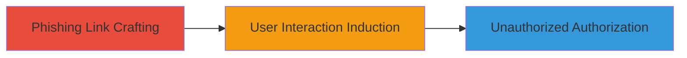

---
tags:
  - oauth
  - phishing
  - social-engineering
  - authorization-bypass
  - linkedin
type: attack_chain
tools: []
tactics:
  - '[[Initial Access]]'
commands: []
platforms:
  - Web
complexity: medium
procedures:
  - '[[procedures/Craft-Phishing-Link-for-LinkedIn-OAuth-Exploitation]]'
  - '[[procedures/Induce-User-Interaction-via-Social-Engineering]]'
  - '[[procedures/Complete-Unauthorized-App-Binding-on-LinkedIn]]'
step_count: 3
techniques:
  - '[[T1566.002]]'
  - '[[Exploit Public-Facing Application]]'
description: >-
  A social engineering attack exploiting a flaw in LinkedIn's OAuth process to
  force unauthorized app binding by tricking users into holding the space key on
  a manipulated phishing link.
skill_level: intermediate
impact_level: medium
id: ef589407-886c-4580-8179-1fa8faaf4103
created_at: '2025-12-14T17:30:35.382Z'
updated_at: '2025-12-14T17:30:35.382Z'
verified: false
validated: true
submitted: true
mitre_tactics:
  - '[[Initial Access]]'
mitre_techniques:
  - '[[T1566.002]]'
  - '[[Exploit Public-Facing Application]]'
---
# LinkedIn Forced OAuth Authorization via Phishing Link and Space Key Manipulation

## Overview

This attack chain exploits a vulnerability in LinkedIn's OAuth authorization process, allowing attackers to perform social engineering that tricks users into authorizing a malicious third-party app without explicit consent. By crafting a phishing link with a manipulated URL hash targeting a button ID, and instructing the user to hold down the space key, the OAuth flow is forced to complete, binding the app to the user's account. The impact is limited to unauthorized app access with restricted scopes, but it demonstrates a bypass of consent mechanisms requiring user interaction.

## Chain Metrics Dashboard

| Metric | Value |
|--------|-------|
| Chain Status | Unverified |
| Total Steps | 3 |
| Execution Time | ~5 minutes |
| Skill Level | Intermediate |
| Complexity | Medium |
| Impact Level | Medium |

## Attack Flow Visualization

## Prerequisites & Requirements

### Required Tools

- None (relies on web browser and URL manipulation)

### Target Environment

- LinkedIn web platform
- OAuth-enabled third-party app registration
- Web browser for link delivery

### Initial Access Requirements

- Ability to send phishing links (e.g., via email or messaging)
- No prior credentials needed, but social engineering targets LinkedIn users

## Detailed Attack Procedures

### Step 1: Craft Phishing Link
procedure: [[procedures/Craft-Phishing-Link-for-LinkedIn-OAuth-Exploitation]]

**Objective**: Create a manipulated URL that exploits the OAuth flow by targeting a button ID in the hash fragment to initiate authorization without consent.

**Instructions**: Register a third-party app with LinkedIn's OAuth API to obtain client credentials. Construct the phishing URL by appending a hash fragment (e.g., #button-id) that references an authorization button in the OAuth UI. Embed this in a social engineering message, such as "Hold space to continue login."

**Expected Output**: A clickable link that, when visited, loads the OAuth page with the manipulated hash.

**Success Indicators**:
- Link generated and tested in a browser to confirm OAuth page loads with hash applied
- No immediate errors in URL parsing

### Step 2: Induce User Interaction
procedure: [[procedures/Induce-User-Interaction-via-Social-Engineering]]

**Objective**: Trick the target into visiting the link and performing the required keyboard input to trigger the forced authorization.

**Instructions**: Deliver the phishing link via email, DM, or other channels, using pretext like "Verify your LinkedIn account by holding space on this page." Once visited, the page requires the user to hold the space key to simulate a button press, bypassing explicit consent.

**Expected Output**: User visits the page and holds space, advancing the OAuth flow.

**Success Indicators**:
- User confirms interaction (e.g., via follow-up or observed behavior)
- OAuth UI responds to space key hold without additional prompts

### Step 3: Complete Unauthorized Binding
procedure: [[procedures/Complete-Unauthorized-App-Binding-on-LinkedIn]]

**Objective**: Finalize the OAuth process to bind the malicious app to the user's account with limited scopes.

**Instructions**: As the user holds space, the manipulated hash triggers the authorization endpoint. Monitor the callback or app dashboard for confirmation of binding. The app gains access to restricted user data as per OAuth scopes.

**Expected Output**: App successfully authorized; access token issued for the third-party app.

**Success Indicators**:
- App dashboard shows new authorization
- Limited data access verified (e.g., profile info if scoped)

## Attack Chain Summary

### Key Achievements

1. Bypassed explicit OAuth consent via UI manipulation
2. Achieved unauthorized app binding through social engineering
3. Demonstrated limited-scope access without full account compromise

## Technique & Tactic Coverage

### MITRE ATT&CK Techniques

- [[T1566.002]]
- [[Exploit Public-Facing Application]]

### MITRE ATT&CK Tactics

- [[Initial Access]]

---
*Last updated: 2023-10-01T00:00:00Z*
