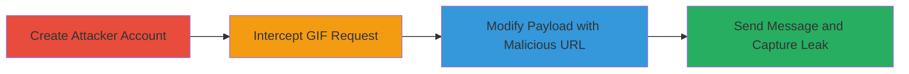

---
tags:
  - information-disclosure
  - api-vulnerability
  - privacy-leak
  - messaging-exploit
  - client-side-leak
type: attack_chain
tools:
  - '[[tools/Burp-Suite]]'
  - '[[tools/Burp-Collaborator]]'
tactics:
  - '[[Initial Access]]'
  - '[[Collection]]'
verified: false
platforms:
  - Web
  - Mobile (iOS)
  - Mobile (Android)
  - iPad
  - Smart TV
submitted: true
complexity: medium
created_at: '2023-10-01T00:00:00Z'
procedures:
  - '[[procedures/Create-LinkedIn-Attacker-Account]]'
  - '[[procedures/Intercept-GIF-Send-Request-with-Burp-Suite]]'
  - '[[procedures/Modify-Message-Payload-to-Embed-Malicious-URL]]'
  - '[[procedures/Send-Modified-Message-and-Capture-Victim-Data]]'
step_count: 4
techniques:
  - '[[Exploit Public-Facing Application]]'
  - '[[Client Configurations]]'
updated_at: '2025-12-14T17:25:18.086Z'
description: >-
  Multi-stage attack exploiting LinkedIn's messaging API to embed arbitrary URLs
  in GIF messages, causing victim clients to fetch malicious endpoints and leak
  sensitive information like IP address, user agent, device details, and time
  zone.
skill_level: intermediate
impact_level: high
id: 687fe779-479e-416c-a8da-95562a4484f8
validated: true
mitre_tactics:
  - '[[Initial Access]]'
  - '[[Collection]]'
mitre_techniques:
  - '[[Exploit Public-Facing Application]]'
  - '[[Client Configurations]]'
---
# LinkedIn Information Disclosure via Malicious GIF URL in Messaging API

Multi-stage attack chain demonstrating exploitation of LinkedIn's messaging API vulnerability to disclose victim information by embedding arbitrary external URLs disguised as GIFs.

## Chain Metrics Dashboard

| Metric | Value |
|--------|-------|
| Chain Status | Unverified |
| Total Steps | 4 |
| Execution Time | ~10 minutes |
| Skill Level | Intermediate |
| Complexity | Medium |
| Impact Level | High |

## Attack Flow Visualization

## Prerequisites & Requirements

### Required Tools

- [[tools/Burp-Suite]]
- [[tools/Burp-Collaborator]]

### Target Environment

- LinkedIn web or mobile app (victim on web, iOS, Android, iPad, or Smart TV)
- Attacker requires a standard LinkedIn account
- Network access to LinkedIn API endpoints
- Burp Suite configured as proxy for HTTP interception

### Initial Access Requirements

- Valid LinkedIn credentials for attacker account
- Victim must accept and open message from attacker
- No prior access to victim account needed; social engineering to initiate messaging

## Detailed Attack Procedures

### Step 1: Create Attacker Account
procedure: [[procedures/Create-LinkedIn-Attacker-Account]]

**Objective**: Establish a legitimate-looking LinkedIn profile to send messages to victims without raising suspicion.

**Instructions**: Navigate to the LinkedIn registration page and create a new user account using valid email and personal details. Verify the account via email confirmation to enable messaging features.

**Expected Output**: Active LinkedIn account ready for sending messages.

**Success Indicators**:
- Account creation confirmation email received
- Ability to access messaging interface

### Step 2: Intercept GIF Send Request
procedure: [[procedures/Intercept-GIF-Send-Request-with-Burp-Suite]]

**Objective**: Capture the normal HTTP request structure when sending a GIF to understand the API payload format.

**Instructions**: Configure your browser or mobile app to proxy traffic through Burp Suite. In the LinkedIn messaging interface, select a GIF from the GIF Keyboard and attempt to send it to a test victim or yourself. Intercept the request in Burp Suite's Proxy tab.

**Expected Output**: Captured HTTP POST request to the createMessage endpoint with JSON payload containing externalMedia details.

**Success Indicators**:
- Request intercepted showing JSON structure with 'message.renderContentUnions.externalMedia.media.url'
- Forward non-relevant requests to proceed to the target endpoint

### Step 3: Modify Payload with Malicious URL
procedure: [[procedures/Modify-Message-Payload-to-Embed-Malicious-URL]]

**Objective**: Alter the JSON payload to replace the legitimate GIF URL with an attacker-controlled URL, exploiting the lack of validation.

**Instructions**: In Burp Suite's Repeater or Intruder, forward requests until reaching the /voyager/api/voyagerMessagingDashMessengerMessages?action=createMessage endpoint. Edit the JSON body to change the 'message.renderContentUnions.externalMedia.media.url' field to your Burp Collaborator URL (e.g., 'https://abc123.burpcollaborator.net'). Forward the modified request to send the payload.

**Expected Output**: Modified request sent successfully, with the message appearing as a GIF in LinkedIn but linking to the malicious URL.

**Success Indicators**:
- API responds with 200 OK or success status
- Message sent without error in LinkedIn interface

### Step 4: Send Message and Capture Data
procedure: [[procedures/Send-Modified-Message-and-Capture-Victim-Data]]

**Objective**: Trigger the victim's client to fetch the malicious URL upon opening the message, leaking device and network information to the attacker.

**Instructions**: Send the modified message to the target victim via LinkedIn. Monitor the Burp Collaborator dashboard for incoming requests when the victim opens the conversation. Analyze the request headers for leaked data.

**Expected Output**: Incoming HTTP request to Collaborator URL with headers revealing IP, User-Agent (OS, browser, device), device ID, phone model (especially on iOS), and time zone.

**Success Indicators**:
- Request logged in Collaborator showing victim details
- More comprehensive data on iOS vs. Android/web clients

## Attack Chain Summary

### Key Achievements

1. Successful embedding of arbitrary URL in LinkedIn GIF message without detection
2. Client-side fetch leaking IP, user agent, and device-specific info across platforms
3. Privacy compromise enabling further targeting or correlation attacks

## Technique & Tactic Coverage

### MITRE ATT&CK Techniques

- [[Exploit Public-Facing Application]] Exploit Public-Facing Application
- [[Client Configurations]] Gather Victim Identity Information

### MITRE ATT&CK Tactics

- [[Initial Access]] Initial Access
- [[Collection]] Collection

---
*Last updated: 2023-10-01T00:00:00Z*
