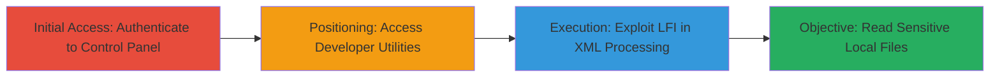

# Local File Inclusion via XML Member Processing in ExpressionEngine

## Overview

This attack chain demonstrates how a logged-in user with control panel access can exploit a local file inclusion (LFI) vulnerability in ExpressionEngine's XML Member Processing feature. The vulnerability arises from insufficient input validation in XML handling, allowing path traversal to include and read arbitrary local files on the server. This can lead to disclosure of sensitive information like configuration files or system logs. The attack requires authenticated access and is targeted at ExpressionEngine instances running vulnerable versions.

## Chain Metrics Dashboard

| Metric | Value |
|--------|-------|
| Chain Status | Unverified |
| Total Steps | 3 |
| Execution Time | ~5 minutes |
| Skill Level | Intermediate |
| Complexity | Medium |
| Impact Level | High |

## Attack Flow Visualization

## Prerequisites & Requirements

### Required Tools

- Web browser or [[tools/Burp-Suite]] for intercepting and modifying requests

### Target Environment

- ExpressionEngine CMS (vulnerable versions)
- PHP-based web server
- Required services/ports: HTTP/HTTPS on port 80/443
- Network access requirements: Direct access to the web application

### Initial Access Requirements

- Valid credentials for a logged-in user with control panel access
- Permissions to access developer utilities
- No prior network position needed beyond authenticated session

## Detailed Attack Procedures

### Step 1: Authenticate to Control Panel
procedure: [[procedures/Access-ExpressionEngine-Control-Panel]]

**Objective**: Gain authenticated access to the ExpressionEngine control panel to enable interaction with administrative features.

**Instructions**: Log in to the ExpressionEngine admin interface using valid credentials. Navigate to the control panel login page (typically /admin.php) and submit the username and password.

**Expected Output**: Successful login redirect to the control panel dashboard.

**Success Indicators**:
- Dashboard loads without errors
- User session is active (check for session cookies)

### Step 2: Access Developer Utilities and XML Member Processing
procedure: [[procedures/Exploit-LFI-in-XML-Member-Processing]]

**Objective**: Position the attacker to interact with the vulnerable XML Member Processing feature by navigating to developer utilities.

**Instructions**: From the control panel, navigate to Developer > Utilities. Locate and access the XML Member Processing tool. Prepare to submit XML input that includes a malicious file path for traversal.

**Expected Output**: The XML processing interface loads, ready for input submission.

**Success Indicators**:
- Developer utilities section is accessible
- No permission errors on XML processing page

### Step 3: Exploit LFI to Read Local Files
procedure: [[procedures/Extract-Sensitive-Files-via-LFI]]

**Objective**: Include and extract contents of sensitive local files using path traversal in the XML input.

**Instructions**: In the XML Member Processing form, craft an XML payload with a traversal path, such as including a reference to `/etc/passwd` via `<?xml version="1.0"?><!DOCTYPE root [<!ENTITY xxe SYSTEM "file:///etc/passwd">]><root>&xxe;</root>`. Submit the form. If using a proxy like Burp Suite, intercept and modify the request to inject the path.

**Expected Output**: The response includes the contents of the targeted file, such as user account listings from /etc/passwd.

**Success Indicators**:
- Arbitrary file contents appear in the response
- No parsing errors; file data is readable

## Attack Chain Summary

### Key Achievements

1. Authenticated access to administrative features
2. Exploitation of LFI for arbitrary file read
3. Disclosure of sensitive server files, potentially leading to further compromise

## Technique & Tactic Coverage

### MITRE ATT&CK Techniques

- [[Exploit Public-Facing Application]] Exploit Public-Facing Application
- [[File and Directory Discovery]] File and Directory Discovery

### MITRE ATT&CK Tactics

- [[Initial Access]] Initial Access
- [[Discovery]] Discovery

---
*Last updated: 2023-10-01T00:00:00Z*
