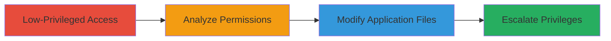

# Local Privilege Escalation in UniFi Video via Weak Default ACLs on Windows

Multi-stage attack chain demonstrating local privilege escalation by exploiting insecure default permissions on UniFi Video installation directories, allowing file modification to hijack execution and gain elevated privileges on Windows systems.

## Chain Metrics Dashboard

| Metric | Value |
|--------|-------|
| Chain Status | Unverified |
| Total Steps | 3 |
| Execution Time | ~5 minutes |
| Skill Level | Intermediate |
| Complexity | Medium |
| Impact Level | High |

## Attack Flow Visualization



## Prerequisites & Requirements

### Required Tools

- Built-in Windows tools (icacls, copy)

### Target Environment

- Windows OS (versions supporting UniFi Video up to 3.7.3)
- UniFi Video installed with default ACLs (typically C:\Program Files\Ubiquiti UniFi Video)
- No specific services/ports required (local access only)
- Network access not needed

### Initial Access Requirements

- Local low-privileged user account
- No network position required
- Prior administrative installation of UniFi Video assumed

## Detailed Attack Procedures

### Step 1: Gain Low-Privileged Access

procedure: [[procedures/Exploit-Weak-ACLs-in-UniFi-Video-Directory]]

**Objective**: Assume or obtain a low-privileged user session on the target Windows system where UniFi Video is installed.

**Instructions**: Log in as a standard user or exploit another vector to gain a limited shell. Verify the UniFi Video installation path using [[commands/dir-unifi-path]]:

```cmd
 dir "C:\Program Files\Ubiquiti UniFi Video" /s
```

**Expected Output**: Confirmation of installation directory and files.

**Success Indicators**:
- Shell access as low-priv user
- UniFi Video directory located

### Step 2: Analyze and Exploit Permissions

procedure: [[procedures/Exploit-Weak-ACLs-in-UniFi-Video-Directory]]

**Objective**: Identify weak ACLs on the installation directory allowing write access to unprivileged users.

**Instructions**: Use [[commands/icacls-check-perms]] to inspect permissions on the UniFi Video directory:

```cmd
 icacls "C:\Program Files\Ubiquiti UniFi Video"
```

If write access is confirmed, proceed to modify a key executable file, such as replacing a script or binary with a malicious version using [[commands/copy-replace-file]]:

```cmd
 copy malicious.exe "C:\Program Files\Ubiquiti UniFi Video\bin\helper.exe"
```

**Expected Output**: Permissions display showing (F) or (M) for modify access; successful file copy without errors.

**Success Indicators**:
- Write permissions confirmed for low-priv user
- File modification succeeds

### Step 3: Trigger Escalation

procedure: [[procedures/Exploit-Weak-ACLs-in-UniFi-Video-Directory]]

**Objective**: Execute the modified file to escalate privileges, potentially gaining SYSTEM or admin access.

**Instructions**: Restart the UniFi Video service or trigger the modified executable to run under higher privileges using [[commands/sc-start-service]]:

```cmd
 sc start "UniFi Video"
```

Monitor for elevated shell spawn from the malicious payload in the modified file.

**Expected Output**: Elevated command prompt or access to restricted resources.

**Success Indicators**:
- Process runs with higher privileges (check with [[commands/whoami-privs]])
- Full system compromise achieved

## Attack Chain Summary

### Key Achievements

1. Confirmed weak ACLs allowing file writes by unprivileged users
2. Modified application files to inject escalation payload
3. Achieved local privilege escalation to admin/SYSTEM level

## Technique & Tactic Coverage

### MITRE ATT&CK Techniques

- [[File Permissions Modification]] File and Directory Permissions Modification
- [[Exploitation for Privilege Escalation]] Exploitation for Privilege Escalation

### MITRE ATT&CK Tactics

- [[Privilege Escalation]] Privilege Escalation

---
*Last updated: 2023-10-01T12:00:00Z*
