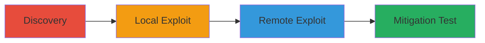

---
tags:
  - rce
  - privilege-escalation
  - command-injection
  - websocket
  - javascript
type: attack_chain
tools:
  - '[[tools/poc.py]]'
  - '[[tools/rce0923234.html]]'
  - '[[tools/unifi-video.Win7_x64.v3.10.7-beta.2_ee88ac.190725.1817.exe]]'
  - '[[tools/2019-04-21_17-47-17.mp4]]'
  - '[[tools/ubiq_rce.mp4]]'
tactics:
  - '[[Execution]]'
  - '[[Privilege Escalation]]'
  - '[[Persistence]]'
commands:
  - '[[commands/launchprocess-websocket]]'
platforms:
  - Windows
complexity: medium
procedures:
  - '[[procedures/Discover-Exposed-EvoStream-API]]'
  - '[[procedures/Exploit-Local-Privilege-Escalation]]'
  - '[[procedures/Develop-Remote-Code-Execution-Payload]]'
  - '[[procedures/Test-Mitigation-in-Beta-Software]]'
step_count: 4
techniques:
  - '[[Command-Line Interface]]'
  - '[[Exploitation for Privilege Escalation]]'
  - '[[Exploitation of Remote Services]]'
description: >-
  Multi-stage attack exploiting an unauthenticated command execution
  vulnerability in Ubiquiti's UniFi Video software, leading to local privilege
  escalation and full remote code execution as SYSTEM on Windows systems
skill_level: intermediate
impact_level: high
id: 011c9f33-fdd0-49f2-a62a-e1a3d52c9484
created_at: '2025-12-11T06:10:22.848Z'
updated_at: '2025-12-11T06:10:22.848Z'
verified: false
validated: true
submitted: true
mitre_tactics:
  - '[[TA0002]]'
  - '[[TA0004]]'
  - '[[TA0003]]'
mitre_techniques:
  - '[[T1059]]'
  - '[[T1068]]'
  - '[[T1210]]'
---
# Local Privilege Escalation to Remote Code Execution in Ubiquiti UniFi Video via EvoStream API

Multi-stage attack chain demonstrating a complete attack workflow exploiting the EvoStream API in Ubiquiti's UniFi Video software for privilege escalation and remote code execution.

## Chain Metrics Dashboard

| Metric | Value |
|--------|-------|
| Chain Status | Unverified |
| Total Steps | 4 |
| Execution Time | ~15 minutes |
| Skill Level | Intermediate |
| Complexity | Medium |
| Impact Level | High |

## Attack Flow Visualization



## Prerequisites & Requirements

### Required Tools

- [[tools/poc.py]]
- [[tools/rce0923234.html]]
- [[tools/unifi-video.Win7_x64.v3.10.7-beta.2_ee88ac.190725.1817.exe]]

### Target Environment

- Windows platform
- UniFi Video software installed with EvoStream service running on port 7440
- Local or remote network access for exploitation

### Initial Access Requirements

- Local user access for initial exploitation
- Ability to host and access remote JavaScript payload for RCE
- No prior credentials needed due to unauthenticated API

## Detailed Attack Procedures

### Step 1: Discovery - [[procedures/Discover-Exposed-EvoStream-API]]

**Procedure**: [[procedures/Discover-Exposed-EvoStream-API]]

**Objective**: Identify the unauthenticated EvoStream API endpoint on localhost:7440 that allows command execution.

**Expected Output**: Confirmation of API accessibility and support for 'launchprocess' command.

**Success Indicators**:
- API endpoint responds to WebSocket connections
- Documentation confirms 'launchprocess' for arbitrary command execution

Use tools like a web browser or WebSocket client to probe localhost:7440 and review EvoStream documentation for exposed commands.

### Step 2: Local Exploit - [[procedures/Exploit-Local-Privilege-Escalation]]

**Procedure**: [[procedures/Exploit-Local-Privilege-Escalation]]

**Objective**: Achieve privilege escalation from user to SYSTEM by executing arbitrary commands via the API.

**Expected Output**: Successful execution of commands as SYSTEM, such as launching a binary.

**Success Indicators**:
- Commands run with SYSTEM privileges
- Video demonstration shows escalation (e.g., via [[tools/2019-04-21_17-47-17.mp4]])

Execute the proof-of-concept script [[tools/poc.py]] to send 'launchprocess' requests to the API:

```python
# Example poc.py snippet (inferred)
import websocket
ws = websocket.create_connection('ws://localhost:7440')
ws.send('{"command": "launchprocess", "binary": "cmd.exe", "args": "/c whoami"}')
print(ws.recv())
```

Validate by checking output for SYSTEM-level access.

### Step 3: Remote Exploit - [[procedures/Develop-Remote-Code-Execution-Payload]]

**Procedure**: [[procedures/Develop-Remote-Code-Execution-Payload]]

**Objective**: Develop and deploy a JavaScript payload for remote code execution via WebSocket requests from a webpage.

**Expected Output**: Remote launching of applications like calc.exe as SYSTEM.

**Success Indicators**:
- Webpage triggers command execution on target
- Video shows RCE (e.g., via [[tools/ubiq_rce.mp4]])

Host the JavaScript payload [[tools/rce0923234.html]] and access it from the target browser to send WebSocket requests:

```javascript
// Example from rce0923234.html (inferred)
var ws = new WebSocket('ws://localhost:7440');
ws.onopen = function() {
    ws.send('{"command": "launchprocess", "binary": "calc.exe"}');
};
```

Confirm execution by observing the application launch on the target system.

### Step 4: Mitigation Test - [[procedures/Test-Mitigation-in-Beta-Software]]

**Procedure**: [[procedures/Test-Mitigation-in-Beta-Software]]

**Objective**: Verify the beta fix by installing and testing the updated software.

**Expected Output**: API requires client certificate authentication, preventing exploitation.

**Success Indicators**:
- Exploitation attempts fail due to authentication
- Beta version confirms security enhancement

Install the beta software [[tools/unifi-video.Win7_x64.v3.10.7-beta.2_ee88ac.190725.1817.exe]] and attempt previous exploits, observing authentication failures.

## Attack Chain Summary

### Key Achievements

1. Discovery of unauthenticated API for command execution
2. Local privilege escalation to SYSTEM
3. Full remote code execution via JavaScript

## Technique & Tactic Coverage

### MITRE ATT&CK Techniques

- [[Command-Line Interface]]
- [[Exploitation for Privilege Escalation]]

### MITRE ATT&CK Tactics

- [[Execution]]
- [[Privilege Escalation]]

*Last updated: 2023-10-01*
