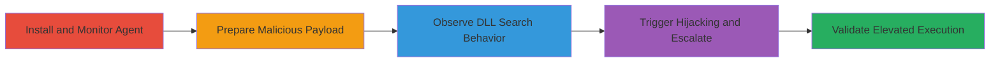

# Local Privilege Escalation via DLL Search-Order Hijacking in Acronis Cyber Protection Agent

Multi-stage attack chain demonstrating local privilege escalation through DLL search-order hijacking in the Acronis Cyber Protection Agent's systeminfo.exe utility. The attack leverages the executable's reliance on the Windows default DLL search path, which prioritizes user-controlled PATH directories, allowing a malicious snapapi.dll to be loaded and execute arbitrary code with elevated privileges.

## Chain Metrics Dashboard

| Metric | Value |
|--------|-------|
| Chain Status | Unverified |
| Total Steps | 4 |
| Execution Time | ~15 minutes |
| Skill Level | Intermediate |
| Complexity | Medium |
| Impact Level | High |

## Attack Flow Visualization

## Prerequisites & Requirements

### Required Tools

- [[tools/ProcMon]]

### Target Environment

- Windows OS (tested on Windows 10/11)
- Acronis Cyber Protection Agent installed
- Local user account with modify rights to a PATH directory (e.g., C:\Python27)

### Initial Access Requirements

- Local access to the target machine
- No network access required beyond downloading the agent installer
- Administrative privileges not needed initially, but escalation is the goal

## Detailed Attack Procedures

### Step 1: Install Acronis Agent and Monitor with ProcMon
procedure: [[procedures/Install-and-Monitor-Acronis-Agent-with-ProcMon]]

**Objective**: Install the Acronis Cyber Protection Agent and use ProcMon to observe the DLL loading behavior of systeminfo.exe.

**Instructions**: Download the agent installer from the official Acronis site and complete installation. Launch ProcMon, set filters for systeminfo.exe, and execute the utility to capture file access attempts.

**Expected Output**: ProcMon logs showing systeminfo.exe searching for snapapi.dll in PATH directories like C:\Python27 before the intended location, resulting in 'NAME NOT FOUND' errors.

**Success Indicators**:
- Agent installed successfully at C:\Program Files\Common Files\Acronis\AdvReport\
- ProcMon captures DLL search paths including user-writable folders

### Step 2: Prepare Malicious DLL and Payload
procedure: [[procedures/Prepare-Malicious-DLL-and-Payload]]

**Objective**: Create and place a malicious snapapi.dll in a writable PATH directory, along with a batch file payload to execute elevated commands.

**Instructions**: Copy a pre-built malicious snapapi.dll into C:\Python27 (or similar PATH folder). Create a batch file in C:\attacker\mmg.bat containing payload commands like [[commands/whoami-validate-privileges]].

**Expected Output**: Malicious DLL placed without errors; batch file ready for execution.

**Success Indicators**:
- DLL file exists in PATH directory
- Batch file contains valid payload commands

### Step 3: Trigger DLL Hijacking for Escalation
procedure: [[procedures/Trigger-DLL-Hijacking-for-Escalation]]

**Objective**: Re-run systeminfo.exe to load the malicious DLL, which executes the payload with elevated privileges.

**Instructions**: With ProcMon running, execute systeminfo.exe again. The tool will load snapapi.dll from the hijacked PATH, triggering the batch file payload.

**Expected Output**: Elevated execution of mmg.bat, appending output to C:\attacker\who.txt showing SYSTEM or high-privilege context.

**Success Indicators**:
- ProcMon shows successful load of snapapi.dll from C:\Python27
- who.txt file contains elevated privilege details

## Attack Chain Summary

### Key Achievements

1. Identified vulnerable DLL search order in systeminfo.exe using ProcMon
2. Hijacked snapapi.dll loading to execute arbitrary code
3. Achieved local privilege escalation without direct admin access

## Technique & Tactic Coverage

### MITRE ATT&CK Techniques

- [[DLL Search Order Hijacking]]

### MITRE ATT&CK Tactics

- [[Privilege Escalation]]

---
*Last updated: 2023-10-01T00:00:00Z*
