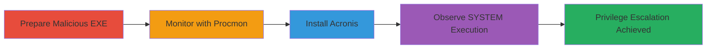

# Local Privilege Escalation via EXE Hijacking in Acronis True Image 2021

## Chain Metrics Dashboard

| Metric | Value |
|--------|-------|
| Chain Status | Unverified |
| Total Steps | 4 |
| Execution Time | ~10 minutes |
| Skill Level | Intermediate |
| Complexity | Medium |
| Impact Level | High |

## Attack Flow Visualization



The vulnerability stems from the Acronis Scheduler2 Service (schedul2.exe) attempting to execute 'C:\program.exe' from the C: drive root during service startup without path validation. A local attacker with write access to C:\ can place a malicious 'program.exe' there, leading to SYSTEM-level code execution upon installation or service restart. This chain demonstrates the full workflow, requiring admin rights for file placement but chaining potential with other vulns for full LPE.

## Prerequisites & Requirements

### Required Tools

- [[tools/Procmon]]
- [[tools/Acronis-True-Image-2021-Installer]]

### Target Environment

- Windows OS (tested on Windows 10/11)
- Write access to C:\ (admin privileges or chained vuln)
- Acronis True Image 2021 not pre-installed

### Initial Access Requirements

- Local user account with admin rights
- No network access needed; fully local

## Detailed Attack Procedures

### Step 1: Prepare Malicious Executable
procedure: [[procedures/Prepare-Malicious-Executable-for-Hijacking]]

**Objective**: Create and place a malicious executable named 'program.exe' in C:\ to hijack the service's execution attempt.

**Instructions**: Compile or obtain a simple malicious EXE that demonstrates execution (e.g., a message box pop-up). Use [[commands/copy-malicious-exe]] to place it in C:\ before installation.

```bash
copy malicious.exe C:\program.exe
```

Verify placement with [[commands/dir-c-drive]]:

```bash
dir C:\ /b | findstr program.exe
```

**Expected Output**: 'program.exe' listed in C:\ directory.

**Success Indicators**:
- Malicious file successfully copied to C:\
- File permissions allow execution by SYSTEM

### Step 2: Set Up Monitoring
procedure: [[procedures/Monitor-File-Operations-with-Procmon]]

**Objective**: Launch Procmon to capture file operations by schedul2.exe, confirming the hijack attempt.

**Instructions**: Start [[tools/Procmon]] and apply filters for 'schedul2.exe' processes and CreateFile operations using [[commands/procmon-filter-setup]] (via Procmon GUI, but scripted launch if automated).

Launch Procmon:

```bash
procmon.exe /AcceptEula /BackingFile capture.pml
```

Set filters in the GUI: Process Name is schedul2.exe, Operation is CreateFile.

**Expected Output**: Procmon running and capturing events.

**Success Indicators**:
- Filters applied successfully
- No errors in Procmon startup

### Step 3: Trigger Service Startup
procedure: [[procedures/Install-Acronis-True-Image-to-Trigger-Service]]

**Objective**: Run the Acronis installer to start the Scheduler2 Service, triggering the EXE execution attempt.

**Instructions**: Download the installer if not present, then execute it with [[commands/run-acronis-installer]]:

```bash
AcronisTrueImage2021.exe /SILENT
```

Complete the installation process, which will start or restart the service.

**Expected Output**: Installation completes; service starts.

**Success Indicators**:
- Acronis installed without errors
- Scheduler2 Service running (check via services.msc)

### Step 4: Validate Hijack Execution
procedure: [[procedures/Observe-SYSTEM-Execution-of-Hijacked-EXE]]

**Objective**: Review Procmon logs to confirm schedul2.exe executed the malicious 'C:\program.exe' as SYSTEM.

**Instructions**: Stop Procmon capture and review events using [[commands/procmon-review-logs]] (GUI search for CreateFile on program.exe).

In Procmon, filter for successful CreateFile on C:\Program.exe by PID of schedul2.exe.

**Expected Output**: Log entry showing CreateFile success, execution as NT AUTHORITY\SYSTEM, and payload trigger (e.g., pop-up 'EXE Loaded').

**Success Indicators**:
- Procmon shows execution of program.exe with SYSTEM privileges
- Malicious payload activates (e.g., message box appears)

## Attack Chain Summary

### Key Achievements

1. Placed hijackable malicious EXE in vulnerable path
2. Monitored service behavior to confirm attempt
3. Triggered service startup via installation
4. Achieved arbitrary code execution at SYSTEM level

## Technique & Tactic Coverage

### MITRE ATT&CK Techniques

- [[Hijack Execution Flow]] Hijack Execution Flow
- [[Windows Service]] Create or Modify System Process: Windows Service

### MITRE ATT&CK Tactics

- [[Privilege Escalation]] Privilege Escalation

---

*Last updated: 2023-10-01T00:00:00Z*
