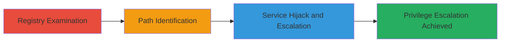

---
tags:
  - unquoted-service-path
  - privilege-escalation
  - windows-registry
  - service-hijack
type: attack_chain
tools: []
tactics:
  - '[[Privilege Escalation]]'
verified: false
platforms:
  - Windows
submitted: true
created_at: '2023-10-01T00:00:00Z'
procedures:
  - '[[procedures/Examine-Windows-Registry-for-Rockstar-Service]]'
  - '[[procedures/Identify-Unquoted-Path-in-Service-ImagePath]]'
  - '[[procedures/Exploit-Unquoted-Service-Path-with-Malicious-Binary]]'
step_count: 3
techniques:
  - '[[Hijack Execution Flow]]'
  - '[[Windows Service]]'
updated_at: '2025-12-14T17:26:27.168Z'
description: >-
  This attack chain exploits an unquoted service path vulnerability in the
  Rockstar Game Library Service on Windows to achieve local privilege escalation
  by hijacking service execution with a malicious binary.
id: 09cbc1fb-fe74-4bdd-bd6e-036345e915ec
validated: true
mitre_tactics:
  - '[[Privilege Escalation]]'
mitre_techniques:
  - '[[Hijack Execution Flow]]'
  - '[[Windows Service]]'
---
# Local Privilege Escalation via Unquoted Service Path in Rockstar Game Library Service

Multi-stage attack chain demonstrating a complete attack workflow for exploiting an unquoted service path vulnerability in the Rockstar Game Library Service to elevate privileges on a Windows system.

## Chain Metrics Dashboard

| Metric | Value |
|--------|-------|
| Chain Status | Unverified |
| Total Steps | 3 |
| Execution Time | ~5 minutes |
| Skill Level | Intermediate |
| Complexity | Low |
| Impact Level | High |

## Attack Flow Visualization



## Prerequisites & Requirements

### Required Tools

- Built-in Windows tools (reg.exe, cmd.exe)

### Target Environment

- Windows OS (e.g., Windows 10/11)
- Rockstar Game Library Service installed (part of Rockstar Games Launcher)
- Local user access to the target machine

### Initial Access Requirements

- Local non-administrative access to the Windows machine
- No network access required; this is a local escalation

## Detailed Attack Procedures

### Step 1: Examine Registry for Service Entry
procedure: [[procedures/Examine-Windows-Registry-for-Rockstar-Service]]

**Objective**: Locate the registry key for the Rockstar Game Library Service and retrieve its ImagePath value to identify potential misconfigurations.

**Instructions**: Use the built-in [[commands/reg-query-service-imagepath]] command to query the registry:

```cmd
reg query "HKLM\SYSTEM\CurrentControlSet\Services\RockstarService" /v ImagePath
```

**Expected Output**: Displays the ImagePath value, such as `C:\Program Files\Rockstar Games\Launcher\Rocker.exe` without quotes.

**Success Indicators**:
- Registry key found under HKLM\SYSTEM\CurrentControlSet\Services
- ImagePath value retrieved successfully

### Step 2: Identify Lack of Quotation Marks
procedure: [[procedures/Identify-Unquoted-Path-in-Service-ImagePath]]

**Objective**: Analyze the ImagePath to confirm it lacks enclosing quotation marks, which enables path hijacking due to Windows' directory search behavior.

**Instructions**: Review the output from Step 1 manually or script it to check for quotes. For example, pipe the reg query output to findstr to verify absence of quotes:

```cmd
reg query "HKLM\SYSTEM\CurrentControlSet\Services\RockstarService" /v ImagePath | findstr /v "\"" 
```

**Expected Output**: The path appears without leading/trailing double quotes, confirming vulnerability.

**Success Indicators**:
- Path contains spaces but no quotes
- Windows will search subdirectories sequentially (e.g., C:\Program.exe if placed there)

### Step 3: Exploit by Placing Malicious Executable
procedure: [[procedures/Exploit-Unquoted-Service-Path-with-Malicious-Binary]]

**Objective**: Hijack the service execution by placing a malicious binary in an intermediate directory along the unquoted path, leading to privilege escalation when the service starts.

**Instructions**: Create a directory matching the first segment before a space (e.g., C:\Program.exe if path is C:\Program Files\...), then copy a malicious executable. Use [[commands/create-directory-and-copy-binary]]:

```cmd
mkdir "C:\Program.exe"
mkdir "C:\Program.exe\Files"
copy malicious.exe "C:\Program.exe"
sc start RockstarService
```

**Expected Output**: Service starts and executes the malicious binary with SYSTEM privileges.

**Success Indicators**:
- Malicious binary executes under elevated privileges
- Privilege escalation confirmed (e.g., via whoami /priv showing SeDebugPrivilege)

## Attack Chain Summary

### Key Achievements

1. Identified vulnerable service configuration in Windows Registry
2. Confirmed unquoted path enabling hijack
3. Achieved local privilege escalation without modifying system files

## Technique & Tactic Coverage

### MITRE ATT&CK Techniques

- [[Hijack Execution Flow]] Hijack Execution Flow
- [[Windows Service]] Create or Modify System Process: Windows Service

### MITRE ATT&CK Tactics

- [[Privilege Escalation]] Privilege Escalation

---
*Last updated: 2023-10-01T00:00:00Z*
