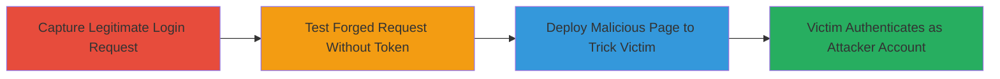

---
tags:
  - csrf
  - login-csrf
  - web
  - authentication-bypass
type: attack_chain
tools:
  - '[[tools/Browser-Developer-Tools]]'
tactics:
  - '[[Initial Access]]'
verified: false
platforms:
  - Web
submitted: true
complexity: medium
created_at: '2023-10-01T00:00:00Z'
procedures:
  - '[[procedures/Capture-Login-Request-with-Browser-Dev-Tools]]'
  - '[[procedures/Test-Login-Without-Authenticity-Token]]'
step_count: 2
techniques:
  - '[[Exploit Public-Facing Application]]'
updated_at: '2025-12-14T17:27:22.840Z'
description: >-
  A multi-step attack exploiting missing CSRF protection on the Mavenlink login
  endpoint to force a victim to authenticate as an attacker-controlled account,
  enabling session hijacking or unauthorized access.
skill_level: intermediate
impact_level: high
id: 2f64d4f1-8550-4aed-b330-c2091d66419e
validated: true
mitre_tactics:
  - '[[Initial Access]]'
mitre_techniques:
  - '[[Exploit Public-Facing Application]]'
---
# Login CSRF Exploitation to Force Victim Authentication in Mavenlink

Multi-stage attack chain demonstrating a complete workflow to exploit Login CSRF in the Mavenlink application, allowing an attacker to forge login requests and trick victims into authenticating as the attacker's account.

## Chain Metrics Dashboard

| Metric | Value |
|--------|-------|
| Chain Status | Unverified |
| Total Steps | 2 |
| Execution Time | ~5 minutes |
| Skill Level | Intermediate |
| Complexity | Medium |
| Impact Level | High |

## Attack Flow Visualization

## Prerequisites & Requirements

### Required Tools

- [[tools/Browser-Developer-Tools]]

### Target Environment

- Web application (Ruby on Rails inferred from authenticity_token)
- Access to the login endpoint (POST /login)
- Valid credentials for testing (e.g., email and password)

### Initial Access Requirements

- Network access to the target web app
- No prior credentials needed for discovery, but valid test credentials for verification
- Ability to host a malicious webpage (e.g., via local server or external host)

## Detailed Attack Procedures

### Step 1: Capture Legitimate Login Request
procedure: [[procedures/Capture-Login-Request-with-Browser-Dev-Tools]]

**Objective**: Intercept and analyze a valid login request to identify the authenticity_token parameter and other details for forgery.

**Instructions**: Open the target login page in a browser, enter valid credentials, and use developer tools to capture the POST request to /login. Note headers (User-Agent, Accept, Cookies) and body parameters (utf8, authenticity_token, login[email_address], login[password], login[open_id], from).

**Expected Output**: Full request details, including the authenticity_token value.

**Success Indicators**:
- Request captured successfully with all parameters visible
- Valid login completes, confirming endpoint functionality

### Step 2: Test Forged Request Without Authenticity Token
procedure: [[procedures/Test-Login-Without-Authenticity-Token]]

**Objective**: Verify the vulnerability by submitting a login request missing the authenticity_token, confirming the server accepts forged requests.

**Instructions**: Modify the captured request in browser dev tools or a proxy tool by removing the authenticity_token parameter. Resubmit with valid credentials (e.g., email: haxthat_f@yahoo.com, password: fatalsky) to the /login endpoint. If successful, craft a malicious HTML form on an attacker-controlled page to automate the forged POST, tricking the victim into submitting it via a link or iframe.

**Expected Output**: Successful authentication response (e.g., redirect to dashboard) without the token.

**Success Indicators**:
- Login succeeds despite missing token
- Victim can be forced to authenticate as attacker account via malicious page

## Attack Chain Summary

### Key Achievements

1. Identified missing CSRF protection on login endpoint
2. Demonstrated ability to forge requests without authenticity_token
3. Enabled potential session fixation or account compromise by forcing victim logins

## Technique & Tactic Coverage

### MITRE ATT&CK Techniques

- [[Exploit Public-Facing Application]]

### MITRE ATT&CK Tactics

- [[Initial Access]]

---
*Last updated: 2023-10-01T00:00:00Z*
