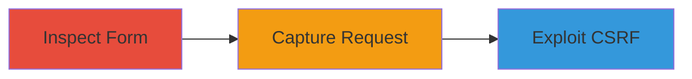

---
tags:
  - csrf
  - login-csrf
  - web-vulnerability
type: attack_chain
tools: []
tactics:
  - '[[Initial Access]]'
verified: false
platforms:
  - Web
submitted: true
complexity: low
created_at: '2023-10-01T00:00:00Z'
procedures:
  - '[[procedures/Inspect-Login-Form-for-CSRF-Tokens]]'
  - '[[procedures/Capture-HTTP-Requests-to-Login-Endpoint]]'
  - '[[procedures/Craft-and-Deliver-Login-CSRF-PoC]]'
step_count: 3
techniques:
  - '[[Exploit Public-Facing Application]]'
updated_at: '2025-12-14T17:27:15.761Z'
description: >-
  A multi-step attack chain exploiting the absence of CSRF protection on the
  IRCCloud login form to perform login CSRF, allowing an attacker to force users
  to authenticate to attacker-controlled accounts without awareness.
skill_level: beginner
impact_level: medium
id: 800972f7-3b79-41ce-9688-05ab08be2ded
validated: true
mitre_tactics:
  - '[[Initial Access]]'
mitre_techniques:
  - '[[Exploit Public-Facing Application]]'
---
# Login CSRF Exploitation via Missing Token on IRCCloud Form

Multi-stage attack chain demonstrating the discovery and exploitation of a CSRF vulnerability in the IRCCloud login form, enabling login CSRF attacks that link user sessions to attacker-controlled accounts.

## Chain Metrics Dashboard

| Metric | Value |
|--------|-------|
| Chain Status | Unverified |
| Total Steps | 3 |
| Execution Time | ~5 minutes |
| Skill Level | Beginner |
| Complexity | Low |
| Impact Level | Medium |

## Attack Flow Visualization



## Prerequisites & Requirements

### Required Tools

- Web browser with developer tools (e.g., Chrome DevTools)
- Text editor for crafting HTML PoC

### Target Environment

- Web platform
- Access to https://www.irccloud.com/
- No specific ports or services required beyond standard HTTPS (443)

### Initial Access Requirements

- Public internet access to the target site
- No credentials needed for discovery; victim must be tricked into visiting attacker's page while intending to log in

## Detailed Attack Procedures

### Step 1: Inspect Login Form for CSRF Tokens
procedure: [[procedures/Inspect-Login-Form-for-CSRF-Tokens]]

**Objective**: Identify the absence of CSRF protection in the login form to confirm exploitability.

**Instructions**: Open the target login page in a web browser and use developer tools to examine the HTML structure of the form. Look for input fields and check for hidden CSRF tokens.

**Expected Output**: HTML form with POST method to root endpoint, containing email, password, and org_invite fields, but no CSRF or authenticity token.

**Success Indicators**:
- Form lacks anti-CSRF measures
- Inputs are email (text), password (password), org_invite (hidden)

### Step 2: Capture HTTP Requests to Login Endpoint
procedure: [[procedures/Capture-HTTP-Requests-to-Login-Endpoint]]

**Objective**: Analyze the network traffic to understand the form submission behavior and confirm no token validation.

**Instructions**: Use browser developer tools or a proxy to monitor the GET request to the main page. Note headers and form action.

**Expected Output**: GET request to https://www.irccloud.com/ with standard headers like User-Agent, Referer, and no-cache directives.

**Success Indicators**:
- Request captured without errors
- No CSRF token observed in response or subsequent POST

### Step 3: Craft and Deliver Login CSRF PoC
procedure: [[procedures/Craft-and-Deliver-Login-CSRF-PoC]]

**Objective**: Create a malicious HTML page that auto-submits the login form to force the victim to log in to an attacker-controlled account.

**Instructions**: Create an HTML file with a form mimicking the target's, pre-filled with attacker's credentials, and use JavaScript to auto-submit. Host it on a controllable domain and trick the victim into visiting it (e.g., via phishing link) while they are on the target site.

Example PoC HTML:

```html
<!DOCTYPE html>
<html>
<body>
<form id="csrf-form" action="https://www.irccloud.com/" method="POST">
    <input type="email" name="email" value="attacker@example.com">
    <input type="password" name="password" value="attackerpass">
    <input type="hidden" name="org_invite" value="">
</form>
<script>
    document.getElementById('csrf-form').submit();
</script>
</body>
</html>
```

Serve this page and send a link to the victim.

**Expected Output**: Victim's browser submits the form automatically, logging them into the attacker's account and potentially linking sessions.

**Success Indicators**:
- Form submission succeeds without user interaction
- Victim's session is tied to attacker's account

## Attack Chain Summary

### Key Achievements

1. Confirmed missing CSRF protection on login form
2. Analyzed request structure for exploitation
3. Demonstrated login CSRF to hijack user authentication flow

## Technique & Tactic Coverage

### MITRE ATT&CK Techniques

- [[Exploit Public-Facing Application]]

### MITRE ATT&CK Tactics

- [[Initial Access]]

---
*Last updated: 2023-10-01T00:00:00Z*
