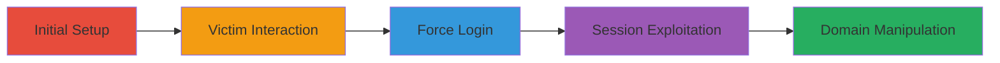

---
tags:
  - csrf
  - open-redirect
  - xss
  - saml
  - sso
  - session-hijacking
type: attack_chain
tools:
  - '[[tools/Browser]]'
tactics:
  - '[[Initial Access]]'
  - '[[Execution]]'
  - '[[Collection]]'
commands:
  - '[[commands/get-saml-sign-in-with-email-and-remember-me]]'
  - '[[commands/get-saml-sign-in-with-email]]'
  - '[[commands/set-timeout-for-redirect]]'
platforms:
  - Web
complexity: medium
procedures:
  - '[[procedures/Craft-Malicious-HTML-for-Login-CSRF]]'
  - '[[procedures/Force-Victim-to-Visit-Malicious-Page]]'
  - '[[procedures/Exploit-Login-CSRF-for-Authentication-and-Redirect]]'
  - '[[procedures/Combine-Logout-and-Login-CSRF-for-Information-Leak]]'
  - '[[procedures/Manipulate-SAML-Email-Domain-for-Phishing]]'
step_count: 5
techniques:
  - '[[Man in the Browser]]'
  - '[[User Execution]]'
  - '[[JavaScript]]'
description: >-
  Chained exploitation of Login CSRF, Open Redirect, and Self-XSS in HackerOne's
  SSO-SAML system to force malicious sessions, redirect users, and leak
  information.
skill_level: intermediate
impact_level: high
id: 6959febe-6ed1-4ba7-a6e6-de47ecabe75f
created_at: '2025-12-13T09:01:26.517Z'
updated_at: '2025-12-13T09:01:26.517Z'
verified: false
validated: true
submitted: true
mitre_tactics:
  - '[[Initial Access]]'
  - '[[Execution]]'
  - '[[Collection]]'
mitre_techniques:
  - '[[Man in the Browser]]'
  - '[[User Execution]]'
  - '[[JavaScript]]'
---
# Login CSRF and Open Redirect in HackerOne SSO-SAML for Session Hijacking and Self-XSS Exploitation

Multi-stage attack chain exploiting vulnerabilities in HackerOne's SSO-SAML login system, including Login CSRF to force authentication, Open Redirect for arbitrary redirects, and Self-XSS for script execution in victim sessions. This allows session hijacking, information leakage, and potential phishing.

## Chain Metrics Dashboard

| Metric | Value |
|--------|-------|
| Chain Status | Unverified |
| Total Steps | 5 |
| Execution Time | ~5 minutes |
| Skill Level | Intermediate |
| Complexity | Medium |
| Impact Level | High |

## Attack Flow Visualization



## Prerequisites & Requirements

### Required Tools

- [[tools/Browser]]

### Target Environment

- Web platform
- SSO-SAML services
- HTML and JavaScript tech stack

### Initial Access Requirements

- Ability to host malicious HTML page
- Victim must visit the page in a browser with clear cookies
- No prior credentials needed

## Detailed Attack Procedures

### Step 1: Craft Malicious HTML
procedure: [[procedures/Craft-Malicious-HTML-for-Login-CSRF]]

**Objective**: Create a proof-of-concept HTML page to initiate the Login CSRF attack.

**Instructions**: Develop an HTML page containing an iframe and JavaScript to load a redacted source and redirect to the SAML sign_in endpoint. Use [[commands/set-timeout-for-redirect]] for timing:

```javascript
setTimeout(function(){document.location.href = "https://hackerone.com/users/saml/sign_in?email=████&remember_me=true";}, 5000);
```

**Expected Output**: A functional malicious HTML page that loads an iframe and triggers a redirect after 5 seconds.

**Success Indicators**:
- HTML page loads without errors
- JavaScript timeout executes correctly

### Step 2: Force Victim Interaction
procedure: [[procedures/Force-Victim-to-Visit-Malicious-Page]]

**Objective**: Get the victim to load the malicious page in their browser.

**Instructions**: Host the malicious HTML and trick the victim into visiting it using a browser with cleared cookies. The page will load an iframe with src='████████' and initiate the redirect.

**Expected Output**: Victim's browser loads the page and starts the SSO-SAML flow.

**Success Indicators**:
- Page visit confirmed
- Iframe loads successfully

### Step 3: Exploit Login CSRF
procedure: [[procedures/Exploit-Login-CSRF-for-Authentication-and-Redirect]]

**Objective**: Force authentication and redirect the victim to arbitrary URLs.

**Instructions**: Execute the GET request via the JavaScript redirect using [[commands/get-saml-sign-in-with-email-and-remember-me]]:

```bash
GET https://hackerone.com/users/saml/sign_in?email=████&remember_me=true
```

This starts the SSO-SAML flow automatically.

**Expected Output**: Victim is redirected to external URLs or into a malicious session.

**Success Indicators**:
- Successful redirect observed
- Session forced without user interaction

### Step 4: Combine CSRF for Exploitation
procedure: [[procedures/Combine-Logout-and-Login-CSRF-for-Information-Leak]]

**Objective**: Use Logout CSRF followed by Login CSRF to leak information or trigger Self-XSS.

**Instructions**: First perform Logout CSRF, then chain with Login CSRF to steal session data or execute stored Self-XSS when the user interacts.

**Expected Output**: Information leakage or XSS execution in the victim's session.

**Success Indicators**:
- Session information captured
- XSS triggered successfully

### Step 5: Manipulate SAML Domain
procedure: [[procedures/Manipulate-SAML-Email-Domain-for-Phishing]]

**Objective**: Enable phishing by manipulating email domains in SAML config.

**Instructions**: Add extra dots to domains like 'hackerone..com' to redirect victims to attacker-controlled login flows.

**Expected Output**: Victim redirected to phishing site.

**Success Indicators**:
- Domain manipulation accepted
- Redirect to malicious domain successful

## Attack Chain Summary

### Key Achievements

1. Forced malicious login sessions without user consent
2. Arbitrary redirects for phishing setups
3. Exploitation of Self-XSS for script injection and data leakage

## Technique & Tactic Coverage

### MITRE ATT&CK Techniques

- [[Man in the Browser]]
- [[User Execution]]
- [[JavaScript]]

### MITRE ATT&CK Tactics

- [[Initial Access]]
- [[Execution]]
- [[Collection]]

*Last updated: [TIMESTAMP]*
